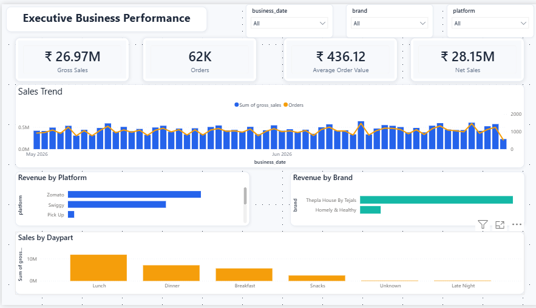
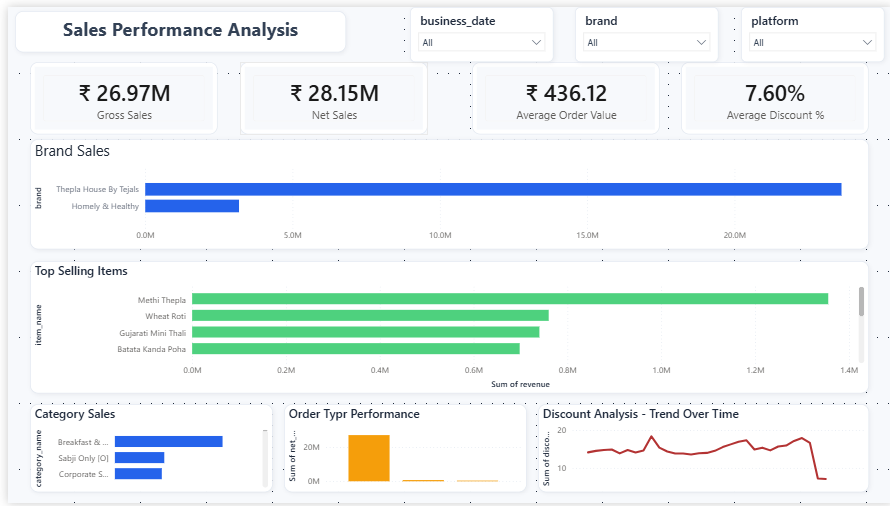
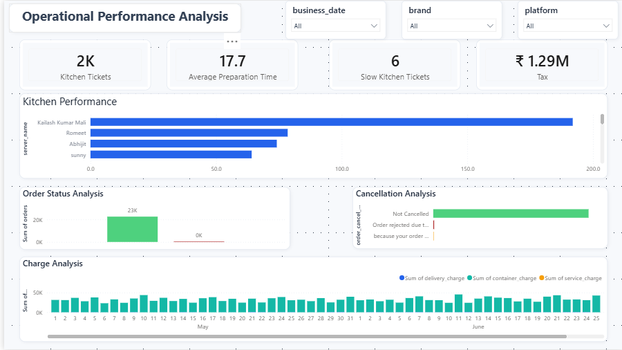
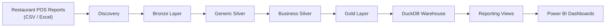
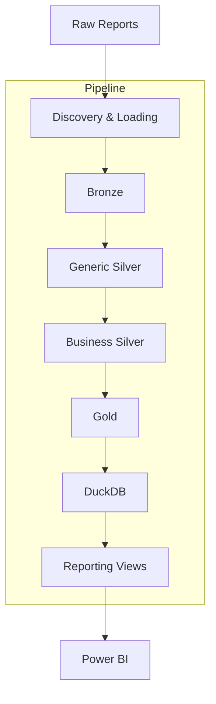
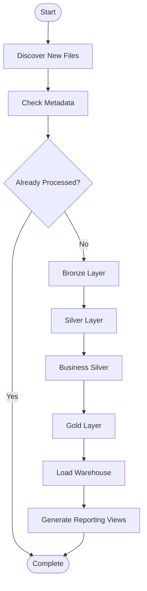
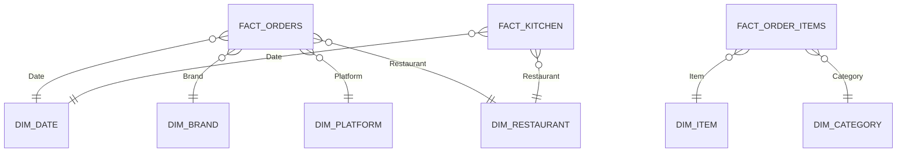
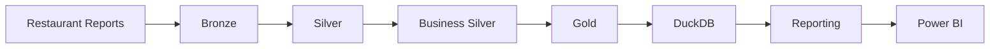

<div align="center">

# Restaurant POS ELT Pipeline

### End-to-End ELT Pipeline for Restaurant Analytics using Medallion Architecture, DuckDB, Docker & Power BI

<p>


</p>

*A production-style analytics pipeline that transforms raw restaurant POS reports into a dimensional warehouse and interactive business dashboards.*

</div>

---

# Overview

Restaurant POS systems generate a large number of operational reports every day, but those reports are rarely designed for analytics. Data is typically spread across multiple CSV and Excel exports, each with its own structure, naming conventions and business rules. Before meaningful analysis can begin, the data has to be cleaned, standardized and combined into a consistent analytical model.

This project solves that problem by building a complete **End-to-End ELT Pipeline** for restaurant POS data.

Instead of creating dashboards directly from spreadsheets, the pipeline progressively transforms raw operational reports into analytics-ready datasets using a layered Medallion Architecture. The processed data is modeled into a dimensional warehouse with DuckDB, published through curated reporting views and finally visualized in Power BI.

The focus of this project is not just dashboard creation—it is designing a maintainable analytics platform where ingestion, transformation, warehousing and reporting are clearly separated and can evolve independently.

---

# Project Highlights

- End-to-End ELT pipeline from raw POS reports to business dashboards
- Layered Medallion Architecture (Bronze → Silver → Gold)
- Incremental processing using metadata tracking
- Separate Generic Silver and Business Silver transformation stages
- Star schema dimensional modeling
- DuckDB analytical warehouse
- Curated reporting layer for business users
- Three interactive Power BI dashboards
- Dockerized deployment
- GitHub Actions workflow for automated validation

---

# Project Metrics

| Component | Count |
|-----------|------:|
| Raw Report Types | 3 |
| Bronze Datasets | 3 |
| Silver Datasets | 3 |
| Fact Tables | 3 |
| Dimension Tables | 6 |
| Reporting Views | 14 |
| Dashboard Pages | 3 |
| Analytical Warehouse | 1 DuckDB Database |
| Container Runtime | Docker |
| CI Workflow | GitHub Actions |

---

# Dashboard Gallery

The reporting layer publishes curated analytical datasets that are consumed by three Power BI dashboards. Each dashboard focuses on a different business perspective while sharing the same warehouse and reporting layer.

---

## Executive Business Performance

A high-level overview of overall business performance designed for owners and decision makers.

**Key Insights**

- Revenue
- Orders
- Average Order Value
- Brand Contribution
- Platform Performance
- Daily Sales Trend

<p align="center">

</p>

---

## Sales Performance Analysis

Provides a detailed breakdown of sales across brands, platforms, categories and menu items.

**Key Insights**

- Category Performance
- Item Performance
- Revenue Distribution
- Brand Comparison
- Platform Analysis
- Daily Sales Trends

<p align="center">

</p>

---

## Operational Performance Analysis

Focused on operational efficiency and restaurant performance rather than sales metrics.

**Key Insights**

- Kitchen Processing Time
- Order Status Analysis
- Order Type Distribution
- Kitchen Performance
- Operational Bottlenecks
- Process Efficiency

<p align="center">

</p>

---

> **Looking for the implementation details?**
>
> The remainder of this README provides a high-level overview of the architecture and workflow. Detailed engineering documentation for each layer of the pipeline is available in the [`docs/`](docs/) directory.


---

# End-to-End Pipeline

Every execution follows the same lifecycle—from discovering new restaurant reports to publishing analytics-ready datasets for Power BI.



Instead of transforming data directly into dashboards, the pipeline progressively improves data quality at every stage. Each layer has a clearly defined responsibility, making the workflow easier to maintain, troubleshoot and extend.

---

# System Architecture

The project follows a modular architecture where ingestion, transformation, warehousing and reporting are separated into independent components.



This layered approach keeps responsibilities isolated and prevents business logic from becoming tightly coupled with ingestion or reporting.

---

# Medallion Architecture

The transformation pipeline is based on the Medallion Architecture, where each layer increases the quality and analytical value of the data.

| Layer | Responsibility | Output |
|--------|----------------|--------|
| **Raw** | Original restaurant reports | CSV / Excel |
| **Bronze** | Immutable copy of source data | Parquet |
| **Silver** | Generic cleaning and standardization | Clean datasets |
| **Business Silver** | Domain-specific enrichment | Business-ready datasets |
| **Gold** | Star schema modelling | Facts & Dimensions |
| **Warehouse** | Central analytical storage | DuckDB |
| **Reporting** | Business-facing analytical views | CSV datasets |
| **Power BI** | Interactive dashboards | Business insights |

Each stage builds upon the previous one without modifying upstream data, making the entire pipeline reproducible and easy to debug.

---

# Processing Lifecycle

Every pipeline execution follows the same sequence.



This workflow ensures that previously processed reports are skipped while new reports move through every downstream layer automatically.

---

# Incremental Processing

The pipeline keeps track of every processed source file using metadata stored alongside the project.

Before processing begins, each incoming report is compared against the existing metadata.

If the report has already been processed, it is skipped entirely.

If it is new, the report progresses through every pipeline layer until the reporting datasets are regenerated.

This approach reduces unnecessary work while keeping the warehouse synchronized with newly available data.

---

# Design Decisions

Several implementation choices were made intentionally during development.

## Immutable Bronze Layer

Raw reports are never modified after ingestion.

Instead, they are stored as immutable Parquet datasets that act as the source of truth for every downstream transformation.

---

## Generic and Business Transformations

Data cleaning and business logic are intentionally separated.

Generic Silver handles reusable operations such as datatype conversion, null handling and duplicate removal.

Business Silver applies restaurant-specific enrichment including brand parsing, platform identification, business calendars and daypart classification.

Keeping these concerns separate makes the transformation layer easier to maintain and reuse.

---

## Dimensional Modelling

The Gold layer organizes analytical data into fact and dimension tables rather than exposing transformed datasets directly.

This structure simplifies reporting while reducing duplication across dashboards.

---

## Warehouse as the Reporting Boundary

Power BI does not consume transformation outputs directly.

Instead, reporting datasets are generated from the DuckDB warehouse, creating a stable interface between engineering and business reporting.

This allows warehouse logic to evolve without forcing dashboard redesigns.

---

## Containerized Execution

Docker packages the complete runtime environment so that the pipeline behaves consistently across development machines.

Running the project no longer depends on local Python installations or manually configured environments.

---

# Why This Architecture?

Although the project uses a relatively small dataset, the architecture mirrors patterns commonly used in modern analytics platforms.

The emphasis was not on building the largest pipeline possible, but on building one that is modular, reproducible and straightforward to extend.

Adding new restaurant reports or additional reporting views requires minimal changes because each layer has a clearly defined responsibility.


---

# Technology Stack

The project intentionally uses a lightweight analytics stack that can run entirely on a local machine while still following engineering practices commonly found in production data platforms.

| Category | Technology | Why it was chosen |
|-----------|------------|-------------------|
| Programming Language | Python | Pipeline orchestration and transformation logic |
| Data Processing | Pandas | Data cleaning, enrichment and modelling |
| Storage Format | Apache Parquet | Efficient columnar storage across pipeline layers |
| Analytical Warehouse | DuckDB | Embedded SQL warehouse for analytics |
| Data Modeling | Star Schema | Simplified reporting and analytical queries |
| Visualization | Power BI | Interactive business dashboards |
| Containerization | Docker & Docker Compose | Consistent execution across environments |
| Automation | GitHub Actions | Repository validation and automation |
| Version Control | Git & GitHub | Source control and collaboration |

---

# Repository Structure

The repository is organised around the lifecycle of the pipeline rather than individual technologies. Each directory owns a single responsibility, making the project easier to navigate and maintain.

```text
restaurant-pos-elt-pipeline
│
├── config/
├── data/
├── docs/
├── powerbi/
├── requirements/
├── src/
├── tests/
│
├── Dockerfile
├── docker-compose.yml
├── Makefile
└── main.py
```

---

## Configuration

```
config/
```

Contains the central configuration used throughout the project, including application settings, logging, database configuration and reporting parameters.

Keeping configuration separate from implementation allows the pipeline behaviour to be adjusted without modifying business logic.

---

## Data

```
data/
```

Acts as the working area for every stage of the pipeline.

```text
data/

raw/
bronze/
silver/
gold/
warehouse/
reporting/
metadata/
```

Each folder represents a stage of the ELT lifecycle rather than simply storing files.

| Directory | Purpose |
|-----------|---------|
| raw | Original restaurant reports |
| bronze | Immutable Parquet datasets |
| silver | Cleaned and standardized data |
| gold | Fact and dimension tables |
| warehouse | DuckDB analytical database |
| reporting | Business-facing datasets |
| metadata | Incremental processing metadata |

---

## Source Code

```
src/
```

The application code is organised into independent modules that reflect the pipeline architecture.

| Module | Responsibility |
|---------|----------------|
| analysis | Dataset profiling and exploration |
| ingestion | File discovery and loading |
| transformation | Generic and business transformations |
| silver | Silver layer orchestration |
| gold | Star schema generation |
| warehouse | DuckDB loading and SQL views |
| reporting | Reporting dataset generation |
| storage | Parquet writing and metadata management |
| core | Shared configuration and logging |

Each module focuses on a single stage of the pipeline, reducing coupling between ingestion, transformation and reporting.

---

## Power BI

```
powerbi/
```

Contains everything required for the reporting layer.

```text
powerbi/

dashboards/
screenshots/
themes/
exports/
```

This directory includes:

- Power BI report (.pbix)
- Dashboard screenshots
- Theme configuration
- Exported dashboard PDF

Keeping reporting assets inside the repository makes the project reproducible and easier to review without opening Power BI.

---

## Documentation

```
docs/
```

The README provides a high-level overview of the project.

Detailed implementation notes for every pipeline stage are available inside the `docs` directory.

Topics include:

- Architecture
- Medallion Architecture
- Bronze Layer
- Silver Layer
- Gold Layer
- Warehouse
- Reporting
- Docker
- Power BI
- Troubleshooting
- Data Dictionary

---

## Tests

```
tests/
```

Contains validation scripts used while developing the transformation and warehouse layers.

These tests helped verify business logic, dimensional modelling and reporting outputs during implementation.

---

# Data Model

The analytical model follows a traditional star schema.

Dimension tables describe business entities, while fact tables capture measurable business events.



This modelling approach simplifies reporting by reducing duplication and enabling flexible filtering across business dimensions.

---

# DuckDB Warehouse

The Gold layer is loaded into an embedded DuckDB warehouse that serves as the analytical foundation for reporting.

Rather than querying transformation outputs directly, the reporting layer reads curated warehouse tables and views.

This creates a clear separation between engineering workflows and business reporting.

### Warehouse Responsibilities

- Central analytical storage
- SQL-based reporting
- Reporting view generation
- Power BI integration
- Consistent business metrics

---

# Reporting Layer

The reporting layer provides a stable interface between the warehouse and the dashboards.

Instead of exposing internal warehouse tables, the pipeline publishes business-friendly datasets that are consumed by Power BI.

Current reporting outputs include:

| Report | Purpose |
|---------|---------|
| Daily Sales | Revenue trend analysis |
| Brand Performance | Brand-level insights |
| Platform Performance | Delivery platform comparison |
| Category Performance | Product category analysis |
| Item Performance | Menu item analysis |
| Kitchen Performance | Operational efficiency |
| Order Status Analysis | Order lifecycle tracking |
| Discount Analysis | Discount impact |
| Charge Analysis | Additional charge reporting |

Separating reporting from the warehouse allows dashboard development to remain independent of internal schema changes.

---

# Bringing Everything Together

At a high level, the project follows a straightforward progression.



Every stage builds on the previous one while keeping responsibilities clearly separated. This modular design makes the pipeline easier to extend, debug and maintain as additional restaurant reports or reporting requirements are introduced.


---

# Getting Started

The project can be executed either through a local Python environment or using Docker.

## Prerequisites

- Python 3.14+
- Git
- Docker Desktop *(optional but recommended)*
- Power BI Desktop *(for viewing or modifying dashboards)*

---

## Clone the Repository

```bash
git clone https://github.com/Atharva-512/restaurant-pos-elt-pipeline.git

cd restaurant-pos-elt-pipeline
```

---

## Run Locally

Create a virtual environment.

```bash
python -m venv .venv
```

Activate the environment.

**Windows**

```bash
.venv\Scripts\activate
```

**macOS / Linux**

```bash
source .venv/bin/activate
```

Install the runtime dependencies.

```bash
pip install -r requirements/requirements-runtime.txt
```

Run the pipeline.

```bash
python main.py
```

---

## Run with Docker

Build the image.

```bash
docker compose build
```

Start the pipeline.

```bash
docker compose up
```

Stop the container.

```bash
docker compose down
```

Docker packages the complete runtime environment, making the pipeline reproducible across different machines without additional configuration.

---

# Documentation

The README is intended to provide a high-level overview of the project.

Detailed implementation notes are available in the `docs/` directory.

| Document | Description |
|----------|-------------|
| `project_overview.md` | Business context and project objectives |
| `architecture.md` | Overall system architecture |
| `project_structure.md` | Repository layout and responsibilities |
| `medallion_architecture.md` | Layered pipeline design |
| `bronze_layer.md` | Raw data ingestion |
| `silver_layer.md` | Generic and business transformations |
| `gold_layer.md` | Star schema implementation |
| `warehouse.md` | DuckDB warehouse |
| `reporting_layer.md` | Reporting dataset generation |
| `dashboard_design.md` | Dashboard planning and design |
| `powerbi_integration.md` | Power BI integration |
| `docker_setup.md` | Docker configuration |
| `data_dictionary.md` | Dataset reference |
| `future_enhancements.md` | Planned improvements |
| `troubleshooting.md` | Common issues and solutions |

---

# Future Improvements

The current implementation provides a complete local analytics workflow, but there are several areas that could be explored in future iterations.

- Pipeline orchestration with Apache Airflow or Dagster
- dbt-based transformation layer
- Automated data quality validation
- Cloud object storage for datasets
- Migration to a cloud-native analytical warehouse
- Scheduled Power BI refresh
- REST API for warehouse access
- Real-time ingestion using Kafka
- Monitoring and alerting for pipeline health
- Infrastructure as Code for cloud deployment

---

# Key Learnings

Building this project reinforced several practical data engineering concepts beyond simply writing transformation scripts.

Some of the biggest takeaways were:

- Designing pipelines around clearly defined responsibilities.
- Separating generic transformations from business-specific logic.
- Using dimensional modelling to simplify reporting.
- Building reproducible workflows with Docker.
- Treating reporting as an independent layer rather than querying transformation outputs directly.
- Structuring repositories so they remain maintainable as projects grow.

---

# Contributing

Suggestions, improvements and bug reports are always welcome.

If you find an issue or have ideas for extending the project, feel free to open an issue or submit a pull request.

---

# License

This project is licensed under the MIT License.

See the `LICENSE` file for additional information.

---

<div align="center">

### Thanks for taking the time to explore this project.

If you found it useful or interesting, consider giving the repository a ⭐.

It helps others discover the project and motivates future improvements.

</div>