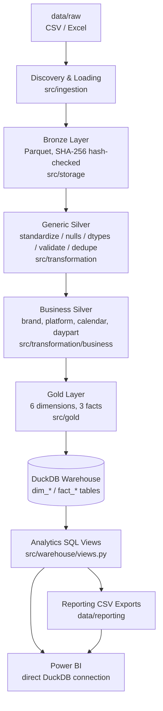
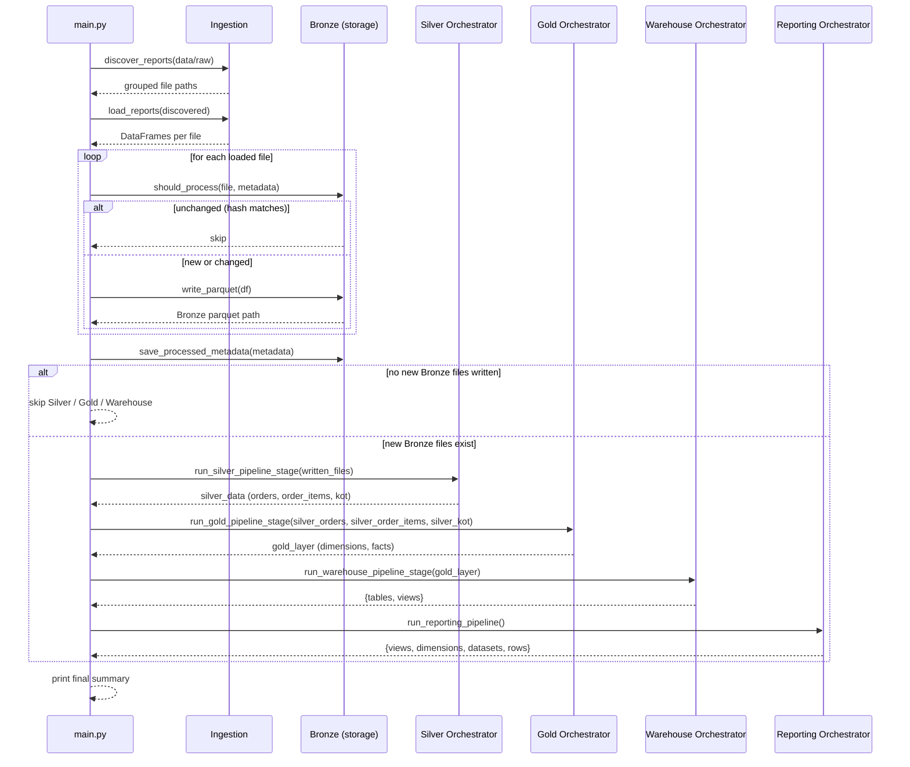
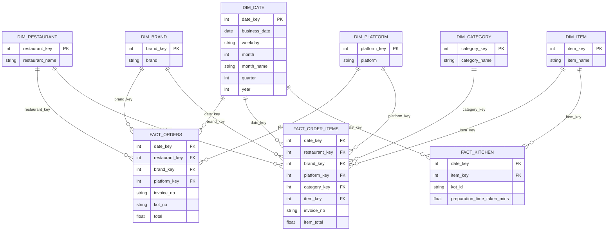
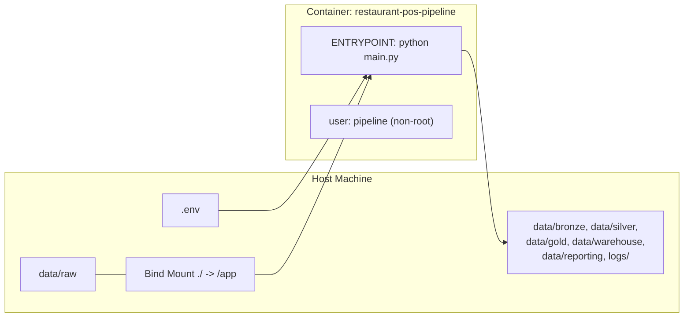

# Restaurant POS ELT Pipeline — Architecture

## Table of Contents

- [Overall Architecture](#overall-architecture)
- [Medallion Architecture](#medallion-architecture)
- [End-to-End Data Flow](#end-to-end-data-flow)
- [Component Interaction](#component-interaction)
- [Execution Lifecycle](#execution-lifecycle)
- [Docker Architecture](#docker-architecture)
- [Reporting Architecture](#reporting-architecture)
- [Power BI Integration](#power-bi-integration)
- [Mermaid Diagrams](#mermaid-diagrams)
- [Engineering Decisions](#engineering-decisions)
- [Scalability](#scalability)
- [Trade-offs](#trade-offs)

---

## Overall Architecture

The pipeline is a **single-process, batch ELT system** structured as a sequence of independent stages, each implemented as its own Python package under `src/`. Every stage follows the same internal shape:

- a **pure transformation/build module** (or set of modules) containing no I/O,
- a **runner** that composes those pure modules against real data,
- a **writer** that owns persistence for that stage only, and
- an **orchestrator** that sequences runner → writer and reports a summary.

`main.py` is the single entry point that wires every stage's orchestrator together in order: Bronze ingestion → Silver orchestrator → Gold orchestrator → Warehouse orchestrator → Reporting orchestrator. No stage imports another stage's internals directly except through its public orchestrator function, which keeps the layers independently testable and independently replaceable.

## Medallion Architecture

The pipeline implements the **Bronze / Silver / Gold Medallion Architecture**:

- **Bronze (`data/bronze/`)** — an untouched, schema-preserved copy of every raw source file, converted only from CSV/Excel to Parquet. No cleaning, renaming, or business logic is applied. Bronze exists purely to give the pipeline a fast, columnar, replay-able copy of raw input.
- **Silver (`data/silver/`)** — cleaned, standardized, de-duplicated data with inferred datatypes (`src/transformation/pipeline.py`), further enriched for the order-summary dataset with restaurant-domain business context: brand, platform, business calendar attributes, and daypart (`src/transformation/business/enricher.py`). This is commonly referred to internally as **Generic Silver** (the five dataset-agnostic steps) followed by **Business Silver** (the restaurant-specific enrichment).
- **Gold (`data/gold/`)** — a conformed dimensional (star schema) model built exclusively from Silver: 6 dimensions and 3 facts, joined via generated surrogate keys rather than natural keys, ready for direct consumption by an analytical warehouse.

This progressive-refinement approach means every layer can be inspected, reprocessed, or rebuilt independently — for example, the Gold layer can be rebuilt from Silver without re-reading or re-cleaning any raw file.

## End-to-End Data Flow

```
data/raw/{order_summary, order_summary_item, kot_process_time}/*.{csv,xlsx}
        |  discover_reports()              [src/ingestion/discovery.py]
        v
   grouped file paths by report name
        |  load_reports()                  [src/ingestion/loader.py]
        v
   pandas DataFrames (raw, per source file)
        |  should_process() / write_parquet()  [src/storage]
        v
data/bronze/<report_name>/<file>.parquet
        |  load_bronze_data()               [src/silver/reader.py]
        v
   run_silver_pipeline()                    [src/transformation/pipeline.py]
   (standardize -> nulls -> datatypes -> validate -> dedupe)
        |
        v
   enrich_business_attributes()             [src/transformation/business/enricher.py]
   (order_summary dataset only: brand, platform, calendar, daypart, validation errors)
        |  write_silver_data()               [src/silver/writer.py]
        v
data/silver/<report_name>/<file>.parquet
        |  build_gold_layer()                [src/gold/runner.py]
        v
   6 Gold dimensions + 3 Gold facts (surrogate-keyed)
        |  write_gold_layer()                [src/gold/writer.py]
        v
data/gold/{dim_*, fact_*}/<name>.parquet
        |  write_warehouse()                 [src/warehouse/writer.py]
        v
data/warehouse/restaurant_pos.duckdb  (dim_* / fact_* tables)
        |  create_views()                    [src/warehouse/views.py]
        v
   Analytics SQL views (vw_daily_sales, vw_platform_performance, ...)
        |  publish_views() / publish_dimensions()  [src/reporting/publisher.py]
        v
data/reporting/{views,dimensions}/*.csv
        |
        v
   Power BI (powerbi/dashboards/Restaurant_POS_Analytics.pbix)
```

## Component Interaction

Every stage exposes exactly one public orchestrator function, and `main.py` calls only those functions:

| Stage | Orchestrator Entry Point | Depends On |
|---|---|---|
| Ingestion | `discover_reports()`, `load_reports()` (called directly from `main.py`) | Filesystem (`data/raw/`) |
| Bronze | `should_process()`, `write_parquet()` (called directly from `main.py`) | Ingestion output, `data/metadata/processed_files.json` |
| Silver | `run_silver_pipeline_stage()` | Bronze Parquet files |
| Gold | `run_gold_pipeline_stage()` | Silver DataFrames (orders, order items, KOT) returned in-memory from the Silver stage |
| Warehouse | `run_warehouse_pipeline_stage()` | Gold DataFrames, returned in-memory from the Gold stage |
| Reporting | `run_reporting_pipeline()` | The DuckDB warehouse file and its analytics views (queried fresh, not passed in-memory) |

A deliberate design choice is visible in this table: Silver → Gold → Warehouse pass data **in-memory** (as DataFrames returned from one orchestrator into the next), while Warehouse → Reporting is **decoupled through the DuckDB file on disk**. This means the Reporting stage can be re-run independently at any time (e.g. to republish CSVs without rebuilding Gold), as long as the warehouse file already exists.

## Execution Lifecycle

A single invocation of `python main.py` proceeds through this lifecycle:

1. **Scan** `data/raw/` recursively and group discovered files by report name.
2. **Load** every discovered file into a DataFrame via the CSV or Excel reader.
3. **Hash-check** each loaded file against `data/metadata/processed_files.json`; unchanged files are skipped, new/changed files are marked for writing.
4. **Write Bronze** Parquet files for every file that needs (re)processing, then persist the updated metadata.
5. **Conditional branch**: if zero files were newly written to Bronze, the Silver, Gold, and Warehouse stages are explicitly skipped for this run (there is nothing new to propagate), and the pipeline reports `Silver Layer: Skipped`.
6. If new Bronze files exist: **run Silver** (generic transformation + Business Silver enrichment) over every Bronze dataset that was passed to it, and write the results.
7. **Run Gold**: build all 6 dimensions and 3 facts from the enriched Silver `order_summary`, `order_summary_item`, and `kot_process_time` DataFrames, and write them to Parquet.
8. **Run Warehouse**: materialize the Gold DataFrames into DuckDB tables and (re)create every analytics SQL view.
9. **Run Reporting**: query every configured analytics view and dimension from DuckDB and publish each as a CSV file.
10. **Print a final summary** of files written/skipped, Silver status, Gold dimension/fact counts, Warehouse table/view counts, and Reporting dataset/row counts.

Note that step 5 means the Silver, Gold, and Warehouse stages currently only ever process the files written *in that specific run* (`written_files`, threaded through `run_silver_pipeline_stage(written_files=...)`), not the full historical Bronze/Silver corpus. A run that finds new files reprocesses only those new files' lineage, not the entire dataset history.

## Docker Architecture

The pipeline ships with a minimal, single-service container definition:

- **`Dockerfile`** — based on `python:3.14-slim`, installs only `requirements/requirements-runtime.txt` (the dev/test dependency set is intentionally excluded from the image), creates and switches to a non-root `pipeline` user, defines a `HEALTHCHECK` that simply verifies the Python interpreter responds, and sets `ENTRYPOINT ["python", "main.py"]` so the container's default action is to run the full pipeline.
- **`docker-compose.yml`** — defines a single `restaurant-pos-pipeline` service built from the Dockerfile, mounts the entire project directory into `/app` (so `data/`, `logs/`, and source changes are reflected without rebuilding the image), loads environment variables from `.env`, and sets `restart: "no"` since this is a run-to-completion batch job, not a long-running service.
- **`Makefile`** — wraps the common Docker Compose commands (`build`, `run`, `down`, `rebuild`, `logs`, `shell`, `clean`) so the pipeline can be operated without memorizing Compose syntax.

```
docker compose up
        |
        v
+-------------------------------------------+
|  restaurant-pos-pipeline (container)       |
|  image: restaurant-pos-elt-pipeline:latest |
|  entrypoint: python main.py                |
|  user: pipeline (non-root)                 |
|                                             |
|  volume mount: ./  ->  /app                 |
|  env_file: .env                             |
+-------------------------------------------+
        |
        v
   data/, logs/ on the host filesystem
   (persisted outside the container lifecycle)
```

Because the entire project directory is bind-mounted rather than baked into the image, the container always operates on the host's current `data/raw/` contents and writes Bronze/Silver/Gold/Warehouse/Reporting output straight back to the host filesystem — there is no separate data-copy or artifact-extraction step required after a run.

## Reporting Architecture

The Reporting layer is deliberately the **only** stage that reads the warehouse back from disk rather than receiving data in-memory from the previous stage, and it treats DuckDB as a read-only source:

- `src/reporting/reporting_config.py` centralizes *only* configuration: the warehouse path, output folder paths, and two whitelists — `REPORTING_VIEWS` and `REPORTING_DIMENSIONS` — naming exactly which DuckDB objects get published.
- `src/reporting/publisher.py` opens a DuckDB connection, runs `SELECT * FROM <name>` for every whitelisted view/dimension, and hands each resulting DataFrame to the exporter.
- `src/reporting/exporter.py` is a generic, project-agnostic CSV writer with no knowledge of DuckDB, restaurants, or dimensional modeling — it only knows how to write a DataFrame to a path and create missing directories.
- `src/reporting/orchestrator.py` sequences "publish all views" then "publish all dimensions" and logs a combined summary (datasets published, total rows exported).

**Known current-state gap:** `REPORTING_VIEWS` in `reporting_config.py` lists 16 view names, but the view-creation module (`src/warehouse/views.py`) currently only defines SQL for 9 of them (`vw_daily_sales`, `vw_platform_performance`, `vw_brand_performance`, `vw_category_performance`, `vw_item_performance`, `vw_kitchen_performance`, `vw_daypart_sales`, `vw_order_type_performance`, `vw_order_status_analysis`). The remaining 7 (`vw_aov_analysis`, `vw_brand_sales`, `vw_category_sales`, `vw_charge_analysis`, `vw_discount_analysis`, `vw_item_sales`, `vw_platform_sales`) already exist as views inside the committed `data/warehouse/restaurant_pos.duckdb` file — and their CSV exports are present under `data/reporting/views/` — but their `CREATE VIEW` statements are not present in the current `views.py` source. In other words, the warehouse file currently on disk contains more views than the checked-in source code would recreate if `create_views()` were run against a fresh warehouse. This is a real gap between source and artifact that should be resolved by porting the missing view definitions into `views.py` before the next warehouse rebuild.

## Power BI Integration

Power BI is positioned as a **pure consumer** at the end of the pipeline, and the codebase enforces a specific, documented boundary:

> "Power BI consumes only these SQL Views — it never queries the Warehouse tables or Gold directly. This separation is a frozen architectural decision of the project." — `src/warehouse/views.py`

This gives two integration paths, both already present as artifacts in the repository:

1. **Direct DuckDB connection** — Power BI (or any BI/SQL client with a DuckDB driver) connects to `data/warehouse/restaurant_pos.duckdb` and queries the `vw_*` views only.
2. **CSV import** — Power BI imports the published files under `data/reporting/views/` and `data/reporting/dimensions/` directly, which is a fully warehouse-independent path.

The repository includes the resulting deliverables: `powerbi/dashboards/Restaurant_POS_Analytics.pbix` (the Power BI project file), `powerbi/exports/dashboards.pdf` (a static export of the report pages), three dashboard screenshots (`executive_business_performance.png`, `sales_performance_analysis.png`, `operational_performance_analysis.png`) reflecting the three reporting personas the views are organized around (executive/business, sales, and kitchen/operations), and a custom `powerbi/themes/Theme.json` used to keep visual styling consistent across the report.

## Mermaid Diagrams

### Medallion pipeline flow



### Execution sequence (`python main.py`)



### Gold star schema (entity relationship)



### Docker execution architecture



## Engineering Decisions

- **DataFrames in-memory between Silver, Gold, and Warehouse, but a file-based handoff between Warehouse and Reporting.** This keeps the hot path (Silver → Gold → Warehouse) fast within a single run, while still allowing the Reporting stage to be re-triggered independently against an already-materialized warehouse.
- **Business logic lives in pure, dependency-light functions.** Modules like `calendar.py` and `daypart.py` accept a plain `datetime.datetime` (or `pandas.Timestamp`, which subclasses it) and deliberately avoid importing pandas, so they can be unit-tested with zero fixtures and reused outside a DataFrame context.
- **Standardization degrades gracefully.** `brand.py` and `platform.py` return the original (trimmed) value for any variant they don't recognize, rather than raising or nulling it out — so an unmapped brand/platform still flows through the pipeline and is caught later by `quality.py`'s validation pass, rather than silently disappearing.
- **Validation is observability, not an enforcement gate.** `business_validator.py` (Generic Silver) and `quality.py` (Business Silver) both produce lists of human-readable violation messages attached to the data (or its metadata) rather than raising exceptions or dropping rows — bad data is surfaced, not hidden or blocked.
- **Surrogate keys, not natural keys, join facts to dimensions.** `src/gold/lookup.py` performs every fact-to-dimension join via a generated integer surrogate key looked up by business attribute (e.g. `restaurant_name`, `brand`, `platform`), which is the standard Kimball-style dimensional modeling approach and insulates facts from future natural-key changes (e.g. a brand rename).
- **DuckDB materialization uses SQL, not `DataFrame.to_sql()`.** `src/warehouse/writer.py` registers each DataFrame as a temporary DuckDB relation and issues `CREATE OR REPLACE TABLE ... AS SELECT * FROM ...`, which is significantly faster than row-by-row or chunked SQLAlchemy inserts for the analytical, columnar workload this pipeline produces.
- **The Analytics View layer is a frozen boundary.** The codebase explicitly documents that Power BI must never query `dim_*`/`fact_*` tables directly — only `vw_*` views — so that the physical Gold model can evolve without breaking every Power BI report that depends on it.
- **Incremental processing is content-based, not timestamp-based.** `should_process()` compares a SHA-256 hash, not a file modification time, so a file that is re-saved with identical content (a common occurrence with manual exports) is correctly skipped rather than needlessly reprocessed.

## Scalability

- **Vertical, single-node scalability today.** The pipeline is built on pandas and DuckDB, both of which operate in a single process and scale with the memory and CPU of the machine (or container) running them. For the current data volumes (tens of thousands of orders per month, per the committed sample) this is comfortably within pandas' effective range.
- **Parquet + columnar storage is chosen deliberately for scale headroom.** Because Bronze, Silver, and Gold are all persisted as Parquet (rather than CSV), the pipeline already benefits from compression and columnar I/O, which keeps read/write costs low as historical volume grows.
- **Incremental ingestion bounds the cost of repeated runs.** Because only new/changed raw files are hashed, loaded, and pushed through Silver/Gold/Warehouse, the pipeline's per-run cost scales with *new* data volume, not total historical volume — a critical property as the raw dataset grows across many months.
- **DuckDB is the natural next scaling lever.** DuckDB can operate directly against Parquet files (including out-of-core execution for datasets larger than memory) without a schema change to the Gold layer, giving a clear scale-up path before a move to a client-server warehouse would be required.
- **Current limitation: full-history Gold rebuild is not incremental.** `build_gold_layer()` is called with the Silver DataFrames produced by the *current run only* (see [Execution Lifecycle](#execution-lifecycle)); there is no logic in this repository to merge newly-built Gold facts/dimensions with previously-written Gold Parquet files or existing DuckDB tables across separate runs beyond DuckDB's `CREATE OR REPLACE TABLE` (which replaces the whole table each run). Scaling to a true incrementally-updated warehouse would require either processing the full Silver history on every run (as the current architecture does implicitly, since each run's `written_files` still get threaded through consistently within that run) or adding an explicit merge/upsert step.

## Trade-offs

| Decision | Benefit | Cost |
|---|---|---|
| pandas + DuckDB (embedded) instead of a distributed engine (Spark) or hosted warehouse | Zero infrastructure, trivial local/CI setup, fast for current data volume | No built-in horizontal scaling; large future volume growth would require re-architecting the compute layer |
| Content-hash (SHA-256) incremental checks instead of timestamp/watermark tracking | Immune to false positives from re-saved/re-exported files with identical content | Requires reading the full byte content of every raw file on every run just to compute the hash, even for files that turn out to be unchanged |
| Business enrichment (brand/platform/calendar/daypart) implemented only for `order_summary` | Keeps the enrichment logic focused and simple; avoids speculative generalization to datasets that don't yet need it | `order_summary_item` and `kot_process_time` do not carry brand/platform context directly, requiring `order_items.py` to re-join order-header context from `silver_orders` to backfill it for `FactOrderItems`, and `FactKitchen` to omit brand/platform/restaurant keys entirely |
| Validation reports errors instead of blocking the pipeline | The pipeline never halts or loses data because of a data-quality issue; issues are visible for follow-up | Known-bad data (unknown brand/platform, missing dates) still flows all the way to Gold and the warehouse unless a downstream consumer explicitly filters on `business_validation_errors` |
| Analytics views layer decoupled from physical Gold tables | Power BI reports are insulated from Gold schema evolution | Introduces a layer that must be kept in sync manually — the current gap between `reporting_config.py`'s 16 configured views and the 9 views defined in `views.py` (see [Reporting Architecture](#reporting-architecture)) is a direct consequence of this manual synchronization requirement |
| Reporting stage re-reads the warehouse from disk rather than receiving Gold DataFrames in-memory | Reporting can be re-run independently of a full pipeline run, and only ever reflects what is actually persisted in the warehouse | Adds a full round-trip through DuckDB (write, then immediately read back) within the same pipeline invocation, which is unnecessary I/O when Reporting always runs right after Warehouse in `main.py` |
