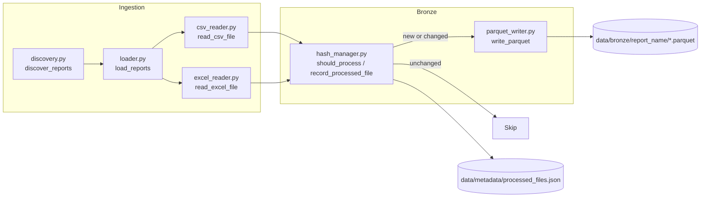
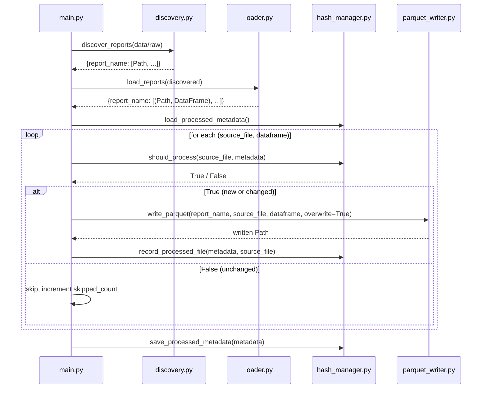
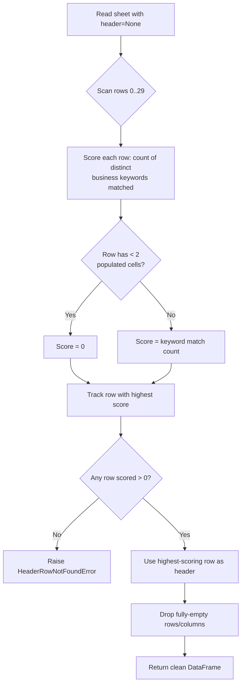

# Bronze Layer

## Table of Contents

- [Overview](#overview)
- [Purpose](#purpose)
- [Business Context](#business-context)
- [Engineering Context](#engineering-context)
- [Folder References](#folder-references)
- [Architecture](#architecture)
- [Workflow](#workflow)
- [Step-by-Step Processing](#step-by-step-processing)
- [Header Detection Algorithm (Excel)](#header-detection-algorithm-excel)
- [Incremental Processing (Hash Manager)](#incremental-processing-hash-manager)
- [Parquet Writer](#parquet-writer)
- [Best Practices Applied](#best-practices-applied)
- [Design Decisions](#design-decisions)
- [Trade-offs](#trade-offs)
- [Performance Considerations](#performance-considerations)
- [Scalability Discussion](#scalability-discussion)
- [Maintainability Discussion](#maintainability-discussion)
- [Summary](#summary)

---

## Overview

The Bronze layer is the first persisted stage of the pipeline. It takes raw
POS export files from `data/raw/` — CSV and Excel — and converts them into
an immutable, hash-verified Parquet copy under `data/bronze/`, without
applying any cleaning, transformation, or business logic. Its sole
responsibilities are **discovery**, **reading**, **change detection**, and
**persistence**.

## Purpose

Bronze exists to create a durable, format-normalized (Parquet) snapshot of
every raw file the pipeline has ever seen, while avoiding redundant
reprocessing of files that have not changed. It is the foundation the
Silver layer reads from — Silver never touches `data/raw/` directly.

## Business Context

Restaurant POS exports arrive as ad-hoc CSV/Excel dumps, generated on
demand from the POS vendor's reporting UI (visible in the raw filenames,
e.g. `KOT_Itemwise_Process_Time_2026_06_29_11_45_43.xlsx`,
`Order_Summary_Report_2026-05.csv`). These exports are not guaranteed to be
delivered exactly once, and the same logical report may be re-exported
(same filename, refreshed content) if a correction is needed. Bronze's
hash-based change detection means the business can safely re-drop the same
export file into `data/raw/` without fear of duplicating downstream data —
unchanged files are skipped automatically.

## Engineering Context

Three source modules jointly implement ingestion into Bronze:

| Module | Responsibility |
|---|---|
| `src/ingestion/discovery.py` | Recursively scan `data/raw/`, group files by parent folder name |
| `src/ingestion/csv_reader.py` / `excel_reader.py` | Read a single file into a DataFrame |
| `src/ingestion/loader.py` | Dispatch each discovered file to the correct reader |
| `src/storage/hash_manager.py` | SHA256 hashing + `processed_files.json` metadata ledger |
| `src/storage/parquet_writer.py` | Persist a DataFrame as Parquet under `data/bronze/<report_name>/` |

All five modules are deliberately narrow: none of them validate business
rules, standardize column names, or infer datatypes — that is Silver's job.

## Folder References

```text
data/raw/
├── order_summary/                  # Order_Summary_Report_YYYY-MM.csv
├── order_summary_item/             # Order_Summary_Item_Report_YYYY-MM.csv
└── kot_process_time/               # KOT_Itemwise_Process_Time_*.xlsx

data/bronze/
├── order_summary/                  # <source_stem>.parquet
├── order_summary_item/
└── kot_process_time/

data/metadata/
└── processed_files.json            # {filename: {hash, processed_time}}
```

The parent folder name under `data/raw/` (e.g. `order_summary`) becomes the
**report name**, which is reused verbatim as the Bronze sub-folder name and
later as the Silver dataset key.

## Architecture



## Workflow



## Step-by-Step Processing

1. **Discovery** (`discover_reports()`): recursively walks `data/raw/` with
   `Path.rglob("*")`. For each file found, it:
   - Skips anything inside a hidden directory (name starts with `.`) or an
     explicitly ignored directory (`__MACOSX`, common in macOS-zipped
     exports).
   - Skips hidden files (dotfiles, e.g. `.DS_Store`).
   - Keeps only files whose extension is `.csv` or `.xlsx`
     (`SUPPORTED_EXTENSIONS`).
   - Groups the surviving files by their **immediate parent folder name**
     (`path.parent.name`), which is the report/table name.
   - Raises `RawDirectoryNotFoundError` if `data/raw/` doesn't exist, and
     `NoSupportedFilesFoundError` if the scan finds zero supported files —
     both are fail-fast, not silent-empty-return, errors.
   - Each group's file list is sorted alphabetically before being returned.

2. **Loading** (`load_reports()` / `loader.py`): for every discovered file,
   dispatches to `read_csv_file()` or `read_excel_file()` based on
   extension (`READER_DISPATCH`). Per-file failures (unsupported type,
   missing file, unreadable/corrupt content) are caught, logged, and
   **skipped** rather than aborting the whole batch — one bad file does not
   take down ingestion for every other file.

3. **Bronze hash check** (`should_process()`): for each loaded
   `(source_file, dataframe)` pair, computes the file's current SHA256 and
   compares it against the stored hash for that exact filename in
   `processed_files.json`. A file is skipped only if **both** the filename
   is already known **and** the hash matches; otherwise it proceeds.

4. **Bronze write** (`write_parquet()`): writes the DataFrame to
   `data/bronze/<report_name>/<source_file_stem>.parquet` using
   `pyarrow.parquet.write_table(..., compression="snappy")`, always with
   `overwrite=True` from `main.py`'s call site (re-processing a changed
   file replaces its Bronze copy).

5. **Metadata update** (`record_processed_file()` +
   `save_processed_metadata()`): the in-memory metadata dict is updated
   with the new hash and a UTC timestamp, then the entire dict is
   re-serialized to `data/metadata/processed_files.json` as indented,
   sorted JSON.

## Header Detection Algorithm (Excel)

The KOT (Kitchen Order Ticket) process-time reports are the one raw source
that cannot be read with a naive `pd.read_excel()` call, because the POS
vendor's export format places a variable-length block of report metadata
(title, date range, filters) **above** the real header row, and this block
is not a consistent number of rows across exports.

`excel_reader.py` solves this with a **content-based header detection**
strategy rather than a structural one (e.g. "widest row"):

1. The sheet is first read entirely with `header=None`, so every row —
   metadata and data alike — is available as plain data.
2. Each of the first `MAX_HEADER_SCAN_ROWS` (30) rows is scored by
   `_score_row()`: the row's non-empty cells are normalized (lowercased,
   trimmed) and checked against a fixed list of `BUSINESS_COLUMN_KEYWORDS`
   (e.g. `"kot"`, `"item name"`, `"quantity"`, `"process time"`, `"brand"`).
   A row scores one point **per distinct keyword matched**, not per cell,
   so a row's score reflects how many different business concepts it
   covers.
3. Rows with fewer than two populated cells are scored zero outright — this
   prevents a single-cell report title (which might coincidentally contain
   a business keyword, e.g. "KOT Process Time Report") from being mistaken
   for the real header.
4. The row with the **highest score** across the scanned range is selected
   as the header row. If no row scores above zero,
   `HeaderRowNotFoundError` is raised.
5. Once the header row is located, everything above and including it is
   discarded from the data body; the header row's values become the column
   names; and fully-empty rows/columns (common as blank separator rows or
   stray side columns) are dropped.



Both `csv_reader.py` and `excel_reader.py` also attach `source_file` and
`source_path` to `DataFrame.attrs` for downstream traceability, and
`csv_reader.py` retries with `utf-8-sig` encoding if strict UTF-8 decoding
fails (common when a CSV was exported by Excel with a BOM).

## Incremental Processing (Hash Manager)

`hash_manager.py` is the change-detection engine for the entire pipeline's
incrementality. Its contract is simple and auditable:

```json
{
  "Order_Summary_Report_2026-05.csv": {
    "hash": "b94d27b9934d3e08a52e52d7da7dabfa...",
    "processed_time": "2026-07-01T10:15:32.123456+00:00"
  }
}
```

- `calculate_file_hash()` streams the file in 1 MB chunks
  (`_HASH_CHUNK_SIZE`) through `hashlib.sha256()`, so memory use does not
  scale with file size.
- `should_process()` returns `False` only when **both** the filename
  already exists in metadata **and** its current hash matches the stored
  hash — meaning:
  - An unchanged file (same name, same content) → skipped.
  - A **corrected** file (same name, different content) → reprocessed.
  - A brand-new filename → always processed.
- `load_processed_metadata()` / `save_processed_metadata()` handle the JSON
  ledger's full lifecycle, including returning an empty dict gracefully if
  the metadata file doesn't exist yet or is empty (first-ever run).

## Parquet Writer

`parquet_writer.py` performs the actual Bronze persistence:

- Destination path convention: `data/bronze/<report_name>/<source_file_stem>.parquet`.
- Uses `pyarrow.Table.from_pandas(dataframe, preserve_index=False)` +
  `pq.write_table(..., compression="snappy")` — bypassing Pandas'
  `to_parquet()` convenience wrapper in favor of the explicit PyArrow API,
  giving direct control over compression codec and avoiding the pandas
  index being written as a spurious column.
- Validates inputs defensively (`report_name` must be non-empty,
  `dataframe` must actually be a `pd.DataFrame`) and raises a
  `ParquetWriteError` (wrapping the underlying `OSError`/`ArrowException`)
  on any I/O failure, rather than letting a raw PyArrow exception leak to
  the caller.
- Supports `overwrite=False` as a safety default for callers who want
  write-once semantics; `main.py` explicitly opts into `overwrite=True`
  since Bronze re-processing is intentional when content changes.

## Best Practices Applied

- Fail-fast, typed exceptions at every boundary (`RawDirectoryNotFoundError`,
  `NoSupportedFilesFoundError`, `UnsupportedFileTypeError`, `CSVReadError`,
  `ExcelReadError`, `HeaderRowNotFoundError`, `ParquetWriteError`) instead of
  generic exceptions or silent failures.
- Per-file isolation during loading: one corrupt file is logged and skipped,
  not fatal to the batch.
- Deterministic, sorted output ordering (`discovered[report_name].sort()`)
  for reproducible runs.
- Traceability metadata (`source_file`, `source_path`) attached to every
  DataFrame at the point of read.

## Design Decisions

- **Group by parent folder name, not by filename pattern.** This makes the
  discovery mechanism agnostic to naming conventions — any file dropped
  into `data/raw/order_summary/` is treated as part of the `order_summary`
  report, regardless of its filename.
- **Content-based (not row-count-based) Excel header detection.** A fixed
  "skip N rows" assumption would break the moment the POS vendor changed
  the metadata block length; keyword scoring is resilient to that.
- **Filename + hash, not hash alone, as the change-detection key.** Using
  hash alone would mean a renamed-but-identical file is silently
  reprocessed as new (acceptable), and a same-named-but-corrected file
  needs the combination to correctly distinguish "new version of a known
  report" from "brand-new report."

## Trade-offs

| Decision | Benefit | Cost |
|---|---|---|
| File-level (not row-level) incrementality | Simple, auditable JSON ledger | A single changed row forces the entire file's Bronze copy (and downstream Silver/Gold rebuild) to be redone |
| Keyword-scoring header detection | Resilient to metadata block length/shape changes | A completely unfamiliar POS export vocabulary (no matching keywords) will fail loudly rather than guess |
| Per-file error isolation in `loader.py` | One bad file doesn't halt the whole ingestion run | Failures are only logged, so a persistently failing file could go unnoticed without active log monitoring |

## Performance Considerations

- Streamed SHA256 hashing avoids loading entire files into memory purely
  for fingerprinting.
- Snappy compression on Parquet write balances compression ratio against
  CPU cost, appropriate for a batch pipeline that is re-run periodically
  rather than continuously.
- Header detection scans at most 30 rows regardless of sheet size, bounding
  the cost of Excel ingestion independent of how large the actual data
  table is.

## Scalability Discussion

Because incrementality is filename+hash based, the pipeline scales well
with **more distinct files** (each new file is an O(1) lookup against the
metadata dict) but not with **very large individual files**, since each
file is still hashed and loaded into memory as a whole DataFrame. For
substantially larger POS exports, chunked/streaming CSV reads
(`pd.read_csv(..., chunksize=...)`) would be a natural extension without
disrupting the discovery/hash/write contract described here.

## Maintainability Discussion

Adding support for a new raw file format (e.g. `.json` or `.parquet`
sources) requires touching exactly two places: adding the extension to
`SUPPORTED_EXTENSIONS` in `discovery.py`, and registering a new reader
function in `READER_DISPATCH` in `loader.py`. No changes are needed to the
hash manager, the Parquet writer, or any downstream layer, because Bronze's
contract is simply "a DataFrame in, a Parquet file out."

## Summary

The Bronze layer's job is narrow and disciplined: discover files, read them
into DataFrames without altering their content, detect whether they are
genuinely new or changed via SHA256, and persist them as compressed Parquet
with zero business logic applied. This narrowness is what allows the
Silver layer (documented next in [silver_layer.md](silver_layer.md)) to
assume a single, predictable input contract — a directory of Parquet files
grouped by report name — regardless of how messy or inconsistent the
original raw export was.
