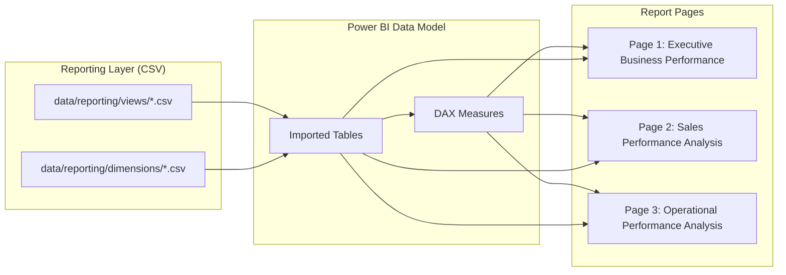

# Dashboard Design

## Table of Contents

- [Overview](#overview)
- [Purpose](#purpose)
- [Business Context](#business-context)
- [Engineering Context](#engineering-context)
- [Folder References](#folder-references)
- [Dashboard Architecture](#dashboard-architecture)
- [Page 1: Executive Business Performance](#page-1-executive-business-performance)
- [Page 2: Sales Performance Analysis](#page-2-sales-performance-analysis)
- [Page 3: Operational Performance Analysis](#page-3-operational-performance-analysis)
- [Cross-Page Filtering Model](#cross-page-filtering-model)
- [Design Decisions](#design-decisions)
- [Trade-offs](#trade-offs)
- [Maintainability Discussion](#maintainability-discussion)
- [Summary](#summary)

---

## Overview

The dashboard layer of this project is a single Power BI report, `Restaurant_POS_Analytics.pbix`, stored at `powerbi/dashboards/Restaurant_POS_Analytics.pbix`. A static PDF export of the same report is checked into `powerbi/exports/dashboards.pdf` for quick viewing without opening Power BI Desktop.

The report contains **three pages** (Power BI calls them "sections"):

| Page | Internal Section Name | Focus |
|---|---|---|
| 1 | Executive Business Performance | High-level sales and order KPIs for leadership |
| 2 | Sales Performance Analysis | Revenue breakdowns by brand, category, item, and discounting |
| 3 | Operational Performance Analysis | Kitchen speed, order status, and charge composition |

This inventory was extracted directly from the report's `Report/Layout` definition (a PBIX file is a ZIP archive; `Report/Layout` is a UTF-16 encoded JSON document describing every page, visual, and field binding), so the structure below reflects what is actually built in the file, not an idealized plan.

There is no Python or web code implementing these dashboards — `src/dashboard/__init__.py` exists as an empty placeholder module and contains no dashboard logic. All visualization work lives inside the `.pbix` file itself.

## Purpose

The dashboard layer is the final consumption point of the Medallion pipeline. Its job is to turn the Reporting Layer's CSV outputs (`data/reporting/views/*.csv` and `data/reporting/dimensions/*.csv`) into visual, filterable, and shareable analysis for three different audiences inside the restaurant business: ownership/leadership, the sales/marketing function, and kitchen operations.

## Business Context

A multi-brand, multi-platform restaurant operation generates three distinct questions that a single flat report cannot answer well:

- **"How is the business doing overall, and where is it trending?"** — answered by Page 1.
- **"Which brands, categories, items, and discounts are driving (or eroding) revenue?"** — answered by Page 2.
- **"Is the kitchen keeping up, and where are orders failing or getting delayed?"** — answered by Page 3.

Separating these into three pages avoids overloading any one audience with metrics they don't act on, while still sharing a common filter context (date, brand, platform) so any user can pivot between the executive view and the operational detail without losing their current selection.

## Engineering Context

Every visual on every page is bound to one of two sources:

1. **DAX measures** defined inside the Power BI data model (e.g. `Net Sales`, `Average Order Value`, `Orders`, `Average Discount %`, `Average Preparation Time`, `Kitchen Tickets`, `Slow Kitchen Tickets`, `Tax`).
2. **Reporting View columns**, imported directly from the CSVs published by the Reporting Layer (e.g. `vw_daily_sales`, `vw_brand_performance`, `vw_platform_performance`, `vw_category_sales`, `vw_kitchen_performance`, `vw_order_status_analysis`, `vw_charge_analysis`, `vw_discount_analysis`).

This means the dashboard never re-derives business logic that already lives in the warehouse SQL views (see `powerbi_integration.md` for the full data flow) — it only aggregates and visualizes what the Analytics Layer has already computed.

## Folder References

```
powerbi/
├── dashboards/
│   └── Restaurant_POS_Analytics.pbix   # The report itself (3 pages)
├── exports/
│   └── dashboards.pdf                  # Static export of all pages
└── screenshots/                        # (present, no additional dashboard logic)

data/reporting/
├── views/       # 16 CSVs consumed as Power BI tables/measures sources
└── dimensions/  # 6 CSVs consumed as slicer/lookup tables

src/dashboard/
└── __init__.py  # Empty placeholder — no dashboard code in this repo
```

## Dashboard Architecture



## Page 1: Executive Business Performance

**Audience:** Ownership and leadership who need a fast, top-of-funnel read on the business.

| Visual Type | Content |
|---|---|
| Card | Net Sales |
| Card | Average Order Value |
| Card | Orders |
| Card | Gross Sales |
| Line + clustered column combo chart | Daily gross sales trend with order count overlay, from `vw_daily_sales` (`business_date`, `gross_sales`, `Orders` measure) |
| Clustered bar chart | Net sales by platform, from `vw_platform_performance` |
| Clustered bar chart | Net sales by brand, from `vw_brand_performance` |
| Column chart | Gross sales by daypart, from `vw_daypart_sales` |
| Slicer | Date (`dim_date.business_date`) |
| Slicer | Brand (`dim_brand.brand`) |
| Slicer | Platform (`dim_platform.platform`) |
| Textbox | Page title ("Executive Business Performance") |

**Design intent:** four KPI cards establish scale immediately, the combo chart shows trend and volume together, and the two bar charts plus the daypart column chart let leadership see *where* that volume is concentrated (channel, brand, time of day) in one glance.

## Page 2: Sales Performance Analysis

**Audience:** Revenue/commercial analysis — brand, category, item, and discount performance.

| Visual Type | Content |
|---|---|
| Card | Gross Sales |
| Card | Average Order Value |
| Card | Net Sales |
| Card | Average Discount % |
| Clustered bar chart | Net sales by brand, from `vw_brand_sales` |
| Clustered bar chart | Revenue by category, from `vw_category_sales` |
| Clustered column chart | Net sales by order type, from `vw_order_type_performance` |
| Line chart | Discount percentage over time (day-level date hierarchy), from `vw_discount_analysis` |
| Clustered bar chart | Revenue by item, from `vw_item_sales` |
| Slicer | Date (`dim_date.business_date`) |
| Slicer | Brand (`dim_brand.brand`) |
| Slicer | Platform (`dim_platform.platform`) |
| Textbox | Page title ("Sales Performance Analysis") |

**Design intent:** this page decomposes the same top-line revenue shown on Page 1 into the dimensions a commercial analyst actually acts on — brand, category, item, order type, and discount trend — using the same slicer set so an analyst can jump here from the executive page without re-filtering.

## Page 3: Operational Performance Analysis

**Audience:** Kitchen and operations management.

| Visual Type | Content |
|---|---|
| Card | Average Preparation Time |
| Card | Kitchen Tickets |
| Card | Slow Kitchen Tickets |
| Card | Tax |
| Clustered bar chart | Average preparation time by server, from `vw_kitchen_performance` |
| Clustered column chart | Orders by status, from `vw_order_status_analysis` |
| Column chart | Delivery, container, and service charges over time (day/month date hierarchy), from `vw_charge_analysis` |
| Clustered bar chart | Orders by cancellation reason, from `vw_order_status_analysis` |
| Slicer | Date (`dim_date.business_date`) |
| Slicer | Brand (`dim_brand.brand`) |
| Slicer | Platform (`dim_platform.platform`) |
| Textbox | Page title ("Operational Performance Analysis") |

**Design intent:** operations cares about speed (`Average Preparation Time`, `Slow Kitchen Tickets`), fulfillment health (order status, cancellation reasons), and the ancillary charge lines that affect margin — none of which are commercial revenue metrics, which is why this is kept as its own page rather than mixed into Page 2.

## Cross-Page Filtering Model

All three pages expose the same three slicers — **Date** (`dim_date.business_date`), **Brand** (`dim_brand.brand`), and **Platform** (`dim_platform.platform`). Because these are bound to the shared dimension tables rather than page-local copies, Power BI's default slicer behavior means a user's selection is scoped to the page they're on (Power BI slicers are page-level unless explicitly synced). The dimensions themselves, however, are shared model tables, so every page's visuals join against the identical `dim_brand`, `dim_platform`, and `dim_date` tables — keeping the *definitions* of "brand" and "platform" consistent even though the slicer *selections* are set independently per page.

## Design Decisions

- **Three pages instead of one dense page** — separates audiences (executive, commercial, operational) so each group sees only the metrics relevant to their decisions.
- **Repeating the same three slicers on every page** — trades a small amount of visual redundancy for a consistent navigation and filtering experience across pages.
- **Cards for headline metrics, bar/column/line charts for breakdowns** — a deliberate visual hierarchy: cards answer "what is the number," charts answer "why."
- **All visuals source from Reporting Views, not raw fact/dimension tables** — keeps business logic (aggregation, joins, ratios) in one place (the warehouse SQL views) rather than duplicating it in DAX.

## Trade-offs

- Because slicer selections are not synced across pages by default, a user filtering to a specific brand on Page 1 must re-apply that filter on Page 2 and Page 3. This was accepted as a reasonable default over the added model complexity of a synced-slicer setup.
- The report has no drill-through pages (e.g., clicking a brand bar to jump to a brand-specific detail page). All analysis stays at the page-level grain shown above.
- There is no bookmark-based storytelling or tooltip-page layer; each visual shows its data directly.

## Maintainability Discussion

Because every visual is bound to a Reporting View or a DAX measure rather than a raw table, adding a new metric to the dashboard is a two-step process: extend or add a view in `src/warehouse/views.py`, republish it through the Reporting Layer (`src/reporting/publisher.py`), and then bind a new visual to it in Power BI Desktop. This keeps the `.pbix` file itself relatively thin and pushes business-logic changes into version-controlled Python/SQL rather than into opaque binary report state.

## Summary

The dashboard is a three-page Power BI report — Executive Business Performance, Sales Performance Analysis, and Operational Performance Analysis — built entirely on top of the CSV outputs of the Reporting Layer and a small set of DAX measures. Each page targets a distinct audience while sharing the same date/brand/platform slicer pattern, and all business logic is delegated to the warehouse SQL views rather than duplicated inside the report.
