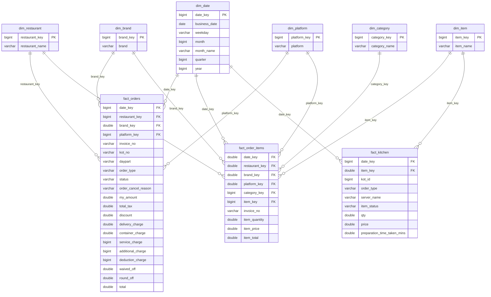

# Data Dictionary

## Table of Contents

- [Overview](#overview)
- [Purpose](#purpose)
- [Scope](#scope)
- [Star Schema](#star-schema)
- [Dimension Tables](#dimension-tables)
- [Fact Tables](#fact-tables)
- [Reporting Views](#reporting-views)
- [Summary](#summary)

---

## Overview

This document is the single reference for every fact table, dimension table, and reporting view materialized by the pipeline, as they exist in `data/warehouse/restaurant_pos.duckdb` and are published to `data/reporting/`. Column names, types, and grains below were read directly from the warehouse database, not inferred from source code alone, to guarantee accuracy against the actual current state of the data.

---

## Purpose

- Give developers a single place to look up any column's name, type, and meaning.
- Give analysts and interviewers a precise reference for what each dataset represents and how its measures are derived.
- Serve as the authoritative grain reference so new views or reports are built on the correct join keys.

---

## Scope

Covered in this document:

- 6 dimension tables (`dim_*`)
- 3 fact tables (`fact_*`)
- 16 reporting views (`vw_*`)

Not covered: Bronze/Silver intermediate schemas (see `docs/grain_analysis.md`), or Power BI-side calculated measures (not present as DAX in this repository beyond what is embedded in the `.pbix` file).

---

## Star Schema

---

## Dimension Tables

### `dim_date`

**Grain:** one row per calendar date present in the source data.
**Row count:** 60

| Column | Type | Description |
|---|---|---|
| `date_key` | BIGINT | Surrogate key for the date. |
| `business_date` | DATE | The calendar date this row represents. |
| `weekday` | VARCHAR | Day of week name (e.g., "Monday"). |
| `month` | BIGINT | Month number (1–12). |
| `month_name` | VARCHAR | Month name (e.g., "June"). |
| `quarter` | BIGINT | Calendar quarter (1–4). |
| `year` | BIGINT | Calendar year. |

### `dim_restaurant`

**Grain:** one row per restaurant/outlet.
**Row count:** 6

| Column | Type | Description |
|---|---|---|
| `restaurant_key` | BIGINT | Surrogate key for the restaurant. |
| `restaurant_name` | VARCHAR | Restaurant/outlet name. |

### `dim_brand`

**Grain:** one row per brand operated by the business.
**Row count:** 2

| Column | Type | Description |
|---|---|---|
| `brand_key` | BIGINT | Surrogate key for the brand. |
| `brand` | VARCHAR | Brand name. |

### `dim_platform`

**Grain:** one row per ordering/sales platform (e.g., in-house POS, aggregator apps).
**Row count:** 6

| Column | Type | Description |
|---|---|---|
| `platform_key` | BIGINT | Surrogate key for the platform. |
| `platform` | VARCHAR | Platform name. |

### `dim_category`

**Grain:** one row per menu item category.
**Row count:** 74

| Column | Type | Description |
|---|---|---|
| `category_key` | BIGINT | Surrogate key for the category. |
| `category_name` | VARCHAR | Category name. |

### `dim_item`

**Grain:** one row per distinct menu item.
**Row count:** 843

| Column | Type | Description |
|---|---|---|
| `item_key` | BIGINT | Surrogate key for the item. |
| `item_name` | VARCHAR | Menu item name. |

---

## Fact Tables

### `fact_orders`

**Grain:** one row per order (invoice), sourced from the Order Summary Report.
**Row count:** 61,838

| Column | Type | Description |
|---|---|---|
| `date_key` | BIGINT | FK to `dim_date`. |
| `restaurant_key` | BIGINT | FK to `dim_restaurant`. |
| `brand_key` | DOUBLE | FK to `dim_brand`. Stored as DOUBLE because unresolved lookups can be null. |
| `platform_key` | BIGINT | FK to `dim_platform`. |
| `invoice_no` | VARCHAR | Degenerate dimension — the order's invoice number. |
| `kot_no` | VARCHAR | Degenerate dimension — the associated kitchen order ticket number. |
| `daypart` | VARCHAR | Business-derived time-of-day segment for the order. |
| `order_type` | VARCHAR | Order channel/type (e.g., dine-in, delivery). |
| `status` | VARCHAR | Order outcome status (e.g., Success, Cancelled). |
| `order_cancel_reason` | VARCHAR | Reason for cancellation, when applicable; null otherwise. |
| `my_amount` | DOUBLE | Gross order amount before adjustments. |
| `total_tax` | DOUBLE | Total tax charged on the order. |
| `discount` | DOUBLE | Total discount applied to the order. |
| `delivery_charge` | DOUBLE | Delivery charge collected on the order. |
| `container_charge` | DOUBLE | Packaging/container charge collected on the order. |
| `service_charge` | BIGINT | Service charge collected on the order. |
| `additional_charge` | BIGINT | Any additional charge collected on the order. |
| `deduction_charge` | BIGINT | Any deduction charge applied to the order. |
| `waived_off` | DOUBLE | Amount waived off on the order. |
| `round_off` | DOUBLE | Rounding adjustment applied to the order total. |
| `total` | DOUBLE | Final net order total after all charges, discounts, and adjustments. |

### `fact_order_items`

**Grain:** one row per ordered line item (item within an order), sourced from the Order Summary Item Report.
**Row count:** 109,428

| Column | Type | Description |
|---|---|---|
| `date_key` | DOUBLE | FK to `dim_date`. |
| `restaurant_key` | DOUBLE | FK to `dim_restaurant`. |
| `brand_key` | DOUBLE | FK to `dim_brand`. |
| `platform_key` | DOUBLE | FK to `dim_platform`. |
| `category_key` | BIGINT | FK to `dim_category`. |
| `item_key` | BIGINT | FK to `dim_item`. |
| `invoice_no` | VARCHAR | Degenerate dimension linking the line item back to its parent order in `fact_orders`. |
| `item_quantity` | DOUBLE | Quantity of the item ordered on this line. |
| `item_price` | DOUBLE | Unit price of the item. |
| `item_total` | DOUBLE | Extended line total (quantity × price, net of any line-level adjustment). |

### `fact_kitchen`

**Grain:** one row per kitchen order ticket (KOT) item, sourced from the KOT Itemwise Process Time Report.
**Row count:** 107,027

| Column | Type | Description |
|---|---|---|
| `date_key` | BIGINT | FK to `dim_date`. |
| `item_key` | DOUBLE | FK to `dim_item`. |
| `kot_id` | BIGINT | Degenerate dimension — the kitchen order ticket identifier. |
| `order_type` | VARCHAR | Order channel/type associated with the ticket. |
| `server_name` | VARCHAR | Server/staff member associated with the ticket. |
| `item_status` | VARCHAR | Kitchen processing status of the item (e.g., served, cancelled). |
| `qty` | DOUBLE | Quantity of the item on the ticket. |
| `price` | DOUBLE | Price of the item on the ticket. |
| `preparation_time_taken_mins` | DOUBLE | Minutes taken to prepare the item — the core kitchen efficiency measure. |

---

## Reporting Views

Each view below is a read-only SQL aggregation defined in the Warehouse (see [`warehouse.md`](warehouse.md) for which are tracked in `src/warehouse/views.py` versus present only in the database file) and published as a CSV by the Reporting Layer (see [`reporting_layer.md`](reporting_layer.md)).

### `vw_daily_sales`
**Grain:** business_date × restaurant_name
| Column | Type |
|---|---|
| business_date | DATE |
| weekday | VARCHAR |
| month | BIGINT |
| month_name | VARCHAR |
| year | BIGINT |
| restaurant_name | VARCHAR |
| orders | BIGINT |
| gross_sales | DOUBLE |
| discount | DOUBLE |
| delivery_charge | DOUBLE |
| container_charge | DOUBLE |
| tax | DOUBLE |
| net_sales | DOUBLE |
| average_order_value | DOUBLE |

### `vw_platform_performance`
**Grain:** platform
| Column | Type |
|---|---|
| platform | VARCHAR |
| orders | BIGINT |
| gross_sales | DOUBLE |
| discount | DOUBLE |
| tax | DOUBLE |
| net_sales | DOUBLE |
| average_order_value | DOUBLE |
| average_discount | DOUBLE |

### `vw_platform_sales`
**Grain:** platform (alternate summary, sorted by gross sales)
| Column | Type |
|---|---|
| platform | VARCHAR |
| total_orders | BIGINT |
| gross_sales | DOUBLE |
| discount | DOUBLE |
| tax | DOUBLE |
| net_sales | DOUBLE |
| average_order_value | DOUBLE |

### `vw_brand_performance`
**Grain:** brand
| Column | Type |
|---|---|
| brand | VARCHAR |
| orders | BIGINT |
| gross_sales | DOUBLE |
| discount | DOUBLE |
| tax | DOUBLE |
| net_sales | DOUBLE |
| average_order_value | DOUBLE |
| average_discount | DOUBLE |

### `vw_brand_sales`
**Grain:** brand (alternate summary, sorted by gross sales)
| Column | Type |
|---|---|
| brand | VARCHAR |
| total_orders | BIGINT |
| gross_sales | DOUBLE |
| discount | DOUBLE |
| net_sales | DOUBLE |
| average_order_value | DOUBLE |

### `vw_category_performance`
**Grain:** category
| Column | Type |
|---|---|
| category | VARCHAR |
| items_sold | DOUBLE |
| gross_sales | DOUBLE |
| net_sales | DOUBLE |
| average_item_price | DOUBLE |

### `vw_category_sales`
**Grain:** category_name (alternate summary, sorted by revenue)
| Column | Type |
|---|---|
| category_name | VARCHAR |
| quantity_sold | DOUBLE |
| revenue | DOUBLE |
| average_item_price | DOUBLE |

### `vw_item_performance`
**Grain:** item × category
| Column | Type |
|---|---|
| item | VARCHAR |
| category | VARCHAR |
| quantity | DOUBLE |
| gross_sales | DOUBLE |
| average_item_price | DOUBLE |

### `vw_item_sales`
**Grain:** item_name (alternate summary, sorted by revenue)
| Column | Type |
|---|---|
| item_name | VARCHAR |
| quantity_sold | DOUBLE |
| revenue | DOUBLE |
| average_price | DOUBLE |
| number_of_orders | BIGINT |

### `vw_kitchen_performance`
**Grain:** order_type × server_name × item_status
| Column | Type |
|---|---|
| order_type | VARCHAR |
| server_name | VARCHAR |
| item_status | VARCHAR |
| kitchen_tickets | BIGINT |
| average_preparation_time | DOUBLE |
| minimum_preparation_time | DOUBLE |
| maximum_preparation_time | DOUBLE |
| performance_status | VARCHAR — derived: `'Excellent'` if average prep time < 10 min, `'Good'` if < 15 min, else `'Needs Attention'`. |

### `vw_daypart_sales`
**Grain:** daypart
| Column | Type |
|---|---|
| daypart | VARCHAR |
| orders | BIGINT |
| gross_sales | DOUBLE |
| discount | DOUBLE |
| tax | DOUBLE |
| net_sales | DOUBLE |
| average_order_value | DOUBLE |
| average_discount | DOUBLE |

### `vw_order_type_performance`
**Grain:** order_type
| Column | Type |
|---|---|
| order_type | VARCHAR |
| orders | BIGINT |
| gross_sales | DOUBLE |
| discount | DOUBLE |
| tax | DOUBLE |
| net_sales | DOUBLE |
| average_order_value | DOUBLE |
| average_discount | DOUBLE |

### `vw_order_status_analysis`
**Grain:** status × order_cancel_reason
| Column | Type |
|---|---|
| status | VARCHAR |
| order_cancel_reason | VARCHAR — `'Not Cancelled'` when status is `'Success'`, `'Unknown'` when null, else the raw cancel reason. |
| orders | BIGINT |
| gross_sales | DOUBLE |
| net_sales | DOUBLE |
| average_order_value | DOUBLE |
| order_percentage | DOUBLE — this status/reason group's share of total orders. |

### `vw_aov_analysis`
**Grain:** year × month
| Column | Type |
|---|---|
| year | BIGINT |
| month | BIGINT |
| month_name | VARCHAR |
| orders | BIGINT |
| sales | DOUBLE |
| average_order_value | DOUBLE |

### `vw_discount_analysis`
**Grain:** business_date
| Column | Type |
|---|---|
| business_date | DATE |
| gross_sales | DOUBLE |
| discount | DOUBLE |
| discount_percentage | DOUBLE — discount as a percentage of gross sales. |

### `vw_charge_analysis`
**Grain:** business_date
| Column | Type |
|---|---|
| business_date | DATE |
| delivery_charge | DOUBLE |
| container_charge | DOUBLE |
| service_charge | HUGEINT |
| additional_charge | HUGEINT |
| deduction_charge | HUGEINT |
| total_sales | DOUBLE |

---

## Summary

The warehouse exposes a conventional star schema — six conformed dimensions (`dim_date`, `dim_restaurant`, `dim_brand`, `dim_platform`, `dim_category`, `dim_item`) joined to three facts at three distinct grains (order, order line item, and kitchen ticket) — plus sixteen reporting views that re-aggregate those facts into the business-facing datasets consumed by Power BI and analysts. This document, together with `warehouse.md` and `reporting_layer.md`, is the authoritative column-level reference for every dataset the pipeline produces.
