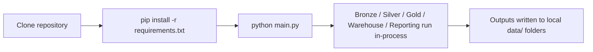

# Docker Setup

## Table of Contents

- [Overview](#overview)
- [Purpose](#purpose)
- [Current State: No Containerization Implemented](#current-state-no-containerization-implemented)
- [What Exists Instead](#what-exists-instead)
- [Folder References](#folder-references)
- [Current Execution Workflow](#current-execution-workflow)
- [Environment Configuration Today](#environment-configuration-today)
- [Why This Matters for Docker Design](#why-this-matters-for-docker-design)
- [Design Decisions (Current State)](#design-decisions-current-state)
- [Trade-offs](#trade-offs)
- [Path to Containerization](#path-to-containerization)
- [Summary](#summary)

---

## Overview

This document was requested to cover Docker implementation, Docker Compose, environment configuration, container lifecycle, and deployment process. A full inspection of the repository — including the working tree, `.gitignore`, and the complete `git log` history — found **no Dockerfile, no `docker-compose.yml`, no `.dockerignore`, and no container-related tooling anywhere in this project**, past or present.

In line with this project's documentation standard of describing only what is actually implemented, this document records that finding accurately and instead documents the execution model the project *does* use today, so a future containerization effort has an honest starting point.

## Purpose

To prevent this document from misrepresenting the project's engineering maturity, its purpose is twofold:

1. State plainly that containerization is not part of the current implementation.
2. Describe the actual local execution and environment setup that a Docker-based setup would need to replicate.

## Current State: No Containerization Implemented

Verified by direct inspection:

- No `Dockerfile` or `Dockerfile.*` exists in the repository.
- No `docker-compose.yml` / `compose.yaml` exists.
- No `.dockerignore` exists.
- No `Makefile` exists.
- No CI/CD workflow directory (e.g. `.github/workflows/`) exists.
- `git log` shows no commit that adds or references Docker, Compose, or container tooling; the commit history (`Create project skeleton` → `Implement file discovery engine` → ... → `Add reporting layer for Power BI integration`) tracks Bronze/Silver/Gold/Warehouse/Reporting development only.

## What Exists Instead

The project currently runs as a plain local Python application:

- A `requirements.txt` pinning all Python dependencies (pandas, pyarrow, duckdb-compatible tooling, SQLAlchemy, psycopg2-binary, python-dotenv, pytest, and supporting Jupyter/dev tooling).
- A single entry point, `main.py`, executed directly with `python main.py`.
- An `.env.example` file, present but currently empty, suggesting environment-variable-based configuration was anticipated but not yet populated with actual variables.
- Three empty configuration modules — `config/settings.py`, `config/database.py`, `config/constants.py` — and two empty YAML files — `config/logging.yaml`, `config/reports.yaml` — which exist as placeholders in the `config/` package but currently hold no configuration values. All effective configuration today (file paths, database file location, published dataset names) is instead defined as constants directly in the relevant modules, for example `WAREHOUSE_DB_PATH` and `REPORTING_VIEWS_FOLDER` in `src/reporting/reporting_config.py`, and `DATABASE_PATH` in `src/warehouse/writer.py`.
- A local DuckDB file, `data/warehouse/restaurant_pos.duckdb`, used directly as an embedded, file-based database — DuckDB requires no server process, which is one reason a containerized database service has not been necessary so far.

## Folder References

```
restaurant-pos-elt-pipeline/
├── requirements.txt        # Full pinned dependency list for local venv/pip install
├── .env.example            # Present but empty — no variables defined yet
├── main.py                 # Single entry point: `python main.py`
├── config/
│   ├── settings.py         # Empty placeholder
│   ├── database.py         # Empty placeholder
│   ├── constants.py        # Empty placeholder
│   ├── logging.yaml        # Empty placeholder
│   └── reports.yaml        # Empty placeholder
└── data/
    └── warehouse/
        └── restaurant_pos.duckdb   # Embedded, file-based DuckDB database
```

## Current Execution Workflow



There is no build step, no image, and no orchestration layer. The pipeline is a synchronous, single-process Python script that reads from and writes to the local filesystem (`data/raw`, `data/bronze`, `data/silver`, `data/gold`, `data/warehouse`, `data/reporting`).

## Environment Configuration Today

- Dependencies are managed via `requirements.txt` and an implied local virtual environment (the repository even contains a `.venv/` directory from local development, excluded from version control via `.gitignore`).
- `.env.example` exists as a convention for future environment-variable configuration (commonly paired with `python-dotenv`, which is already a pinned dependency) but currently contains no keys — meaning no environment variables are read or required to run the pipeline today.
- All file paths (raw/bronze/silver/gold/warehouse/reporting directories) are hard-coded as relative `Path` constants inside the modules that use them (e.g., `RAW_DIR = Path("data") / "raw"` in `main.py`), rather than sourced from configuration files or environment variables.

## Why This Matters for Docker Design

A correct Docker setup for this project cannot be guessed generically — it depends on decisions the project has not yet made:

- Whether `data/` (raw inputs, warehouse DuckDB file, reporting CSVs) should live in a mounted volume or be baked into the image.
- Whether the empty `config/settings.py` / `config/database.py` modules are intended to eventually source values from environment variables (suggested by the presence of `.env.example` and `python-dotenv` in `requirements.txt`), which would directly shape how a container's environment variables should be structured.
- Whether Power BI Desktop (a Windows desktop application) remains an external, non-containerized consumer of the Reporting Layer's CSVs — which is very likely, since Power BI Desktop cannot run inside a Linux container, meaning full containerization can only ever cover the ELT pipeline itself (`main.py` through the Reporting Layer), not the dashboard consumption step described in `dashboard_design.md` and `powerbi_integration.md`.

## Design Decisions (Current State)

- **No containerization yet** — the project has prioritized building out the Bronze → Silver → Gold → Warehouse → Reporting pipeline correctly before investing in deployment tooling, based on the commit history's clear phase-by-phase progression.
- **DuckDB over a client-server database** — an embedded, file-based analytical database was chosen, which incidentally reduces (but does not eliminate) the need for containerization, since there is no separate database server process to orchestrate alongside the application.
- **Empty configuration placeholders left in place** — `config/settings.py`, `config/database.py`, and the YAML config files exist as intended extension points, but the project currently favors explicit, hard-coded path constants over external configuration.

## Trade-offs

- Running the pipeline locally is simple (`pip install`, `python main.py`) but is not reproducible across machines beyond what `requirements.txt` guarantees — no OS-level dependencies, Python version, or system libraries are pinned.
- Without a Dockerfile, onboarding a new contributor requires manually installing Python, creating a virtual environment, and installing `requirements.txt` correctly, rather than a single `docker build` / `docker run`.
- The absence of CI/CD means `pytest` (present in `requirements.txt`, with tests under `tests/`) is run manually rather than automatically on every change.

## Path to Containerization

If containerization is added in the future, based on what exists today, a minimal, accurate first step would cover only the Python ELT pipeline:

1. A `Dockerfile` based on a slim Python image matching the project's development Python version, installing `requirements.txt`.
2. A mounted volume for `data/` so that `data/raw` inputs and `data/warehouse`/`data/reporting` outputs persist outside the container.
3. Environment variables sourced from a real `.env` file (populating the currently-empty `.env.example`) for any values that should move out of hard-coded path constants.
4. `python main.py` as the container's default command.
5. Power BI Desktop would remain outside this container entirely, continuing to read the CSVs from the mounted `data/reporting/` volume, exactly as described in `powerbi_integration.md`.

This is a forward-looking outline, not a description of an existing setup — none of the above is implemented in the repository today.

## Summary

This repository has no Docker, Docker Compose, or container orchestration of any kind. It runs as a local Python script (`python main.py`) against dependencies pinned in `requirements.txt`, with an embedded DuckDB file as its warehouse and hard-coded relative paths for all data folders. The `config/` package and `.env.example` file suggest environment-variable-based configuration was anticipated, but neither is populated yet. Any future Docker setup would need to account for the fact that Power BI Desktop, the project's dashboard consumer, cannot itself be containerized on Linux.
