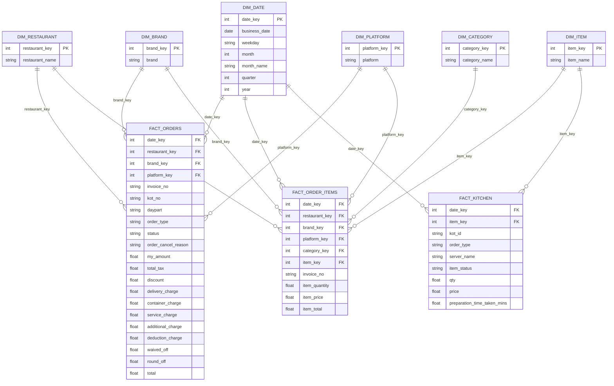
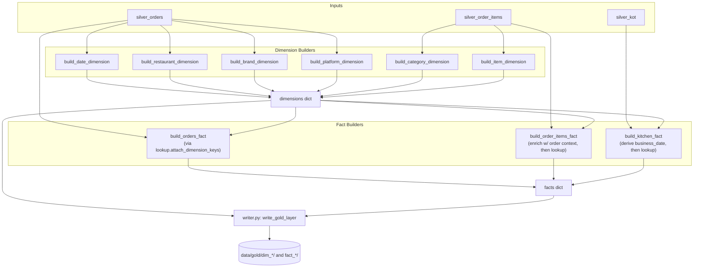
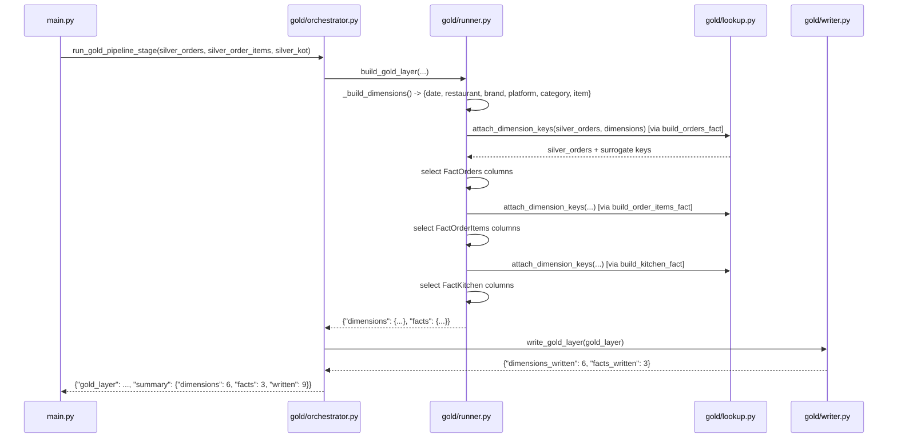
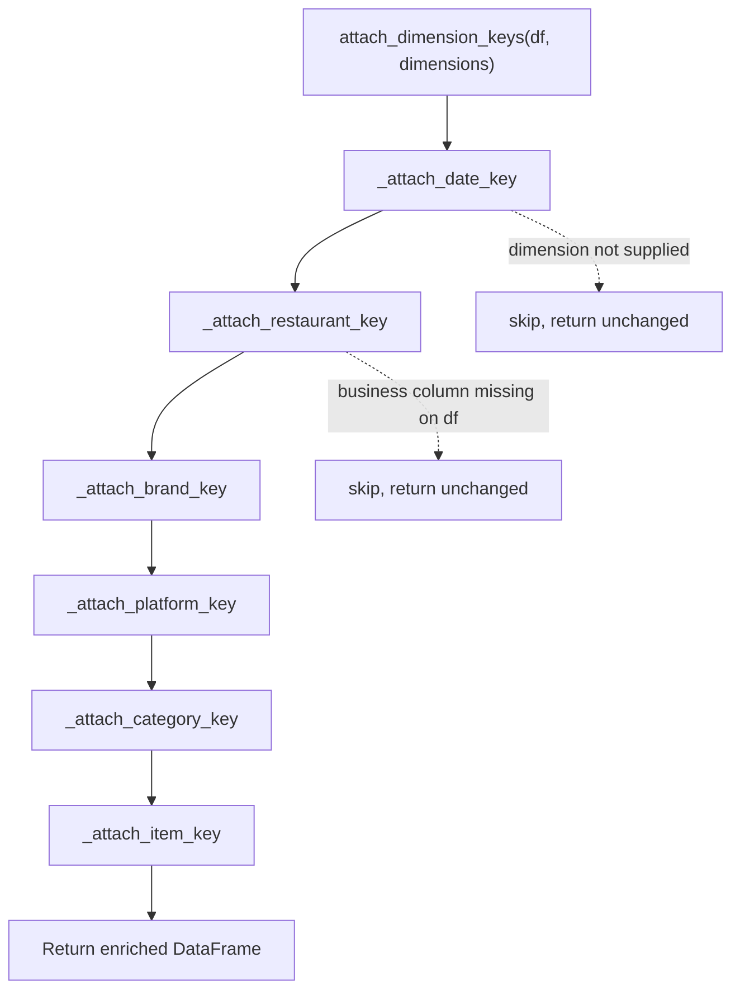

# Gold Layer

## Table of Contents

- [Overview](#overview)
- [Purpose](#purpose)
- [Business Context](#business-context)
- [Engineering Context](#engineering-context)
- [Folder References](#folder-references)
- [Dimensional Model (ER Diagram)](#dimensional-model-er-diagram)
- [Architecture](#architecture)
- [Workflow](#workflow)
- [Step-by-Step Processing: Dimensions](#step-by-step-processing-dimensions)
- [Step-by-Step Processing: Facts](#step-by-step-processing-facts)
- [Surrogate Key Lookup Mechanism](#surrogate-key-lookup-mechanism)
- [Orchestration (runner / writer / orchestrator)](#orchestration-runner--writer--orchestrator)
- [Best Practices Applied](#best-practices-applied)
- [Design Decisions](#design-decisions)
- [Trade-offs](#trade-offs)
- [Performance Considerations](#performance-considerations)
- [Scalability Discussion](#scalability-discussion)
- [Maintainability Discussion](#maintainability-discussion)
- [Summary](#summary)

---

## Overview

The Gold layer transforms enriched Silver DataFrames into a conformed
**star schema**: six dimensions and three fact tables, each with a
sequential integer surrogate key, persisted as Parquet under `data/gold/`
and later materialized into DuckDB by the Warehouse layer. This is the
layer where the data becomes genuinely analysis-ready — a shape a BI tool
can join, filter, and aggregate efficiently.

## Purpose

Gold exists to convert Silver's per-report, denormalized DataFrames
(`order_summary`, `order_summary_item`, `kot_process_time`) into a
dimensional model with clean surrogate keys, so that:

- Every fact table row references its dimensions through small integer
  keys rather than repeating text values.
- Dimension attributes (e.g. `restaurant_name`, `brand`, `platform`) are
  stored exactly once, in exactly one place.
- Analytical queries (the Warehouse's `vw_*` views) can join facts to
  dimensions cheaply and unambiguously.

## Business Context

A star schema is what lets a restaurant operator ask cross-cutting
business questions efficiently: "what is average order value by platform,
by month, by restaurant" requires joining `FactOrders` to `DimPlatform`,
`DimDate`, and `DimRestaurant` — three cheap integer-key joins — rather
than re-parsing text fields at query time. The three fact tables
(`FactOrders`, `FactOrderItems`, `FactKitchen`) map directly onto three
distinct business processes: **order-level financials**, **item-level
sales**, and **kitchen operational performance** — each queried
independently in the Warehouse's analytics views.

## Engineering Context

```text
src/gold/
├── dimensions/
│   ├── date.py          # DimDate
│   ├── restaurant.py    # DimRestaurant
│   ├── brand.py         # DimBrand
│   ├── platform.py      # DimPlatform
│   ├── category.py      # DimCategory
│   └── item.py          # DimItem
├── facts/
│   ├── orders.py        # FactOrders
│   ├── order_items.py   # FactOrderItems
│   └── kitchen.py       # FactKitchen
├── lookup.py             # attach_dimension_keys() — shared surrogate-key joins
├── runner.py              # build_gold_layer() — builds dims then facts
├── writer.py               # write_gold_layer() — persists to Parquet
└── orchestrator.py          # run_gold_pipeline_stage() — runner + writer + summary
```

Every dimension and fact builder module explicitly documents, in its own
docstring, that it performs **pure transformation only** — no file I/O, no
database access, no logging, no orchestration. This is enforced
architecturally: dimension/fact modules receive plain `pd.DataFrame`
arguments and return plain `pd.DataFrame` results.

## Folder References

```text
data/gold/
├── dim_brand/dim_brand.parquet
├── dim_category/dim_category.parquet
├── dim_date/dim_date.parquet
├── dim_item/dim_item.parquet
├── dim_platform/dim_platform.parquet
├── dim_restaurant/dim_restaurant.parquet
├── fact_kitchen/fact_kitchen.parquet
├── fact_order_items/fact_order_items.parquet
└── fact_orders/fact_orders.parquet
```

## Dimensional Model (ER Diagram)



Note that `FACT_KITCHEN` intentionally connects to only two of the six
dimensions (`DimDate`, `DimItem`) — see
[Design Decisions](#design-decisions) for why `restaurant_key`,
`brand_key`, `platform_key`, and `category_key` are deliberately excluded
from it.

## Architecture



## Workflow



## Step-by-Step Processing: Dimensions

All six dimension builders (`date.py`, `restaurant.py`, `brand.py`,
`platform.py`, `category.py`, `item.py`) follow an **identical, repeated
pattern** — a deliberate consistency choice:

1. Select only the required Silver column(s) for that dimension
   (`_REQUIRED_SILVER_COLUMNS`).
2. Drop rows with a null value in the business key column (except
   `DimDate`, whose Silver source is guaranteed non-null by upstream
   calendar derivation).
3. `drop_duplicates()` to produce one row per distinct business value.
4. Sort the result (chronologically for `DimDate`, alphabetically for the
   rest) and `reset_index(drop=True)`.
5. `_assign_surrogate_key()`: insert a new integer key column as the
   **first** column, starting at 1 and incrementing sequentially
   (`range(1, 1 + len(dimension))`).

| Dimension | Source Silver Dataset | Business Key | Surrogate Key |
|---|---|---|---|
| `DimDate` | `order_summary` | `business_date` (+ weekday/month/quarter/year, already derived by Business Silver) | `date_key` |
| `DimRestaurant` | `order_summary` | `restaurant_name` | `restaurant_key` |
| `DimBrand` | `order_summary` | `brand` | `brand_key` |
| `DimPlatform` | `order_summary` | `platform` | `platform_key` |
| `DimCategory` | `order_summary_item` | `category_name` | `category_key` |
| `DimItem` | `order_summary_item` | `item_name` | `item_key` |

`DimBrand` explicitly documents that brandless platforms (Delivery, Pick
Up, Dine In) legitimately produce null brands in Silver, and those rows
are dropped rather than appearing as a spurious "no brand" dimension
member. `DimItem` explicitly documents an intentional scope decision: it
excludes both category and SAP code from item identity, because source
profiling (via `src/analysis/data_profiler.py`) showed `sap_code` is over
99% null and non-unique, and item names legitimately recur under multiple
categories — meaning category is transactional context, not part of an
item's identity, and belongs in `DimCategory` + `FactOrderItems` instead.

## Step-by-Step Processing: Facts

### `FactOrders` (`facts/orders.py`)

Built directly from `silver_orders` with no pre-join required (all needed
dimension business keys — `business_date`, `restaurant_name`, `brand`,
`platform` — already live on the order-header row). Steps:

1. `attach_dimension_keys(silver_orders, dimensions)` — attaches
   `date_key`, `restaurant_key`, `brand_key`, `platform_key`.
2. Select the fact's final column set: the four dimension keys, two
   degenerate dimensions (`invoice_no`, `kot_no`), four order descriptors
   (`daypart`, `order_type`, `status`, `order_cancel_reason`), and eleven
   financial measures (`my_amount`, `total_tax`, `discount`,
   `delivery_charge`, `container_charge`, `service_charge`,
   `additional_charge`, `deduction_charge`, `waived_off`, `round_off`,
   `total`).

### `FactOrderItems` (`facts/order_items.py`)

Requires a **pre-join step** before dimension-key attachment, because
order-header context (business date, brand, platform) lives on
`silver_orders`, not on `silver_order_items`:

1. `_enrich_order_context()`: casts `invoice_no` to `str` on both sides
   (defensive type alignment before joining), then LEFT-joins
   `silver_order_items` to a projection of `silver_orders` containing only
   `restaurant_name`, `invoice_no` (join keys) plus `business_date`,
   `brand`, `platform` (context columns) — on `[restaurant_name,
   invoice_no]`.
2. `attach_dimension_keys()` — attaches all six dimension keys (`date_key`,
   `restaurant_key`, `brand_key`, `platform_key`, `category_key`,
   `item_key`), since order items participate in every dimension.
3. Select the final column set: six dimension keys, the degenerate
   `invoice_no`, and three measures (`item_quantity`, `item_price`,
   `item_total`).

### `FactKitchen` (`facts/kitchen.py`)

Built from `silver_kot`, which has **no order-header linkage at all** (no
`invoice_no`, no `restaurant_name`, no `brand`/`platform` fields) — it
records kitchen-ticket-level operational data only:

1. `_derive_business_date()`: since `silver_kot` has no `business_date`
   column, one is derived inline from the date component of its
   `punch_time` column (`.dt.date`), purely so the date dimension can be
   resolved.
2. `attach_dimension_keys()` — attaches only `date_key` and `item_key`
   (the two dimensions resolvable from available KOT columns).
3. Select the final column set: two dimension keys, four degenerate
   dimensions (`kot_id`, `order_type`, `server_name`, `item_status`), and
   three measures (`qty`, `price`, `preparation_time_taken_mins`).

## Surrogate Key Lookup Mechanism

`lookup.py`'s `attach_dimension_keys()` is the **single shared function**
every fact builder calls to resolve surrogate keys — no fact module
reimplements a merge itself. Its design:

- Accepts a `dimensions: dict[str, pd.DataFrame]` where any subset of the
  six supported dimension names (`"date"`, `"restaurant"`, `"brand"`,
  `"platform"`, `"category"`, `"item"`) may be present.
- For each supported dimension, a private `_attach_<name>_key()` helper
  checks whether that dimension was supplied; if not, it silently skips —
  **the function never fails because a dimension is absent.** This is what
  lets `FactKitchen` request only `{"date", "item"}` from the full
  six-dimension dict without any special-casing in `lookup.py` itself.
- Each attach step delegates to `_merge_surrogate_key()`, a generic LEFT
  join helper: it takes only the dimension's business column + surrogate
  key column (avoiding accidentally duplicating other dimension columns
  onto the fact), and merges with `how="left"`, guaranteeing **every input
  row of the fact is preserved** even if a business key fails to match
  (producing a null surrogate key rather than silently dropping the row).
- `_merge_surrogate_key()` also defensively checks that the business
  column actually exists on the target DataFrame before attempting the
  merge, returning the DataFrame unchanged if not — this is what allows
  `FactKitchen` (which has no `restaurant_name`, `brand`, `platform`, or
  `category_name` columns at all) to safely call the same
  `attach_dimension_keys()` used by the other two facts.



## Orchestration (runner / writer / orchestrator)

- **`runner.py` (`build_gold_layer`)**: builds all six dimensions first
  (`_build_dimensions()`), then builds all three facts
  (`_build_facts()`) reusing those already-built dimensions — dimensions
  are built exactly once and shared across every fact that needs them,
  never rebuilt per fact.
- **`writer.py` (`write_gold_layer`)**: writes every dimension to
  `data/gold/dim_<name>/dim_<name>.parquet` and every fact to
  `data/gold/fact_<name>/fact_<name>.parquet`, using
  `DataFrame.to_parquet(..., index=False)`, overwriting existing files.
  This module performs **no building or transformation** — purely
  persistence.
- **`orchestrator.py` (`run_gold_pipeline_stage`)**: the function
  `main.py` calls directly. It builds the Gold layer, writes it to
  Parquet, and returns both the in-memory `gold_layer` (so the Warehouse
  layer can materialize it into DuckDB without re-reading from disk) and a
  concise `summary` (`dimensions`, `facts`, `written` counts) used in
  `main.py`'s final console report.

## Best Practices Applied

- **Uniform dimension-builder pattern.** Every one of the six dimension
  builders follows the exact same five-step shape (select → dropna →
  dedupe → sort → assign key), making the code predictable to read and
  trivial to extend with a seventh dimension.
- **Pure functions, explicit inputs/outputs.** No dimension or fact builder
  touches the filesystem, a database, or global state — every function
  takes DataFrames in and returns a DataFrame out, which is what makes
  `tests/test_gold.py`'s direct, in-memory integration checks (row-count
  parity, surrogate/business key uniqueness, expected-column-shape
  assertions) possible without any mocking.
- **LEFT joins everywhere, never INNER.** Every dimension-key attachment
  uses `how="left"`, guaranteeing fact row counts are never silently
  reduced by a failed dimension lookup — a missing match surfaces as a
  null surrogate key (which `tests/test_gold.py`'s "Null Surrogate Key
  Check" is specifically designed to catch), not a disappeared row.
- **Defensive column-existence checks in the shared lookup function**
  (`_merge_surrogate_key`) mean a fact builder can safely request more
  dimension keys than its source data can actually support, and the
  unsupported ones are simply skipped rather than raising a `KeyError`.

## Design Decisions

- **`FactKitchen` deliberately excludes `restaurant_key`, `brand_key`,
  `platform_key`, and `category_key`.** Per the module's own docstring,
  this is because these keys "cannot be derived from the available Silver
  KOT columns without making unsupported assumptions" — `silver_kot` has
  no restaurant, brand, platform, or category fields at all. Rather than
  fabricate a join path through `invoice_no` (which `silver_kot` also does
  not carry) or guess at defaults, the fact simply omits those
  dimensions — an explicit acknowledgment of a genuine gap in the KOT
  export's schema, encoded directly in the fact's shape rather than papered
  over.
- **`DimItem` excludes category and SAP code from item identity**, based on
  concrete data profiling evidence (>99% null SAP code, non-unique;
  item names recurring under multiple categories) rather than an
  assumption — category is instead captured as transactional context on
  `FactOrderItems`.
- **`attach_dimension_keys()` centralizes every dimension join in one
  module**, rather than each fact builder writing its own `.merge()`
  calls. This is what makes the "some dimensions may be absent" and
  "some business columns may be absent" behaviors consistent across all
  three facts, instead of each fact independently (and possibly
  inconsistently) handling those edge cases.
- **Sequential integer surrogate keys starting at 1**, not hashes or UUIDs.
  This is the simplest possible surrogate key strategy and is entirely
  sufficient given Gold is fully rebuilt from Silver on every pipeline run
  (see [Trade-offs](#trade-offs) — there is no key-stability requirement
  across runs since downstream Warehouse tables are also fully replaced).

## Trade-offs

| Decision | Benefit | Cost |
|---|---|---|
| `FactKitchen` omits 4 of 6 dimension keys | Honest about what the KOT export can actually support; no fabricated joins | Kitchen performance cannot currently be sliced by restaurant, brand, platform, or category in the Warehouse views |
| Full Gold rebuild every run (no incremental/merge logic) | Simple, always-consistent surrogate keys; no upsert complexity | Every pipeline run reprocesses all currently-loaded Silver data in memory to rebuild every dimension and fact |
| Sequential integer surrogate keys (re-assigned every run) | Trivial to generate, small storage footprint, fast joins | Keys are **not stable across pipeline runs** — a `restaurant_key=3` today may not mean the same restaurant after a re-run with different Silver input; acceptable here because Warehouse tables are also fully replaced (`CREATE OR REPLACE TABLE`) each run, so key values never need to persist across runs |
| Shared `attach_dimension_keys()` for all facts | One tested, consistent join implementation | A dimension-specific join quirk (e.g. a fuzzy-match need for a future dimension) would require extending the shared function rather than a fact-local workaround |

## Performance Considerations

- Dimensions are built exactly once per run and passed by reference into
  every fact builder, avoiding redundant `drop_duplicates()`/sort
  computation.
- `_merge_surrogate_key()` selects only the two required columns
  (`[business_column, key_column]`) from each dimension before merging,
  minimizing the memory/column bloat that a naive full-dimension merge
  would introduce.
- All Gold building happens in memory (`build_gold_layer()` returns
  DataFrames directly), and only the final `write_gold_layer()` step
  touches disk — avoiding intermediate read/write round-trips between
  dimension building and fact building.

## Scalability Discussion

The current model rebuilds every dimension and fact from the *entire*
in-memory Silver dataset on each run (via `main.py`'s `pd.concat()` over
every Silver file for each of `order_summary`, `order_summary_item`, and
`kot_process_time`). This is appropriate at current data volumes but would
need to evolve — e.g. incremental dimension upserts keyed by business
value, and fact tables appended rather than replaced — if Silver's total
row volume grew large enough that a full in-memory rebuild became slow or
memory-constrained. The dimension/fact builder functions themselves would
not need to change under such an evolution; only the runner/orchestrator
layer coordinating them would.

## Maintainability Discussion

Because every dimension builder follows the identical five-step pattern,
adding a **seventh dimension** (e.g. `DimServer`, based on
`silver_kot`'s `server_name`) is a well-defined, low-risk change:
create `src/gold/dimensions/server.py` following the existing pattern, add
it to `_build_dimensions()` in `runner.py`, add a corresponding
`_attach_server_key()` helper (or extend `_SERVER_DIMENSION_KEY`
handling) in `lookup.py`, and reference `"server"` in whichever fact
builder needs it. No existing dimension, fact, or orchestration code needs
to be touched. The same applies symmetrically to adding a fourth fact
table — the runner, writer, and orchestrator are all fact-count-agnostic
(they iterate over whatever is in the `dimensions`/`facts` dicts).

## Summary

The Gold layer is where Silver's cleaned, business-enriched data becomes a
genuine dimensional model: six conformed dimensions, each following an
identical build pattern, and three fact tables, each honestly reflecting
what its source Silver dataset can and cannot support in terms of
dimensional context. A single shared lookup function
(`attach_dimension_keys()`) handles every surrogate-key join across all
three facts, tolerating missing dimensions and missing business columns by
design rather than by exception handling. This Parquet-based star schema
is what the Warehouse layer subsequently loads into DuckDB and exposes to
Power BI through analytics views — the final steps of the pipeline
documented in [medallion_architecture.md](medallion_architecture.md).
