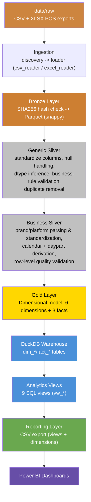
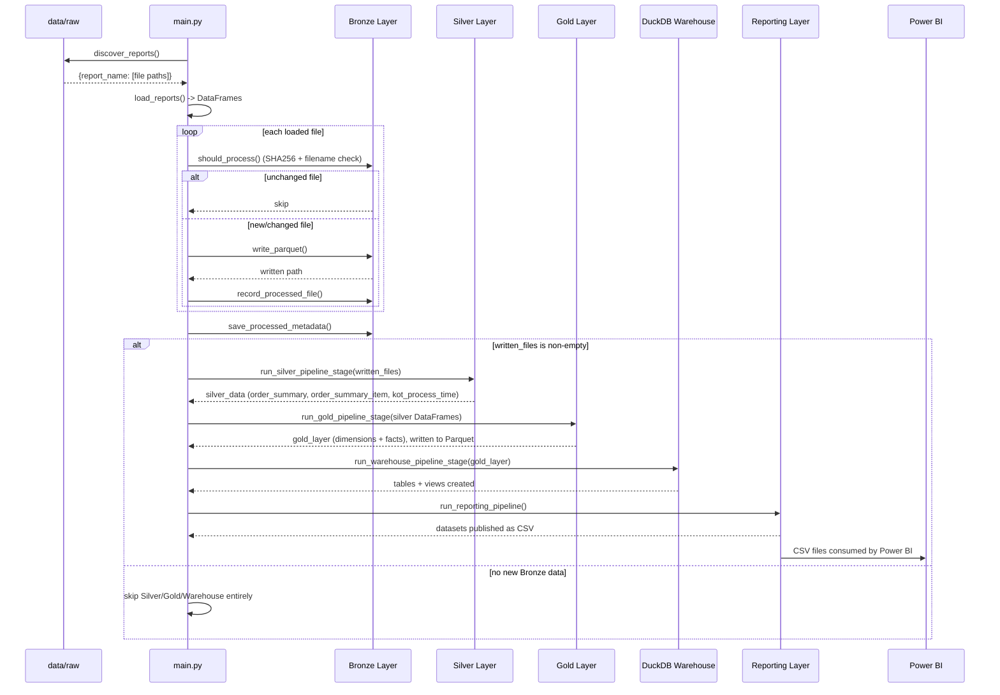

# Medallion Architecture

## Table of Contents

- [Overview](#overview)
- [Purpose](#purpose)
- [Business Context](#business-context)
- [Engineering Context](#engineering-context)
- [Repository Layout](#repository-layout)
- [Architecture Diagram](#architecture-diagram)
- [End-to-End Workflow](#end-to-end-workflow)
- [Execution Sequence](#execution-sequence)
- [Layer Responsibilities](#layer-responsibilities)
- [Design Decisions](#design-decisions)
- [Trade-offs](#trade-offs)
- [Performance Considerations](#performance-considerations)
- [Scalability Discussion](#scalability-discussion)
- [Maintainability Discussion](#maintainability-discussion)
- [Summary](#summary)

---

## Overview

This repository implements a batch ELT (Extract-Load-Transform) pipeline for a
multi-restaurant Point-of-Sale (POS) operation. Raw POS exports (CSV and
Excel) are progressively refined through four physical storage layers —
**Bronze**, **Silver**, **Gold**, and a **DuckDB Warehouse** — before being
published as flat CSV datasets for **Power BI** consumption.

The pipeline follows the **Medallion Architecture** pattern popularized by
the Lakehouse ecosystem (Bronze/Silver/Gold), adapted here for a
Python + Pandas + Parquet + DuckDB stack rather than Spark/Delta Lake. The
entire pipeline is orchestrated by a single entry point, `main.py`, and is
containerized via Docker for reproducible, environment-independent execution.

## Purpose

The pipeline exists to convert raw, inconsistent, multi-format POS exports
(inconsistent column names, embedded metadata blocks, null-like tokens,
mixed brand/platform encodings) into a trustworthy, query-ready analytical
model that a restaurant business can use to answer questions such as:

- Which platform (Swiggy, Zomato, Dine-In, Delivery, Pick Up) generates the
  most net sales?
- Which virtual brand performs best, and where?
- How fast does the kitchen prepare items, and does that vary by server or
  order type?
- What time of day (daypart) drives the most revenue?
- Which orders were cancelled, and why?

## Business Context

Restaurant POS systems (especially those serving multiple virtual brands
across multiple aggregator platforms) generate operationally rich but
analytically messy exports. A single `sub_order_type` field, for example,
conflates two independent business concepts — **brand** and **platform** —
into one string (e.g. `"Thepla House By Tejals - Zomato"`). Without
processing, this data cannot be reliably rolled up, filtered, or trended in
a BI tool. The pipeline's job is to mechanically and repeatably resolve
these inconsistencies once, so that every downstream report — daily sales,
platform performance, kitchen throughput — is built on the same clean,
conformed foundation.

## Engineering Context

The pipeline is intentionally implemented as **plain Python + Pandas**
rather than a distributed engine (Spark, Flink) or a managed ELT tool
(Fivetran, Airbyte, dbt). This reflects the actual scale of the data: POS
exports here are small-to-medium CSV/Excel files (single-digit MB), and a
distributed engine would add operational overhead without any performance
benefit. DuckDB is used specifically because it offers a real embedded SQL
engine (window functions, joins, `CREATE OR REPLACE VIEW`) directly against
Parquet-shaped data, without requiring a client-server database deployment.

## Repository Layout

```text
restaurant-pos-elt-pipeline/
├── main.py                     # Single pipeline entry point
├── Dockerfile                  # Runtime container definition
├── docker-compose.yml          # Local orchestration (build/run/shell)
├── Makefile                    # Developer convenience commands
├── config/                     # Reserved for centralized configuration (currently empty)
├── requirements/
│   ├── requirements-runtime.txt
│   └── requirements-dev.txt
├── data/
│   ├── raw/                    # Landing zone for POS exports (input)
│   ├── bronze/                 # Immutable, hash-checked Parquet copies of raw
│   ├── silver/                 # Cleaned, typed, business-enriched Parquet
│   ├── gold/                   # Dimensional model (star schema) as Parquet
│   ├── warehouse/               # DuckDB database file
│   ├── reporting/              # Published CSVs (views + dimensions)
│   └── metadata/               # processed_files.json (Bronze hash ledger)
├── src/
│   ├── ingestion/               # Discovery, CSV/Excel readers, dispatch loader
│   ├── storage/                 # Bronze hash manager + Parquet writer
│   ├── transformation/          # Generic Silver + Business Silver logic
│   ├── silver/                   # Silver reader/runner/writer/orchestrator
│   ├── gold/                    # Gold dimension/fact builders + orchestrator
│   ├── warehouse/                # DuckDB writer, analytical views, orchestrator
│   ├── reporting/                # CSV publisher + orchestrator
│   ├── analysis/                 # One-off Silver data profiler (not in main pipeline)
│   ├── core/, models/, utils/, validation/   # Present but currently empty (reserved)
├── powerbi/                     # .pbix dashboard, exported PDF, screenshots, theme
├── tests/                       # Manual validation scripts (not pytest suites)
└── .github/workflows/pipeline.yml   # CI: installs deps, runs main.py on push/PR
```

Several files are intentionally empty placeholders at this stage of the
project rather than dead code that was removed: `README.md`, every file
under `config/` (`constants.py`, `database.py`, `settings.py`,
`reports.yaml`, `logging.yaml`), `src/core/config_loader.py`,
`src/core/logger.py`, and the `src/models/`, `src/utils/`, and
`src/validation/` packages (each containing only an empty `__init__.py`).
These represent planned centralization points — for configuration,
structured logging, and shared validation/model types — that have not yet
been wired into the running pipeline. Today, configuration values (paths,
report names, view names) are defined locally as module-level constants
inside the modules that use them (e.g. `WAREHOUSE_DB_PATH` in
`reporting_config.py`, `RAW_DIR`/`BRONZE_ROOT` in `main.py`).

## Architecture Diagram



Only Bronze, Silver, and Gold are physical Medallion layers in the strict
sense. The DuckDB Warehouse and the CSV Reporting layer sit downstream of
Gold and exist to serve Power BI — the Warehouse materializes Gold as
queryable SQL tables, and the Analytics Views encapsulate the business
logic (joins, aggregations, `CASE` classifications) that Power BI consumes,
so Power BI itself contains no transformation logic.

## End-to-End Workflow



## Execution Sequence

`main.py` is the single, linear entry point (`ENTRYPOINT ["python", "main.py"]`
in the Dockerfile). Its `run_pipeline()` function executes these steps, in
order, every time the container runs:

1. **Discover** raw files under `data/raw/` via `discover_reports()`.
2. **Load** every discovered file into a DataFrame via `load_reports()`.
3. **Bronze**: for each loaded file, check `should_process()` (SHA256 hash +
   filename match against `data/metadata/processed_files.json`); write new
   or changed files to Parquet via `write_parquet()`, and record them in the
   metadata dict.
4. **Persist** the updated metadata dict back to disk.
5. **Conditionally** run Silver → Gold → Warehouse → Reporting, but **only
   if at least one new Bronze file was written** in this run. If nothing
   changed, the entire downstream chain is skipped — there is no benefit to
   rebuilding Silver/Gold/Warehouse from data that has not changed.
6. **Print** a final run summary: files written/skipped, and the
   Silver/Gold/Warehouse/Reporting outcome.

This "skip everything downstream if there is no new Bronze data" behavior
is a deliberate incremental-processing decision — see
[Design Decisions](#design-decisions).

## Layer Responsibilities

| Layer | Module(s) | Responsibility | Physical Format |
|---|---|---|---|
| Ingestion | `src/ingestion/` | Discover + read raw files into DataFrames | In-memory only |
| Bronze | `src/storage/` | Hash-checked, immutable landing of raw data | Parquet (snappy), one file per source file |
| Generic Silver | `src/transformation/` (excluding `business/`) | Column/type/null/duplicate cleanup, read-only validation | Parquet, one file per Bronze source file |
| Business Silver | `src/transformation/business/` | Brand/platform parsing, calendar/daypart derivation, business quality checks | Same Parquet files as Generic Silver (order_summary only) |
| Gold | `src/gold/` | Dimensional modeling: conformed dimensions + fact tables with surrogate keys | Parquet, one file per dimension/fact |
| Warehouse | `src/warehouse/` | Materializes Gold into DuckDB tables; defines analytics SQL views | DuckDB database file |
| Reporting | `src/reporting/` | Publishes views/dimensions as flat CSV files | CSV |

## Design Decisions

- **Hash-based incremental Bronze ingestion.** Every raw file is
  fingerprinted with SHA256 (`hash_manager.py`). A file is only reprocessed
  if its filename is new, or its filename is known but the content hash has
  changed. This means re-running the pipeline on an unchanged `data/raw/`
  folder is a cheap no-op, while genuinely updated exports (same filename,
  corrected data) are correctly picked up.
- **Downstream layers only run when Bronze changes.** `main.py` explicitly
  checks `if written_files:` before invoking Silver/Gold/Warehouse/Reporting.
  This avoids wastefully rebuilding the entire Gold model and DuckDB
  warehouse when a scheduled run finds nothing new.
- **Two-stage Silver (Generic vs. Business).** Generic Silver
  (`transformation/pipeline.py`) performs domain-agnostic cleanup that would
  apply to *any* tabular dataset (column names, nulls, dtypes, duplicates).
  Business Silver (`transformation/business/`) performs POS-specific
  enrichment (brand/platform extraction, daypart classification) and is
  intentionally only invoked for `order_summary`, since that is the only
  Bronze dataset containing the `sub_order_type` field business enrichment
  depends on (see `src/silver/runner.py`).
- **Dimension keys attached via lookup, not embedded in dimension logic.**
  `src/gold/lookup.py` centralizes every surrogate-key LEFT-join used across
  all three Gold facts, so a single, tested function
  (`attach_dimension_keys()`) is reused rather than reimplementing merge
  logic per fact.
- **DuckDB as the single source of truth for Power BI.** Per the module
  docstring in `src/warehouse/views.py`, this is a **frozen architectural
  decision**: Power BI never queries Gold Parquet or the `dim_*`/`fact_*`
  tables directly — it only reads the `vw_*` analytics views. This keeps
  all business logic (joins, `CASE` classifications, ratios) in one
  auditable SQL layer instead of duplicated inside Power BI's own DAX/Power
  Query layer.
- **CSV as the Power BI hand-off format**, rather than a live DuckDB
  connection. This decouples Power BI refresh cycles from the pipeline
  runtime environment and avoids requiring Power BI (or its refresh
  infrastructure) to have DuckDB driver access.

## Trade-offs

| Decision | Benefit | Cost |
|---|---|---|
| Pandas/Parquet/DuckDB instead of Spark/Delta | Zero cluster/infra overhead; fast for current data volume | Will not scale to multi-TB/distributed workloads without a rewrite |
| Hash-based file-level incrementality | Simple, dependency-free, auditable via `processed_files.json` | Not row/partition-level; a single changed row forces reprocessing of the whole file |
| Full rebuild of Silver/Gold/Warehouse on any new Bronze file | Simple mental model; guarantees Gold is always fully consistent | No incremental/merge logic in Gold — every Gold build reprocesses all currently-loaded Silver data in memory |
| Config values as local module constants (no central `config/` yet) | No indirection; easy to read a single file and see its exact behavior | Environment-specific overrides (e.g. via `.env`) are not yet wired into the code, despite `.env`/`.env.example` existing |
| CSV as the BI hand-off format | Simple, portable, no live DB dependency for Power BI | Extra file-based step vs. a live DuckDB/Direct Query connection |

## Performance Considerations

- **Snappy-compressed Parquet** is used at every persisted layer (Bronze,
  Silver, Gold), which is a well-established compromise between compression
  ratio and read/write speed for analytical workloads.
- **SHA256 hashing is streamed in 1 MB chunks** (`_HASH_CHUNK_SIZE` in
  `hash_manager.py`) rather than loading whole files into memory, so hashing
  scales linearly with file size without a corresponding memory spike.
- **DuckDB table materialization uses `CREATE OR REPLACE TABLE ... AS SELECT`**
  against a *registered* in-memory DataFrame (`connection.register()`)
  rather than `DataFrame.to_sql()`, which is markedly faster for bulk loads
  because it uses DuckDB's native Arrow/Pandas ingestion path instead of
  row-by-row INSERTs.
- **Gold dimensions are built once and reused** across all three fact
  builders (`src/gold/runner.py`), avoiding redundant `drop_duplicates()` /
  sort work per fact.

## Scalability Discussion

The current design assumes data volumes that comfortably fit in a single
process's memory (Pandas DataFrames held fully in RAM at each stage). This
is appropriate for the current scale of a small number of restaurants and
monthly POS exports. If data volume grew substantially (many more
restaurants, higher order frequency, multi-year backfills), the natural
evolution path — without changing the layer boundaries already established
— would be to:

- Partition Bronze/Silver/Gold Parquet by `business_date` or `restaurant_name`
  so only relevant partitions are read per run.
- Replace in-memory `pd.concat()` of all Silver files (`main.py`) with a
  DuckDB-native read over the Silver Parquet directory, since DuckDB can
  scan Parquet directly without materializing everything in Pandas first.
- Move from full Gold rebuilds to incremental (upsert-style) dimension and
  fact updates.

## Maintainability Discussion

Every layer in this codebase follows a strict **single-responsibility
module boundary**, made explicit in nearly every module's docstring (e.g.
"this module performs only X — it does not do Y"). Concretely:

- Readers do not validate. Validators do not transform. Writers do not
  build. Orchestrators do not contain business logic — they only call
  runner/writer/builder functions in sequence.
- Each Gold dimension and fact builder is a standalone, independently
  testable module with no dependency on file I/O, logging, or orchestration.
- The Warehouse layer strictly separates physical tables (`dim_*`/`fact_*`,
  owned by `writer.py`) from the analytical SQL layer (`vw_*` views, owned
  by `views.py`), so business-logic changes (e.g. a new performance
  threshold in `vw_kitchen_performance`) never require touching table
  materialization code.

This discipline is what makes the pipeline safe to extend — for example,
adding a new Gold dimension only requires a new file in
`src/gold/dimensions/`, a new entry in `runner.py`'s `_build_dimensions()`,
and a corresponding lookup in `lookup.py`, without touching ingestion,
Bronze, or Silver at all.

## Summary

This repository demonstrates a complete, working Medallion Architecture
implemented with a deliberately lightweight, dependency-minimal stack:
Pandas for transformation, Parquet for immutable layer storage, DuckDB as
an embedded analytical warehouse, and CSV as the final hand-off format to
Power BI. Every layer boundary is enforced by module-level documentation
and function signatures, and the pipeline is fully incremental at the file
level via SHA256 hashing. The remaining three documents in this set —
[Bronze Layer](bronze_layer.md), [Silver Layer](silver_layer.md), and
[Gold Layer](gold_layer.md) — describe each layer's implementation in full
depth.
