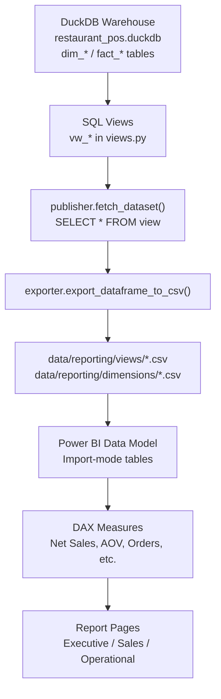
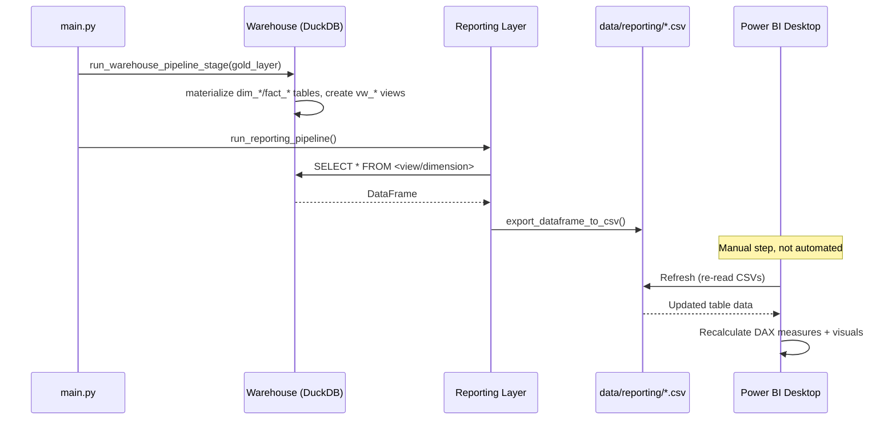

# Power BI Integration

## Table of Contents

- [Overview](#overview)
- [Purpose](#purpose)
- [Business Context](#business-context)
- [Engineering Context](#engineering-context)
- [Folder References](#folder-references)
- [Power BI Data Flow](#power-bi-data-flow)
- [Data Model](#data-model)
- [Refresh Workflow](#refresh-workflow)
- [Step-by-Step Processing](#step-by-step-processing)
- [Design Decisions](#design-decisions)
- [Trade-offs](#trade-offs)
- [Performance Considerations](#performance-considerations)
- [Scalability Discussion](#scalability-discussion)
- [Maintainability Discussion](#maintainability-discussion)
- [Summary](#summary)

---

## Overview

Power BI is the terminal consumer of this pipeline. It does not connect to DuckDB directly, does not read Parquet, and does not query any layer before the Reporting Layer. Its only inputs are the CSV files published to `data/reporting/views/` (16 files) and `data/reporting/dimensions/` (6 files) by `src/reporting/publisher.py`.

The Power BI artifact itself is a single file: `powerbi/dashboards/Restaurant_POS_Analytics.pbix`, with a static PDF export at `powerbi/exports/dashboards.pdf`.

## Purpose

This document explains **how data physically gets from the DuckDB warehouse into the Power BI report**, what the refresh workflow looks like given that this pipeline runs locally and on-demand (not on a schedule), and why the integration is deliberately restricted to a single, well-defined handoff point (the Reporting Layer CSVs).

## Business Context

Restaurant operators and analysts need dashboards that are trustworthy and reproducible: the same view in Power BI should always match what the SQL views say, without requiring anyone to write or debug DAX equivalents of business logic that already exists in SQL. Routing every visual through the Reporting Layer's CSVs means the business logic (sales aggregation, discount %, kitchen timing, order status classification) is defined exactly once, in `src/warehouse/views.py`, and Power BI's job is limited to presentation.

## Engineering Context

The project's own architectural comment inside `src/warehouse/views.py` states this constraint directly:

> Power BI consumes only these SQL Views — it never queries the Warehouse tables or Gold directly. This separation is a frozen architectural decision of the project.

That single sentence defines the entire integration boundary: Power BI is a pure presentation layer sitting on top of already-aggregated, already-validated CSV extracts.

## Folder References

```
data/warehouse/
└── restaurant_pos.duckdb        # dim_* / fact_* tables + vw_* SQL views

data/reporting/
├── views/                       # 16 CSVs — one per SQL view in views.py
│   ├── vw_daily_sales.csv
│   ├── vw_platform_performance.csv
│   ├── vw_brand_performance.csv
│   ├── vw_brand_sales.csv
│   ├── vw_category_sales.csv
│   ├── vw_category_performance.csv
│   ├── vw_item_sales.csv
│   ├── vw_item_performance.csv
│   ├── vw_daypart_sales.csv
│   ├── vw_discount_analysis.csv
│   ├── vw_order_type_performance.csv
│   ├── vw_order_status_analysis.csv
│   ├── vw_kitchen_performance.csv
│   ├── vw_charge_analysis.csv
│   ├── vw_aov_analysis.csv
│   └── vw_platform_sales.csv
└── dimensions/                  # 6 CSVs — one per conformed dimension
    ├── dim_brand.csv
    ├── dim_category.csv
    ├── dim_date.csv
    ├── dim_item.csv
    ├── dim_platform.csv
    └── dim_restaurant.csv

src/reporting/
├── reporting_config.py          # REPORTING_VIEWS / REPORTING_DIMENSIONS tuples + paths
├── publisher.py                 # connects to DuckDB, fetches each view/dimension, writes CSV
├── exporter.py                  # generic DataFrame -> CSV writer
└── orchestrator.py              # runs publish_views() then publish_dimensions()

powerbi/
├── dashboards/Restaurant_POS_Analytics.pbix
└── exports/dashboards.pdf
```

## Power BI Data Flow



Every visual traced in `dashboard_design.md` binds to either a table in this CSV set (via `queryRef` values such as `vw_daily_sales.business_date` or `dim_brand.brand`) or to a DAX measure built on top of one (`Table.Net Sales`, `Measure.Average Discount %`, `Measure.Average Preparation Time`, and similar). The naming match between the `REPORTING_VIEWS` / `REPORTING_DIMENSIONS` tuples in `reporting_config.py` and the table names referenced inside the `.pbix` report layout confirms this is the actual, and only, integration path — there is no secondary or direct database connection defined in the report.

## Data Model

The report's internal data model (Power BI's compressed, binary `DataModel` stream inside the `.pbix` package) is not human-readable outside Power BI Desktop, so its Power Query (M) source expressions can't be quoted verbatim here. What can be confirmed from the report layout is:

- Every table referenced by a visual matches a CSV filename exactly (`vw_daily_sales`, `vw_brand_performance`, `dim_date`, `dim_brand`, `dim_platform`, etc.), consistent with each CSV being imported as its own model table.
- A handful of derived DAX measures exist on top of these imported tables — `Net Sales`, `Gross Sales`, `Average Order Value`, `Orders`, `Average Discount %`, `Average Preparation Time`, `Kitchen Tickets`, `Slow Kitchen Tickets`, and `Tax` — used by the card visuals across all three pages.
- Slicers on `dim_date.business_date`, `dim_brand.brand`, and `dim_platform.platform` imply relationships from these dimension tables to the fact-derived views, so that filtering by brand or platform on a page correctly filters the corresponding `vw_*` visuals.

## Refresh Workflow

There is no Power BI Service, no scheduled/gateway-based refresh, and no automated publish step in this repository. The refresh workflow is entirely local and manual:

1. Run the pipeline end to end: `python main.py`. This re-runs Bronze → Silver → Gold → Warehouse → Reporting in sequence (see `main.py`), ending with `run_reporting_pipeline()` rewriting every CSV under `data/reporting/views/` and `data/reporting/dimensions/`.
2. Open `powerbi/dashboards/Restaurant_POS_Analytics.pbix` in Power BI Desktop.
3. Use **Home → Refresh** in Power BI Desktop. Because the model's source tables are the CSV files, this re-imports the freshly written CSVs and recalculates every DAX measure and visual against the new data.
4. Optionally re-export `powerbi/exports/dashboards.pdf` from Power BI Desktop's Export to PDF option, to keep the static export in sync with the interactive report.

## Step-by-Step Processing



## Design Decisions

- **CSV as the sole interface** — rather than pointing Power BI at DuckDB directly (which would require an ODBC/JDBC-style connector and expose the physical warehouse schema), the project publishes flat, self-describing CSVs. This keeps the Power BI side simple (plain file import) and keeps warehouse internals (table naming, keys, join logic) entirely hidden from the report.
- **Views published, not raw fact/dimension tables** — publishing `vw_*` views instead of `fact_*`/`dim_*` tables directly means every business rule (e.g., average order value calculation, discount percentage, daypart bucketing) is computed once in SQL and never re-implemented in DAX.
- **One CSV per view/dimension** — a 1:1 mapping between `REPORTING_VIEWS`/`REPORTING_DIMENSIONS` entries and output files keeps the publishing code (`publisher.py`) generic and makes it trivial to see, from the `data/reporting/` folder alone, exactly what Power BI can consume.

## Trade-offs

- **No live/DirectQuery connection** — because the CSVs are Import-mode sources, Power BI never reflects the warehouse in real time; every insight is only as fresh as the last `python main.py` run followed by a manual refresh in Power BI Desktop.
- **No incremental refresh in Power BI** — each refresh re-reads full CSVs rather than only new rows, which is acceptable at the current data volume (a few months of restaurant POS exports) but would need reconsideration if history grew into millions of rows.
- **Manual two-step refresh (pipeline, then Power BI)** — there is no single command that regenerates data and refreshes the report; a person has to run the pipeline and then explicitly refresh Power BI Desktop.

## Performance Considerations

Because Power BI imports flat CSVs into its own compressed in-memory (VertiPaq) model, report-time query performance is governed by Power BI's engine, not by DuckDB or the CSV files themselves — once imported, slicing and aggregating happens against the compressed model tables, not against re-reads of the CSVs. The CSV export step itself (`exporter.export_dataframe_to_csv`) is a simple, unbuffered `DataFrame.to_csv()` call per dataset, which is appropriate for the current dataset sizes but would benefit from chunked or Parquet-based exports if reporting datasets grew substantially.

## Scalability Discussion

The current design scales cleanly to more views: adding a new `vw_*` definition to `views.py`, registering its name in `REPORTING_VIEWS`, and re-running the pipeline produces a new CSV automatically — no changes are needed in `publisher.py` or `exporter.py`. What does not scale automatically is the Power BI side: each new CSV still needs to be manually added as a table inside Power BI Desktop (Get Data → Text/CSV) and bound to visuals, since there is no automated Power BI deployment pipeline (e.g., via the Power BI REST API or a `.pbip`/Deployment Pipelines setup) in this repository.

## Maintainability Discussion

Keeping all business logic in `views.py` (SQL) rather than in Power BI (DAX) means the analytical logic is version-controlled, code-reviewable, and testable independently of Power BI Desktop. Anyone maintaining this project can understand exactly what each dashboard number means by reading one SQL view definition, without needing to open the `.pbix` file at all. The cost of this approach is that any new business metric requires a full round trip — SQL view, CSV republish, Power BI table refresh, and visual binding — rather than a quick ad-hoc DAX measure inside the report.

## Summary

Power BI integrates with this pipeline through exactly one interface: the flat CSV files published by the Reporting Layer from a fixed set of 16 SQL views and 6 conformed dimensions. There is no direct database connection, no scheduled refresh, and no automated deployment — refreshing the dashboard is a two-step manual process of re-running `main.py` and then refreshing the report in Power BI Desktop. This design trades refresh convenience for a strict, auditable separation between business logic (SQL) and presentation (Power BI).
