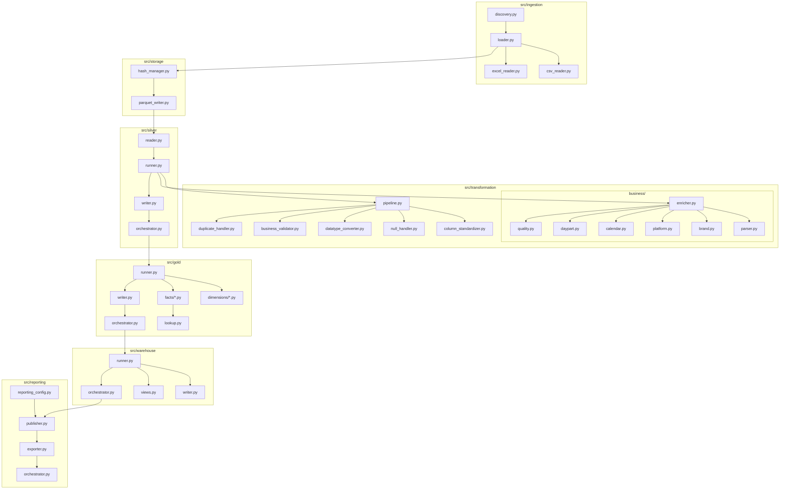

# Restaurant POS ELT Pipeline — Project Structure

## Table of Contents

- [Complete Repository Tree](#complete-repository-tree)
- [Explanation of Every Folder](#explanation-of-every-folder)
- [Explanation of Every Important File](#explanation-of-every-important-file)
- [Module Responsibilities](#module-responsibilities)
- [Execution Flow](#execution-flow)
- [Dependency Relationships](#dependency-relationships)
- [Folder Design Decisions](#folder-design-decisions)

---

## Complete Repository Tree

```
restaurant-pos-elt-pipeline/
├── .github/
│   └── workflows/
│       └── pipeline.yml
├── .dockerignore
├── .env
├── .env.example
├── .gitignore
├── Dockerfile
├── Makefile
├── README.md
├── docker-compose.yml
├── main.py
│
├── config/
│   ├── constants.py            (empty — reserved)
│   ├── database.py             (empty — reserved)
│   ├── logging.yaml            (empty — reserved)
│   ├── reports.yaml            (empty — reserved)
│   └── settings.py             (empty — reserved)
│
├── docs/
│   ├── project_overview.md
│   ├── architecture.md
│   └── project_structure.md
│
├── logs/
│   └── .gitkeep
│
├── requirements/
│   ├── requirements-runtime.txt
│   └── requirements-dev.txt
│
├── src/
│   ├── __init__.py
│   │
│   ├── analysis/
│   │   ├── __init__.py
│   │   ├── data_profiler.py
│   │   └── run_profiler.py
│   │
│   ├── core/                   (empty — reserved)
│   │   ├── __init__.py
│   │   ├── config_loader.py
│   │   └── logger.py
│   │
│   ├── gold/
│   │   ├── dimensions/
│   │   │   ├── brand.py
│   │   │   ├── category.py
│   │   │   ├── date.py
│   │   │   ├── item.py
│   │   │   ├── platform.py
│   │   │   └── restaurant.py
│   │   ├── facts/
│   │   │   ├── kitchen.py
│   │   │   ├── order_items.py
│   │   │   └── orders.py
│   │   ├── lookup.py
│   │   ├── orchestrator.py
│   │   ├── runner.py
│   │   └── writer.py
│   │
│   ├── ingestion/
│   │   ├── __init__.py
│   │   ├── csv_reader.py
│   │   ├── discovery.py
│   │   ├── excel_reader.py
│   │   └── loader.py
│   │
│   ├── models/                 (empty — reserved)
│   │   └── __init__.py
│   │
│   ├── reporting/
│   │   ├── __init__.py
│   │   ├── exporter.py
│   │   ├── orchestrator.py
│   │   ├── publisher.py
│   │   └── reporting_config.py
│   │
│   ├── silver/
│   │   ├── __init__.py
│   │   ├── orchestrator.py
│   │   ├── reader.py
│   │   ├── runner.py
│   │   └── writer.py
│   │
│   ├── storage/
│   │   ├── __init__.py
│   │   ├── hash_manager.py
│   │   └── parquet_writer.py
│   │
│   ├── transformation/
│   │   ├── __init__.py
│   │   ├── business/
│   │   │   ├── __init__.py
│   │   │   ├── brand.py
│   │   │   ├── calendar.py
│   │   │   ├── daypart.py
│   │   │   ├── enricher.py
│   │   │   ├── parser.py
│   │   │   ├── platform.py
│   │   │   └── quality.py
│   │   ├── business_validator.py
│   │   ├── column_standardizer.py
│   │   ├── datatype_converter.py
│   │   ├── duplicate_handler.py
│   │   ├── null_handler.py
│   │   └── pipeline.py
│   │
│   ├── utils/                  (empty — reserved)
│   │   └── __init__.py
│   │
│   ├── validation/              (empty — reserved)
│   │   └── __init__.py
│   │
│   └── warehouse/
│       ├── __init__.py
│       ├── orchestrator.py
│       ├── runner.py
│       ├── views.py
│       └── writer.py
│
├── tests/
│   ├── __init__.py
│   ├── test_business_silver.py
│   └── test_gold.py
│
├── powerbi/
│   ├── dashboards/
│   │   └── Restaurant_POS_Analytics.pbix
│   ├── exports/
│   │   └── dashboards.pdf
│   ├── screenshots/
│   │   ├── executive_business_performance.png
│   │   ├── operational_performance_analysis.png
│   │   └── sales_performance_analysis.png
│   └── themes/
│       └── Theme.json
│
└── data/
    ├── raw/
    │   ├── order_summary/                 (2 CSV exports: 2026-05, 2026-06)
    │   ├── order_summary_item/            (2 CSV exports: 2026-05, 2026-06)
    │   └── kot_process_time/              (6 Excel exports)
    ├── bronze/
    │   ├── order_summary/                 (Parquet, 1:1 with raw)
    │   ├── order_summary_item/            (Parquet, 1:1 with raw)
    │   └── kot_process_time/              (Parquet, 1:1 with raw)
    ├── silver/
    │   ├── order_summary/                 (cleaned + business-enriched Parquet)
    │   ├── order_summary_item/            (cleaned Parquet)
    │   └── kot_process_time/              (cleaned Parquet)
    ├── gold/
    │   ├── dim_brand/dim_brand.parquet
    │   ├── dim_category/dim_category.parquet
    │   ├── dim_date/dim_date.parquet
    │   ├── dim_item/dim_item.parquet
    │   ├── dim_platform/dim_platform.parquet
    │   ├── dim_restaurant/dim_restaurant.parquet
    │   ├── fact_kitchen/fact_kitchen.parquet
    │   ├── fact_order_items/fact_order_items.parquet
    │   └── fact_orders/fact_orders.parquet
    ├── warehouse/
    │   └── restaurant_pos.duckdb          (6 dim tables, 3 fact tables, 16 SQL views)
    ├── reporting/
    │   ├── dimensions/                    (6 CSV files, one per dimension)
    │   └── views/                         (16 CSV files, one per analytics view)
    └── metadata/
        └── processed_files.json           (SHA-256 hash + timestamp per ingested file)
```

## Explanation of Every Folder

| Folder | Purpose |
|---|---|
| `.github/workflows/` | Holds the GitHub Actions CI definition (`pipeline.yml`) that installs dependencies and runs the pipeline on every push/PR to `main`. |
| `config/` | Reserved location for centralized configuration (constants, database settings, logging config, report config). All files currently present are empty placeholders — no configuration logic has been implemented here yet; the pipeline currently hardcodes its paths and settings directly in the modules that need them (e.g. `Path("data") / "bronze"` in `parquet_writer.py`). |
| `docs/` | Project documentation, including this file, the architecture document, and the project overview. |
| `logs/` | Destination directory for log output (kept in version control via `.gitkeep` so the empty folder exists on checkout); no file currently writes structured logs to disk — `main.py` uses `logging.basicConfig` at `WARNING` level to standard output, and the Reporting layer uses the `logging` module directly. |
| `requirements/` | Splits Python dependencies into `requirements-runtime.txt` (what the Docker image and pipeline actually need) and `requirements-dev.txt` (testing/linting/notebook tooling), keeping the production image minimal. |
| `src/` | All pipeline source code, organized as one package per pipeline stage plus supporting packages. |
| `src/analysis/` | A standalone, one-time data-profiling toolkit (`data_profiler.py`, `run_profiler.py`) used during development to inspect Silver datasets before designing the Business Silver layer. Explicitly decoupled from the runtime pipeline — `main.py` never imports this package. |
| `src/core/` | Reserved for shared cross-cutting concerns (configuration loading, logging setup). `config_loader.py` and `logger.py` are currently empty; no module in the pipeline imports from `src.core` today. |
| `src/gold/` | Builds the Gold star schema: `dimensions/` (6 dimension builders), `facts/` (3 fact builders), `lookup.py` (surrogate-key joins), `runner.py` (composes dimensions + facts), `writer.py` (Parquet persistence), `orchestrator.py` (stage entry point). |
| `src/ingestion/` | Discovers and loads raw POS files: `discovery.py` (recursive file scan/group), `csv_reader.py` / `excel_reader.py` (format-specific readers), `loader.py` (dispatches by extension). |
| `src/models/` | Reserved for shared data model / schema definitions (e.g. dataclasses or Pydantic models). Currently contains only an empty `__init__.py`; no models have been implemented yet. |
| `src/reporting/` | Publishes the DuckDB analytics layer as CSV: `reporting_config.py` (whitelists + paths), `publisher.py` (DuckDB → DataFrame), `exporter.py` (DataFrame → CSV), `orchestrator.py` (stage entry point). |
| `src/silver/` | Coordinates the Silver stage I/O: `reader.py` (reads Bronze Parquet), `runner.py` (applies the transformation pipeline + Business Silver enrichment), `writer.py` (writes Silver Parquet), `orchestrator.py` (stage entry point). The actual transformation logic lives in `src/transformation/`, not here. |
| `src/storage/` | Bronze-layer persistence primitives: `hash_manager.py` (SHA-256 content hashing + `processed_files.json` metadata) and `parquet_writer.py` (DataFrame → Bronze Parquet). |
| `src/transformation/` | The Generic Silver transformation engine (`pipeline.py` plus `column_standardizer.py`, `null_handler.py`, `datatype_converter.py`, `business_validator.py`, `duplicate_handler.py`) and, in the `business/` subpackage, the restaurant-domain Business Silver enrichment logic (`parser.py`, `brand.py`, `platform.py`, `calendar.py`, `daypart.py`, `quality.py`, composed by `enricher.py`). |
| `src/utils/` | Reserved for shared, generic helper functions used across packages. Currently contains only an empty `__init__.py`. |
| `src/validation/` | Reserved for a dedicated, cross-cutting validation framework. Currently contains only an empty `__init__.py`; validation logic that exists today lives inline in `src/transformation/business_validator.py` and `src/transformation/business/quality.py` rather than in this package. |
| `src/warehouse/` | Materializes the Gold model into DuckDB and defines the analytics SQL layer: `writer.py` (Gold DataFrames → `dim_*`/`fact_*` tables), `views.py` (analytics `vw_*` views), `runner.py` (composes writer + views), `orchestrator.py` (stage entry point). |
| `tests/` | Two standalone validation/regression scripts run directly with `python`, not a pytest suite: `test_business_silver.py` (exercises Business Silver enrichment against real committed data) and `test_gold.py` (the official Gold-layer regression check, asserting dimension/fact shapes and surrogate-key integrity). |
| `powerbi/` | Power BI deliverables: the `.pbix` report file (`dashboards/`), a static PDF export of the report pages (`exports/`), dashboard screenshots (`screenshots/`), and a shared visual theme (`themes/`). |
| `data/raw/` | Original, unmodified POS export files as received (CSV for order summary/order summary item, Excel for KOT process time), grouped into one subfolder per report type. |
| `data/bronze/` | Bronze-layer Parquet copies of every raw file, one-to-one with `data/raw/`, produced by `src/storage/parquet_writer.py`. |
| `data/silver/` | Silver-layer Parquet output after Generic Silver transformation (all three datasets) and Business Silver enrichment (`order_summary` only). |
| `data/gold/` | Gold-layer Parquet output: one folder per dimension (`dim_*`) and per fact (`fact_*`). |
| `data/warehouse/` | The single DuckDB database file (`restaurant_pos.duckdb`) containing the materialized Gold tables and the analytics SQL views built on top of them. |
| `data/reporting/` | CSV exports of every published dimension (`dimensions/`) and every published analytics view (`views/`), produced by the Reporting stage. |
| `data/metadata/` | `processed_files.json`, the SHA-256 hash + timestamp ledger used by the Bronze stage to decide whether a raw file needs (re)processing. |

## Explanation of Every Important File

| File | Responsibility |
|---|---|
| `main.py` | The single pipeline entry point. Discovers and loads raw files, writes Bronze (with hash-based skip logic), and — only if new Bronze files were written — runs Silver, Gold, Warehouse, and Reporting in sequence, printing a final run summary. |
| `Dockerfile` | Builds a `python:3.14-slim`-based image containing only runtime dependencies, running as a non-root `pipeline` user, with `ENTRYPOINT ["python", "main.py"]`. |
| `docker-compose.yml` | Defines the single `restaurant-pos-pipeline` service: builds from the Dockerfile, bind-mounts the project directory into `/app`, loads `.env`, and runs to completion (`restart: "no"`). |
| `Makefile` | Developer convenience wrapper around Docker Compose commands (`build`, `run`, `down`, `rebuild`, `logs`, `shell`, `clean`). |
| `.github/workflows/pipeline.yml` | GitHub Actions workflow: on every push or PR to `main`, checks out the repo, sets up Python 3.14, installs `requirements-runtime.txt`, and runs `python main.py` — functioning as an executable CI regression check for the whole pipeline. |
| `.env` / `.env.example` | Environment variables consumed by Docker Compose (`PROJECT_NAME`, `PIPELINE_ENV`, `LOG_LEVEL`, `WAREHOUSE_PATH`, `REPORTING_OUTPUT`, `PYTHONUNBUFFERED`). |
| `requirements/requirements-runtime.txt` | Pinned production dependencies: pandas, numpy, pyarrow, duckdb, SQLAlchemy, openpyxl, python-dotenv, PyYAML, loguru, requests. |
| `requirements/requirements-dev.txt` | Pinned development-only dependencies (testing, linting/formatting such as `black`, notebook tooling), excluded from the Docker image. |
| `src/ingestion/discovery.py` | Recursively scans a raw directory, skips hidden files/dotfiles and macOS `__MACOSX` metadata folders, and groups supported `.csv`/`.xlsx` files by their parent folder name (the report/table name). |
| `src/ingestion/csv_reader.py` | Reads a single CSV into a DataFrame with a UTF-8 → UTF-8-BOM fallback, raising a `CSVReadError` on genuine parse failures, and attaches source-file metadata to `DataFrame.attrs`. |
| `src/ingestion/excel_reader.py` | Reads a single KOT Excel export by scanning the first 30 rows for the row that best matches known POS business column names (KOT, Item Name, Quantity, Process Time, etc.), rather than assuming a fixed header row offset — tolerating variable-length metadata blocks above the real table. |
| `src/ingestion/loader.py` | Dispatches each discovered file to the CSV or Excel reader based on extension, logging and skipping any file that fails to load rather than aborting the whole run. |
| `src/storage/hash_manager.py` | Computes a streaming SHA-256 hash of a raw file, and compares it against `data/metadata/processed_files.json` to decide whether the file is new/changed (`should_process`) or already ingested. |
| `src/storage/parquet_writer.py` | Writes a DataFrame to `data/bronze/<report_name>/<file_stem>.parquet` using PyArrow with Snappy compression. |
| `src/transformation/pipeline.py` | The Generic Silver orchestration function `run_silver_pipeline()`: standardize columns → normalize nulls → infer datatypes → validate business rules (read-only) → remove duplicates, returning the cleaned DataFrame plus a metadata dict (rows before/after, duplicates removed, validation errors). |
| `src/transformation/column_standardizer.py` | Normalizes column names: lowercase, spaces → underscores, strips `%`, `(`, `)`, `/`, collapses repeated underscores. |
| `src/transformation/null_handler.py` | Normalizes null-like text tokens (`"N/A"`, `"-"`, `"NULL"`, `"None"`, `"NaN"`, empty/whitespace strings, etc.) to real `None` values and trims whitespace, leaving numeric/boolean/datetime columns untouched. |
| `src/transformation/datatype_converter.py` | Infers each column's true dtype purely from its values, in priority order datetime → integer/float → boolean, without any hardcoded column-name logic. |
| `src/transformation/business_validator.py` | Read-only, dataset-agnostic business-rule checks: negative numeric values, duplicate/null identifier columns (`*_id`, `*_no`, `invoice_no`, `bill_no`, `kot_no`, `order_no`), and impossible dates (before 1900 or in the future). Never mutates the data. |
| `src/transformation/duplicate_handler.py` | Drops exact duplicate rows (`keep="first"`) and reports the count removed. |
| `src/transformation/business/parser.py` | Splits the raw `sub_order_type` field (e.g. `"Thepla House By Tejals - Zomato"`) into `(brand, platform)`, or treats a bare channel name (`"Dine In"`) as platform-only with no brand. |
| `src/transformation/business/brand.py` / `platform.py` | Map known raw brand/platform variants to a single canonical form (e.g. `"Homely and Healthy"` → `"Homely & Healthy"`); unrecognized values pass through unchanged rather than being dropped. |
| `src/transformation/business/calendar.py` | Derives `business_date`, `weekday`, `month`, `month_name`, `quarter`, and `year` from a datetime value, with no pandas dependency. |
| `src/transformation/business/daypart.py` | Classifies a datetime's time-of-day into Breakfast / Lunch / Snacks / Dinner / Late Night business dayparts. |
| `src/transformation/business/quality.py` | Row-level validation of the derived brand/platform/business_date/daypart combination (e.g. flags "Unknown brand", "Platform exists without brand"), returning a list of messages per row rather than mutating anything. |
| `src/transformation/business/enricher.py` | The single composition point for Business Silver: calls parser → brand/platform standardization → calendar → daypart → quality validation, and is the only module `src/silver/runner.py` is meant to call for this enrichment. |
| `src/silver/reader.py` | Loads every Bronze Parquet file (or a specific subset passed in) and groups the resulting DataFrames by report/dataset name. |
| `src/silver/runner.py` | Runs every Bronze dataset through `run_silver_pipeline()`, applies `enrich_business_attributes()` specifically to the `order_summary` dataset, and prints a per-file transformation report. |
| `src/silver/writer.py` | Writes every transformed Silver DataFrame to `data/silver/<dataset_name>/<file_name>` as Parquet. |
| `src/silver/orchestrator.py` | The Silver stage's single public entry point, `run_silver_pipeline_stage()`, composing `runner.py` and `writer.py` and printing a stage summary. |
| `src/gold/dimensions/*.py` | Each file builds one conformed Gold dimension (Date, Restaurant, Brand, Platform, Category, Item) from the relevant Silver dataset: select the business attribute column(s), drop nulls, de-duplicate, sort, and assign a sequential surrogate key. |
| `src/gold/facts/orders.py` | Builds `FactOrders` from Silver `order_summary`: attaches date/restaurant/brand/platform surrogate keys and selects invoice/KOT identifiers, order descriptors (daypart, order type, status, cancel reason), and financial measures. |
| `src/gold/facts/order_items.py` | Builds `FactOrderItems` from Silver `order_summary_item`, first re-joining order-header context (business date, brand, platform) from Silver `order_summary` via `restaurant_name` + `invoice_no`, then attaching all six dimension surrogate keys. |
| `src/gold/facts/kitchen.py` | Builds `FactKitchen` from Silver `kot_process_time`, deriving `business_date` from `punch_time` to resolve the date dimension, and attaching only `date_key` and `item_key` (restaurant/brand/platform/category keys are explicitly and deliberately omitted as unavailable in the KOT source). |
| `src/gold/lookup.py` | `attach_dimension_keys()` — performs the LEFT-join lookup of every available dimension's surrogate key onto a Silver DataFrame, skipping any dimension not supplied rather than failing. |
| `src/gold/runner.py` | `build_gold_layer()` — builds all 6 dimensions, then all 3 facts (reusing the already-built dimensions), returning a `{"dimensions": ..., "facts": ...}` dict. |
| `src/gold/writer.py` | Writes every Gold dimension/fact to `data/gold/<dim_or_fact_prefix><name>/<...>.parquet`. |
| `src/gold/orchestrator.py` | The Gold stage's single public entry point, `run_gold_pipeline_stage()`. |
| `src/warehouse/writer.py` | `write_warehouse()` — registers each Gold DataFrame with DuckDB and materializes it via `CREATE OR REPLACE TABLE ... AS SELECT * FROM ...`, inside an explicit transaction (commit/rollback). Also defines `DATABASE_PATH` (`data/warehouse/restaurant_pos.duckdb`), imported by both `views.py` and `reporting_config.py`. |
| `src/warehouse/views.py` | Defines and executes the analytics SQL view layer (`vw_daily_sales`, `vw_platform_performance`, `vw_brand_performance`, `vw_category_performance`, `vw_item_performance`, `vw_kitchen_performance`, `vw_daypart_sales`, `vw_order_type_performance`, `vw_order_status_analysis`) — the only layer Power BI is architecturally permitted to query. |
| `src/warehouse/runner.py` | Composes `write_warehouse()` and `create_views()` into a single `{"tables": ..., "views": ...}` summary. |
| `src/warehouse/orchestrator.py` | The Warehouse stage's single public entry point, `run_warehouse_pipeline_stage()`. |
| `src/reporting/reporting_config.py` | Pure configuration: `WAREHOUSE_DB_PATH`, `REPORTING_ROOT`/`REPORTING_VIEWS_FOLDER`/`REPORTING_DIMENSIONS_FOLDER`, and the `REPORTING_VIEWS` (16 names) / `REPORTING_DIMENSIONS` (6 names) whitelists that determine exactly what gets published. |
| `src/reporting/publisher.py` | Opens a DuckDB connection, runs `SELECT * FROM <name>` for each whitelisted view/dimension, and hands the DataFrame to the exporter, tracking rows/datasets published. |
| `src/reporting/exporter.py` | Generic, project-agnostic CSV writer (`export_dataframe_to_csv`) with directory creation; has no knowledge of DuckDB or the domain. |
| `src/reporting/orchestrator.py` | The Reporting stage's single public entry point, `run_reporting_pipeline()`, sequencing `publish_views()` then `publish_dimensions()`. |
| `src/analysis/data_profiler.py` | `profile_dataframe()` — produces a structural/statistical profile (row/column counts, memory usage, per-column null/distinct stats, duplicate rows, numeric and date summaries) of any DataFrame; used once during Business Silver design, not part of the runtime pipeline. |
| `src/analysis/run_profiler.py` | A script that discovers every Parquet file under `data/silver/`, profiles it with `data_profiler.py`, and prints a human-readable report. |
| `tests/test_business_silver.py` | Loads a real Silver `order_summary` Parquet file, runs `enrich_business_attributes()` on it, and prints a sample of the enriched columns for manual inspection. |
| `tests/test_gold.py` | The official Gold-layer regression check: loads real Silver Parquet data for all three datasets, calls `build_gold_layer()`, and asserts the expected dimension count (6), fact count (3), expected columns per dimension/fact, and that no fact row has a null surrogate key for its expected dimensions — raising immediately (uncaught) on any mismatch. |

## Module Responsibilities



## Execution Flow

The call chain triggered by `python main.py` (function-level):

```
main.run_pipeline()
├── discover_reports(RAW_DIR)                          [src/ingestion/discovery.py]
├── load_reports(discovered)                            [src/ingestion/loader.py]
│   └── _read_file() → read_csv_file() | read_excel_file()
├── load_processed_metadata()                           [src/storage/hash_manager.py]
├── for each loaded file:
│   ├── should_process(file, metadata)                  [src/storage/hash_manager.py]
│   ├── write_parquet(...)                               [src/storage/parquet_writer.py]
│   └── record_processed_file(metadata, file)            [src/storage/hash_manager.py]
├── save_processed_metadata(metadata)                    [src/storage/hash_manager.py]
├── if written_files:
│   ├── run_silver_pipeline_stage(written_files)         [src/silver/orchestrator.py]
│   │   ├── run_silver_transformations(bronze_root, written_files)   [src/silver/runner.py]
│   │   │   ├── load_bronze_data(...)                     [src/silver/reader.py]
│   │   │   ├── run_silver_pipeline(df)                   [src/transformation/pipeline.py]
│   │   │   │   ├── standardize_columns(df)
│   │   │   │   ├── handle_nulls(df)
│   │   │   │   ├── convert_datatypes(df)
│   │   │   │   ├── validate_business_rules(df)
│   │   │   │   └── remove_duplicates(df)
│   │   │   └── enrich_business_attributes(df)  (order_summary only) [src/transformation/business/enricher.py]
│   │   └── write_silver_data(silver_data)                [src/silver/writer.py]
│   ├── run_gold_pipeline_stage(silver_orders, silver_order_items, silver_kot)  [src/gold/orchestrator.py]
│   │   ├── build_gold_layer(...)                         [src/gold/runner.py]
│   │   │   ├── build_date_dimension / build_restaurant_dimension / build_brand_dimension /
│   │   │   │   build_platform_dimension / build_category_dimension / build_item_dimension
│   │   │   └── build_orders_fact / build_order_items_fact / build_kitchen_fact
│   │   │       └── attach_dimension_keys(...)             [src/gold/lookup.py]
│   │   └── write_gold_layer(gold_layer)                  [src/gold/writer.py]
│   ├── run_warehouse_pipeline_stage(gold_layer)          [src/warehouse/orchestrator.py]
│   │   ├── write_warehouse(gold_layer)                    [src/warehouse/writer.py]
│   │   └── create_views()                                 [src/warehouse/views.py]
│   └── run_reporting_pipeline()                          [src/reporting/orchestrator.py]
│       ├── publish_views()                                [src/reporting/publisher.py]
│       └── publish_dimensions()                           [src/reporting/publisher.py]
│           └── export_dataframe_to_csv(...)                [src/reporting/exporter.py]
└── print final summary
```

## Dependency Relationships

- **`main.py`** imports directly from `src.ingestion`, `src.storage`, `src.silver.orchestrator`, `src.gold.orchestrator`, `src.warehouse.orchestrator`, and `src.reporting` — it never imports a lower-level module (e.g. `src.transformation.pipeline`) directly.
- **`src.silver.orchestrator`** depends only on `src.silver.runner` and `src.silver.writer`.
- **`src.silver.runner`** depends on `src.silver.reader`, `src.transformation.pipeline`, and `src.transformation.business.enricher` — it is the only module that wires the Generic Silver pipeline and Business Silver enrichment together.
- **`src.transformation.pipeline`** depends on the five sibling transformation modules (`column_standardizer`, `null_handler`, `datatype_converter`, `business_validator`, `duplicate_handler`) and nothing else — no I/O, no pandas file operations.
- **`src.transformation.business.enricher`** depends on all six sibling `business/` modules (`parser`, `brand`, `platform`, `calendar`, `daypart`, `quality`) and is the sole intended call site for Business Silver logic.
- **`src.gold.runner`** depends on all six `src.gold.dimensions.*` modules and all three `src.gold.facts.*` modules.
- **`src.gold.facts.*`** each depend on `src.gold.lookup` for surrogate-key attachment; `order_items.py` additionally depends on the Silver `order_summary` DataFrame directly (passed as a parameter) to re-join order-header context.
- **`src.warehouse.views`** depends on `src.warehouse.writer` only for `DATABASE_PATH` — it does not depend on `src.gold` or `src.silver` at all, since it operates purely in SQL against already-materialized tables.
- **`src.reporting.reporting_config`** depends on `src.warehouse.writer.DATABASE_PATH` for the warehouse location; `src.reporting.publisher` depends on `src.reporting.reporting_config` and `src.reporting.exporter`.
- **`src.analysis`** (data_profiler, run_profiler) has no dependents anywhere else in `src/` or `main.py` — it is intentionally isolated tooling, confirmed by the fact that `main.py` never imports it.
- **`src.core`, `src.models`, `src.utils`, `src.validation`** currently have no internal contents and no dependents anywhere in the codebase — they are reserved package scaffolding for future use, not yet wired into the pipeline.

## Folder Design Decisions

- **One package per Medallion/pipeline stage (`ingestion`, `storage`, `silver`, `gold`, `warehouse`, `reporting`)** rather than one large `pipeline/` package. This mirrors the Medallion Architecture directly in the codebase layout: anyone looking for "how Bronze is written" goes straight to `src/storage/`, and "how the Gold star schema is built" to `src/gold/`, without needing to trace call graphs through a monolithic module.
- **`transformation/` is separate from `silver/`.** `src/transformation/` contains only pure, I/O-free logic (both Generic Silver steps and Business Silver enrichment), while `src/silver/` owns the I/O (reading Bronze, writing Silver) and orchestration. This split means the entire transformation logic can be unit-tested with in-memory DataFrames and no filesystem access at all.
- **`gold/dimensions/` and `gold/facts/` are split into their own subfolders** rather than one flat `gold/` package, because a dimensional model has a natural conceptual split between dimensions and facts, and this repository has enough of each (6 dimensions, 3 facts) that flattening them would make the package harder to scan.
- **`warehouse/writer.py` (physical tables) and `warehouse/views.py` (analytics views) are separate files in the same package**, not separate packages — they are tightly coupled (views query the tables) but serve conceptually distinct audiences (writer.py is infrastructure; views.py is the business-facing analytics contract), so splitting them into files (not packages) balances proximity with separation of concern.
- **`reporting/` reads from the warehouse independently rather than living inside `warehouse/`.** Keeping Reporting as its own top-level package (rather than a submodule of `warehouse/`) reflects that Reporting is a distinct consumer of the warehouse, architecturally equivalent to how Power BI itself consumes the warehouse — it is not part of building the warehouse.
- **Reserved-but-empty packages (`core/`, `models/`, `utils/`, `validation/`) are committed as scaffolding.** This signals the project's intended long-term structure (a shared config/logging layer, shared data models, shared utilities, and a dedicated validation framework) without forcing premature abstraction — logic currently lives closest to where it's used (e.g. validation inline in `transformation/`) until it's actually needed in more than one place.
- **`data/` mirrors the `src/` stage layout exactly** (`raw` → `bronze` → `silver` → `gold` → `warehouse` → `reporting`, plus `metadata`), so the physical data lake on disk is discoverable using the same mental model as the source code that produces it.
- **`powerbi/` is split into `dashboards/`, `exports/`, `screenshots/`, and `themes/`** to separate the editable source artifact (`.pbix`), a static/shareable export (`.pdf`), documentation-friendly images (`.png` screenshots), and reusable styling (`Theme.json`) — each with a different audience and update cadence.
