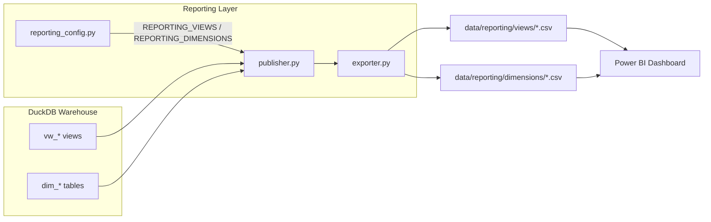
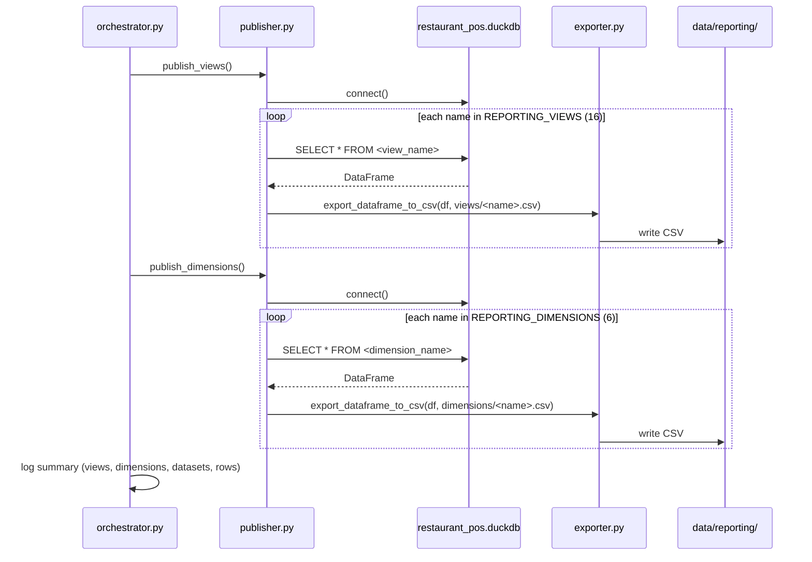

# Reporting Layer

## Table of Contents

- [Overview](#overview)
- [Purpose](#purpose)
- [Business Context](#business-context)
- [Engineering Context](#engineering-context)
- [Folder References](#folder-references)
- [Architecture](#architecture)
- [Workflow](#workflow)
- [Step-by-Step Processing](#step-by-step-processing)
- [Published Datasets](#published-datasets)
- [Best Practices Applied](#best-practices-applied)
- [Design Decisions](#design-decisions)
- [Trade-offs](#trade-offs)
- [Performance Considerations](#performance-considerations)
- [Scalability Discussion](#scalability-discussion)
- [Maintainability Discussion](#maintainability-discussion)
- [Summary](#summary)

---

## Overview

The Reporting Layer is the final stage of the pipeline. It reads the analytical views and dimensions already defined in the DuckDB Warehouse and publishes each one as a standalone CSV file under `data/reporting/`. This is a **pure export layer**: it contains no SQL view definitions, no aggregation logic, and no business rules of its own — every number it publishes was already computed by the Warehouse Layer's SQL views.

The published CSVs are the artifacts that get consumed downstream — either directly by analysts, or as the data source imported into the Power BI dashboard (`powerbi/dashboards/Restaurant_POS_Analytics.pbix`).

---

## Purpose

- Turn the Warehouse's SQL views and dimension tables into portable, file-based datasets that do not require a live DuckDB connection to consume.
- Provide a stable, versionable snapshot of "what the business dashboards saw" at pipeline run time.
- Decouple Power BI/analyst consumption from the DuckDB engine itself.

---

## Business Context

Every CSV published here answers a specific class of business question:

- **Sales & revenue trend** — `vw_daily_sales`, `vw_aov_analysis`
- **Channel and brand mix** — `vw_platform_performance`, `vw_platform_sales`, `vw_brand_performance`, `vw_brand_sales`
- **Menu performance** — `vw_category_performance`, `vw_category_sales`, `vw_item_performance`, `vw_item_sales`
- **Operational / kitchen efficiency** — `vw_kitchen_performance`
- **Order behavior** — `vw_daypart_sales`, `vw_order_type_performance`, `vw_order_status_analysis`
- **Revenue leakage** — `vw_discount_analysis`, `vw_charge_analysis`

Each dataset is scoped to a single business concern, which keeps Power BI report pages simple to build and lets a business user open a single CSV and understand exactly what it represents.

---

## Engineering Context

The Reporting Layer consists of four modules with a strict separation of concerns, per their module docstrings:

- **`reporting_config.py`** — configuration only: filesystem paths and the curated tuples `REPORTING_VIEWS` (16 views) and `REPORTING_DIMENSIONS` (6 dimensions) that get published. No functions, no logic.
- **`exporter.py`** — generic CSV-writing utilities. Knows nothing about DuckDB, the Warehouse, or any project-specific dataset; it only operates on already-created pandas DataFrames and filesystem paths.
- **`publisher.py`** — reads each configured view/dimension from the Warehouse via a DuckDB connection and calls the generic exporter. Knows nothing about pipeline orchestration or Power BI.
- **`orchestrator.py`** — sequences `publish_views()` then `publish_dimensions()` and logs a summary. Contains no SQL and no CSV export logic itself.

```
Warehouse (DuckDB: dim_*, vw_*)
        │
        ▼
publisher.py  →  fetch_dataset() / publish_dataset()
        │
        ▼
exporter.py   →  export_dataframe_to_csv()
        │
        ▼
data/reporting/views/*.csv
data/reporting/dimensions/*.csv
```

---

## Folder References

```
restaurant-pos-elt-pipeline/
├── src/
│   └── reporting/
│       ├── reporting_config.py   # Paths + curated REPORTING_VIEWS / REPORTING_DIMENSIONS tuples
│       ├── exporter.py           # Generic DataFrame → CSV writer
│       ├── publisher.py          # Fetches from DuckDB, delegates to exporter
│       └── orchestrator.py       # Sequences publish_views() → publish_dimensions()
└── data/
    └── reporting/
        ├── views/                # 16 published analytical view CSVs
        │   ├── vw_aov_analysis.csv
        │   ├── vw_brand_performance.csv
        │   ├── vw_brand_sales.csv
        │   ├── vw_category_performance.csv
        │   ├── vw_category_sales.csv
        │   ├── vw_charge_analysis.csv
        │   ├── vw_daily_sales.csv
        │   ├── vw_daypart_sales.csv
        │   ├── vw_discount_analysis.csv
        │   ├── vw_item_performance.csv
        │   ├── vw_item_sales.csv
        │   ├── vw_kitchen_performance.csv
        │   ├── vw_order_status_analysis.csv
        │   ├── vw_order_type_performance.csv
        │   ├── vw_platform_performance.csv
        │   └── vw_platform_sales.csv
        └── dimensions/            # 6 published dimension CSVs
            ├── dim_brand.csv
            ├── dim_category.csv
            ├── dim_date.csv
            ├── dim_item.csv
            ├── dim_platform.csv
            └── dim_restaurant.csv
```

---

## Architecture



---

## Workflow



---

## Step-by-Step Processing

1. **Configuration lookup**: `REPORTING_VIEWS` (16 view names) and `REPORTING_DIMENSIONS` (6 dimension names) are read from `reporting_config.py`, along with the target folders `data/reporting/views/` and `data/reporting/dimensions/`.
2. **Connection**: `publisher.get_connection()` opens a DuckDB connection to `data/warehouse/restaurant_pos.duckdb`.
3. **Fetch**: for each configured name, `fetch_dataset()` runs `SELECT * FROM <name>` and materializes the full result as a pandas DataFrame via `fetchdf()`.
4. **Export**: `publish_dataset()` hands that DataFrame to `export_dataframe_to_csv()`, which:
   - Ensures the destination directory exists (`ensure_directory()`),
   - Writes the DataFrame to `<output_directory>/<name>.csv` with `index=False` and UTF-8 encoding, overwriting any existing file,
   - Logs the published row count.
5. **Repeat for dimensions**: the same fetch/export cycle runs for every name in `REPORTING_DIMENSIONS`, writing to `data/reporting/dimensions/` instead.
6. **Summary**: `orchestrator.run_reporting_pipeline()` totals the datasets published and rows exported across both steps and logs a final summary, returning `{"views": 16, "dimensions": 6, "datasets": 22, "rows": <total>}`.

---

## Published Datasets

### Reporting Views (16)

| View | Business Question | Grain | Key Measures |
|---|---|---|---|
| `vw_daily_sales` | Daily sales trend by restaurant | Date × restaurant | orders, gross_sales, discount, delivery_charge, container_charge, tax, net_sales, average_order_value |
| `vw_platform_performance` | Sales performance by ordering platform | Platform | orders, gross_sales, discount, tax, net_sales, average_order_value, average_discount |
| `vw_platform_sales` | Alternate platform sales summary, sorted by gross sales | Platform | total_orders, gross_sales, discount, tax, net_sales, average_order_value |
| `vw_brand_performance` | Sales performance by brand | Brand | orders, gross_sales, discount, tax, net_sales, average_order_value, average_discount |
| `vw_brand_sales` | Alternate brand sales summary, sorted by gross sales | Brand | total_orders, gross_sales, discount, net_sales, average_order_value |
| `vw_category_performance` | Menu category performance | Category | items_sold, gross_sales, net_sales, average_item_price |
| `vw_category_sales` | Alternate category summary, sorted by revenue | Category | quantity_sold, revenue, average_item_price |
| `vw_item_performance` | Item-level menu performance | Item × category | quantity, gross_sales, average_item_price |
| `vw_item_sales` | Alternate item summary, sorted by revenue | Item | quantity_sold, revenue, average_price, number_of_orders |
| `vw_kitchen_performance` | Kitchen preparation efficiency | Order type × server × item status | kitchen_tickets, average/min/max preparation time, performance_status |
| `vw_daypart_sales` | Sales by time-of-day segment | Daypart | orders, gross_sales, discount, tax, net_sales, average_order_value, average_discount |
| `vw_order_type_performance` | Sales by order type (e.g., dine-in/delivery) | Order type | orders, gross_sales, discount, tax, net_sales, average_order_value, average_discount |
| `vw_order_status_analysis` | Order outcome / cancellation analysis | Status × cancel reason | orders, gross_sales, net_sales, average_order_value, order_percentage |
| `vw_aov_analysis` | Monthly Average Order Value trend | Year × month | orders, sales, average_order_value |
| `vw_discount_analysis` | Discount erosion over time | Business date | gross_sales, discount, discount_percentage |
| `vw_charge_analysis` | Non-item charge breakdown over time | Business date | delivery_charge, container_charge, service_charge, additional_charge, deduction_charge, total_sales |

### Reporting Dimensions (6)

`dim_brand`, `dim_category`, `dim_date`, `dim_item`, `dim_platform`, `dim_restaurant` — published verbatim from the Warehouse so that any downstream tool (including Power BI) can join reporting-view CSVs back to descriptive attributes without needing a live database connection. Full column definitions are in [`data_dictionary.md`](data_dictionary.md).

> **Note on source-of-truth**: nine of the sixteen views above (`vw_daily_sales`, `vw_platform_performance`, `vw_brand_performance`, `vw_category_performance`, `vw_item_performance`, `vw_kitchen_performance`, `vw_daypart_sales`, `vw_order_type_performance`, `vw_order_status_analysis`) have their `CREATE VIEW` SQL tracked in `src/warehouse/views.py`. The other seven (`vw_platform_sales`, `vw_brand_sales`, `vw_category_sales`, `vw_item_sales`, `vw_aov_analysis`, `vw_discount_analysis`, `vw_charge_analysis`) currently exist only inside the committed `restaurant_pos.duckdb` file — see [`warehouse.md`](warehouse.md) for details on this gap.

---

## Best Practices Applied

- **Separation of generic vs. domain-specific code**: `exporter.py` has no knowledge of DuckDB or this project's schema, so it could be reused for any DataFrame-to-CSV export need.
- **Configuration as data**: the list of published views/dimensions lives in a single tuple-based config module rather than being scattered across the codebase, making it trivial to see (and change) exactly what gets published.
- **Idempotent writes**: every export overwrites the destination file (`to_csv` with a fixed path), so re-running the pipeline always reflects the latest Warehouse state without manual cleanup.
- **Structured logging**: every publish step logs the dataset name and row count, giving an audit trail of exactly what was exported and how many rows each dataset contained.
- **Fail-fast directory handling**: `ensure_directory()` explicitly creates parent folders and logs and re-raises on failure rather than silently swallowing filesystem errors.

---

## Design Decisions

- **CSV as the interchange format**: CSV was chosen over Parquet or a database export for the Reporting Layer specifically because it is the format Power BI and business users can open directly without any additional tooling.
- **Read from the Warehouse, not from Gold**: the Reporting Layer intentionally reads from DuckDB's `vw_*` views and `dim_*` tables rather than re-reading Gold Parquet files, ensuring the CSVs reflect exactly the same joins and aggregations that any other SQL client (like Power BI) would see.
- **One CSV per dataset**: each view or dimension is published as its own file rather than being combined into a single wide export, which keeps each file's grain and business meaning unambiguous.

---

## Trade-offs

- **Full re-export vs. incremental**: like the Warehouse Layer, this stage re-exports every configured view and dimension in full on every run rather than only exporting changed rows. This is simple and always correct but means export time scales with the total number of rows in each view, not just new data.
- **CSV vs. richer formats**: CSV loses type fidelity (e.g., explicit date types, decimal precision annotations) compared to Parquet, but gains universal compatibility with spreadsheet tools and Power BI's CSV import path.
- **Configuration drift risk**: because `REPORTING_VIEWS` in `reporting_config.py` is a hand-maintained tuple, it must be kept in sync with whatever views actually exist in the Warehouse. As documented above, all 16 configured names do currently resolve against the database, but 7 of them would fail to publish if the warehouse were rebuilt strictly from `views.py` without also adding their SQL definitions.

---

## Performance Considerations

- Each `fetch_dataset()` call executes `SELECT * FROM <name>` and fully materializes the result via `fetchdf()`. For the current fact table sizes (order of 10⁴–10⁵ rows), this is fast and memory-light; for much larger warehouses, streaming or chunked export would be needed instead of a single `fetchdf()` call.
- Views such as `vw_item_performance` and `vw_item_sales` aggregate over `fact_order_items` (109,428 rows) grouped down to item-level grain (843 items); the aggregation cost is paid once per publish run at query time, not stored.

---

## Scalability Discussion

- The current publish loop is sequential (`for view_name in REPORTING_VIEWS`), issuing one connection-scoped query per dataset. This is simple and adequate at today's scale (22 total datasets); at a much larger number of reporting datasets, parallelizing the fetch/export loop (e.g., via a thread pool, since each query is I/O/DuckDB-bound) would reduce total publish time.
- As new monthly source files are ingested and the underlying fact tables grow, the CSV files produced here will grow proportionally. Because each publish is a full overwrite, storage and I/O cost for this stage grows linearly with warehouse size.

---

## Maintainability Discussion

- The publisher/exporter split means adding a new reporting dataset only requires adding its name to the appropriate tuple in `reporting_config.py` — no new code is needed as long as the corresponding view or table already exists in the Warehouse.
- The main maintainability follow-up (shared with the Warehouse Layer doc) is migrating the seven view definitions that exist only in `restaurant_pos.duckdb` into `src/warehouse/views.py`, so `REPORTING_VIEWS` and the tracked SQL source stay fully in sync and the entire pipeline is reproducible from a clean checkout.

---

## Summary

The Reporting Layer is a thin, intentionally "dumb" export stage: it reads 16 curated analytical views and 6 dimensions from the DuckDB Warehouse and writes each one to its own CSV file under `data/reporting/`, using a strict split between DuckDB-aware fetching (`publisher.py`) and DuckDB-agnostic CSV writing (`exporter.py`). These 22 CSV datasets are what powers the Power BI dashboard and give analysts a portable, versionable snapshot of the business's sales, menu, kitchen, and revenue-erosion metrics at the time the pipeline last ran.
