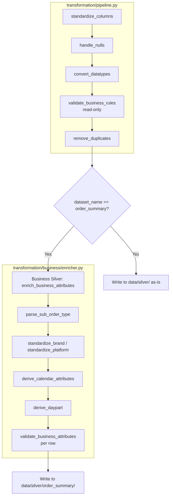
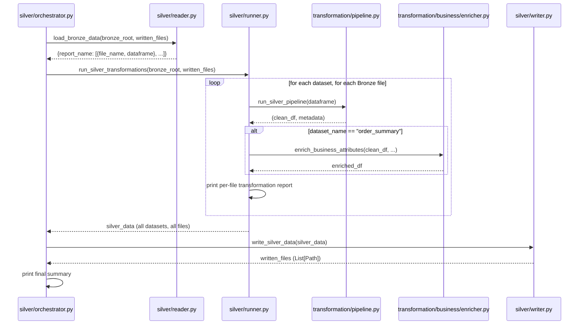
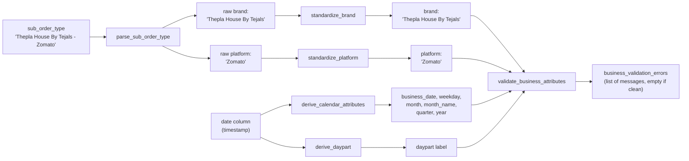

# Silver Layer

## Table of Contents

- [Overview](#overview)
- [Purpose](#purpose)
- [Business Context](#business-context)
- [Engineering Context](#engineering-context)
- [Folder References](#folder-references)
- [Architecture: Generic Silver vs. Business Silver](#architecture-generic-silver-vs-business-silver)
- [Workflow](#workflow)
- [Step-by-Step Processing: Generic Silver](#step-by-step-processing-generic-silver)
- [Step-by-Step Processing: Business Silver](#step-by-step-processing-business-silver)
- [Business Silver Sub-Modules in Detail](#business-silver-sub-modules-in-detail)
- [Orchestration (reader / runner / writer)](#orchestration-reader--runner--writer)
- [Best Practices Applied](#best-practices-applied)
- [Design Decisions](#design-decisions)
- [Trade-offs](#trade-offs)
- [Performance Considerations](#performance-considerations)
- [Scalability Discussion](#scalability-discussion)
- [Maintainability Discussion](#maintainability-discussion)
- [Summary](#summary)

---

## Overview

The Silver layer transforms Bronze Parquet data into clean, typed,
de-duplicated, and (for `order_summary` specifically) business-enriched
data. It is implemented as two distinct sub-layers within the same
physical output location (`data/silver/`):

1. **Generic Silver** (`src/transformation/pipeline.py` and its siblings):
   domain-agnostic cleanup that would apply to any tabular dataset.
2. **Business Silver** (`src/transformation/business/`): POS-specific
   enrichment — brand/platform extraction, calendar and daypart derivation,
   and business-rule quality validation.

## Purpose

Generic Silver exists to guarantee that every dataset leaving Bronze has
consistent column names, correctly typed columns, normalized nulls, and no
exact-duplicate rows — regardless of which report it came from. Business
Silver exists to layer restaurant-specific semantics (which brand, which
platform, which daypart, which calendar attributes) on top of that clean
foundation, so the Gold layer never has to re-derive them.

## Business Context

The single most important business problem Silver solves is the
overloaded `sub_order_type` field. A raw POS export encodes both brand and
platform in one string — `"Thepla House By Tejals - Zomato"` — while
Dine-In, Delivery, and Pick Up orders have no brand at all (they are
walk-in/direct channels, not virtual-brand storefronts). Left unprocessed,
this field cannot be used to build a `DimBrand` or `DimPlatform`, or to
filter a Power BI report by platform. Business Silver's parser and
standardizer modules resolve this exactly once, so every downstream
consumer — Gold, the Warehouse views, Power BI — works from the same
canonical brand/platform vocabulary.

## Engineering Context

```text
src/transformation/
├── column_standardizer.py   # normalize column names
├── null_handler.py          # normalize null-like tokens to None
├── datatype_converter.py    # infer & cast datetime/int/float/bool
├── business_validator.py    # read-only structural/business checks
├── duplicate_handler.py     # exact row de-duplication
├── pipeline.py               # orchestrates the five modules above
└── business/
    ├── parser.py             # split sub_order_type -> (brand, platform)
    ├── brand.py               # canonicalize brand names
    ├── platform.py            # canonicalize platform names
    ├── calendar.py             # derive business_date/weekday/month/quarter/year
    ├── daypart.py              # classify timestamp -> Breakfast/Lunch/.../Late Night
    ├── quality.py              # row-level business validation
    └── enricher.py              # composes the six modules above

src/silver/
├── reader.py     # loads Bronze Parquet, grouped by report name
├── runner.py     # applies Generic Silver + conditional Business Silver
├── writer.py     # persists transformed data to data/silver/
└── orchestrator.py  # coordinates reader -> runner -> writer -> summary
```

## Folder References

```text
data/silver/
├── order_summary/           # Generic Silver + Business Silver applied
├── order_summary_item/      # Generic Silver only
└── kot_process_time/        # Generic Silver only
```

Only `order_summary` receives Business Silver enrichment. This is a
deliberate, explicitly-coded branch in `src/silver/runner.py`
(`if dataset_name == "order_summary":`), justified by an inline comment:
business attributes are "currently derived only for the Order Summary
dataset, as it contains the required business context
(`sub_order_type`)."

## Architecture: Generic Silver vs. Business Silver



## Workflow



## Step-by-Step Processing: Generic Silver

`run_silver_pipeline()` in `pipeline.py` applies exactly five steps, in
this fixed order, to every Bronze DataFrame:

1. **`standardize_columns()`** — normalizes every column name:
   lowercased, spaces replaced with `_`, `%`/`(`/`)`/`/` characters
   stripped, consecutive underscores collapsed to one, and leading/trailing
   underscores trimmed. This guarantees every downstream reference to a
   column name (e.g. `"business_date"`, `"item_name"`) is stable regardless
   of how the original POS export happened to capitalize or space its
   headers.

2. **`handle_nulls()`** — for every non-numeric, non-boolean, non-datetime
   column, trims whitespace and maps a fixed set of null-like tokens
   (`""`, `" "`, `"-"`, `"--"`, `"NA"`, `"N/A"`, `"NULL"`, `"null"`,
   `"None"`, `"none"`, `"NaN"`, `"nan"`) to a real Python `None`. Numeric,
   boolean, and datetime columns are explicitly left untouched, since these
   tokens cannot legitimately appear in already-typed data and blind
   coercion risks corrupting it.

3. **`convert_datatypes()`** — for every column not already a concrete
   numeric/boolean/datetime dtype, attempts conversion in a fixed priority
   order: **datetime → numeric (Int64/Float64) → boolean**. Datetime is
   checked first specifically because POS exports are rich in date/time
   columns that would otherwise risk misclassification. A column is only
   converted if **100% of its non-null values** parse cleanly under the
   candidate type (via `pd.to_datetime`/`pd.to_numeric`/token matching, all
   with `errors="coerce"` and a resulting-null-count check); otherwise it's
   left as text. This "all or nothing" approach means partially-numeric
   text columns are never silently and inconsistently coerced.

4. **`validate_business_rules()`** — a **read-only** validator that never
   mutates the DataFrame; it only returns a list of violation messages,
   covering:
   - Negative values in any numeric (non-boolean) column.
   - Duplicate or null values in identifier-like columns, detected by name
     (exact match against `{"id", "invoice_no", "bill_no", "kot_no",
     "order_no"}`, or suffix match against `_id`/`_no`).
   - "Impossible" dates: any datetime value before 1900-01-01 or after the
     current timestamp.
   These messages are surfaced in the per-file console report and stored in
   the run metadata, but they never block or alter the pipeline — they are
   diagnostic, not enforcement.

5. **`remove_duplicates()`** — drops fully-duplicate rows
   (`df.drop_duplicates(keep="first")`), returning both the cleaned
   DataFrame and a count of rows removed.

`run_silver_pipeline()` returns `(clean_dataframe, metadata)`, where
`metadata` captures `rows_before`, `rows_after`, `duplicates_removed`, and
`validation_errors` — all surfaced in the console transformation report
printed by `silver/runner.py`.

## Step-by-Step Processing: Business Silver

`enrich_business_attributes()` in `business/enricher.py` is the **single
entry point** the Silver runner calls for POS-specific enrichment. It is
only invoked for `order_summary`, and performs five steps on a copy of the
Generic-Silver-cleaned DataFrame:

1. **Parse** `sub_order_type` into raw `(brand, platform)` via
   `parse_sub_order_type()`.
2. **Standardize** both extracted values into canonical form via
   `standardize_brand()` / `standardize_platform()`.
3. **Derive calendar attributes** (`business_date`, `weekday`, `month`,
   `month_name`, `quarter`, `year`) from the order's timestamp column via
   `derive_calendar_attributes()`.
4. **Derive the daypart label** (Breakfast/Lunch/Snacks/Dinner/Late Night)
   from the same timestamp via `derive_daypart()`.
5. **Validate** the resulting row's brand/platform/date/daypart combination
   via `validate_business_attributes()`, attaching the messages as a new
   `business_validation_errors` column (list per row, empty list if clean).



## Business Silver Sub-Modules in Detail

### `parser.py` — `parse_sub_order_type()`

A pure, dependency-free string parser with no DataFrame awareness. It
recognizes two input shapes:

- `"<brand> - <platform>"` (split on the **last** occurrence of `" - "`
  via `rsplit(..., 1)`, so brand names that themselves might contain a
  hyphen are handled correctly) → returns `(brand, platform)`.
- A bare channel name with no separator (`"Dine In"`, `"Delivery"`,
  `"Pick Up"`) → returns `(None, platform)`, since these channels have no
  associated virtual brand.

### `brand.py` — `standardize_brand()`

Maps known brand-name variants to a canonical form via a lookup table
(`_CANONICAL_BRANDS`), after normalizing whitespace and unifying `"and"`/`"&"`
spelling (e.g. `"Homely and Healthy"` and `"Homely & Healthy"` resolve to
the same canonical brand `"Homely & Healthy"`). Unrecognized brands are
returned trimmed but otherwise unchanged — **never silently dropped** —
which is what allows `quality.py` to later flag them as "Unknown brand"
rather than losing them outright.

### `platform.py` — `standardize_platform()`

Same pattern as `brand.py`: a lookup table (`_CANONICAL_PLATFORMS`) maps
case-insensitive variants (`"swiggy (toing)"` → `"Swiggy"`) to canonical
platform names (`Swiggy`, `Zomato`, `Delivery`, `Pick Up`, `Dine In`).

### `calendar.py` — `derive_calendar_attributes()`

Pure `datetime` decomposition (no pandas import — `pandas.Timestamp` is
accepted because it subclasses `datetime.datetime`). Produces
`business_date`, `weekday` (full name), `month`, `month_name`, `quarter`
(derived via `((month - 1) // 3) + 1`), and `year`. Returns an all-`None`
dict if the input timestamp is `None`.

### `daypart.py` — `derive_daypart()`

Classifies a timestamp's time-of-day into one of five labels using
inclusive boundary ranges:

| Daypart | Time Range |
|---|---|
| Breakfast | 05:00 – 10:59 |
| Lunch | 11:00 – 15:59 |
| Snacks | 16:00 – 18:59 |
| Dinner | 19:00 – 22:59 |
| Late Night | 23:00 – 04:59 (wraps past midnight) |

Late Night is handled as a special case since it spans midnight and cannot
be expressed as a single ordinary `start <= t <= end` range like the other
four.

### `quality.py` — `validate_business_attributes()`

A row-level, read-only validator (mirrors the read-only philosophy of
Generic Silver's `business_validator.py`, but operating on already-derived
business attributes rather than raw columns). It checks, per row:

- Brand is one of the known canonical brands (`_KNOWN_BRANDS`), else
  `"Unknown brand"`.
- Platform is one of the known canonical platforms (`_KNOWN_PLATFORMS`),
  else `"Unknown platform"`.
- `business_date` is present, else `"Missing business date"`.
- `daypart` is present, else `"Missing daypart"`.
- A brand exists but no platform does → `"Brand exists without platform"`
  (structurally shouldn't happen, since brand is only ever parsed alongside
  a platform).
- A platform exists, no brand exists, and the platform is **not** one of
  the legitimately brandless platforms (`Delivery`, `Pick Up`, `Dine In`)
  → `"Platform exists without brand"`. This encodes the business rule that
  aggregator platforms (Swiggy, Zomato) should always carry a brand, while
  direct/walk-in channels legitimately do not.

## Orchestration (reader / runner / writer)

- **`reader.py` (`load_bronze_data`)**: loads Bronze Parquet files, either
  the full set found under `bronze_root` or a specific `parquet_files` list
  (used by `main.py` to load only the files written in the *current* run,
  avoiding a full-Bronze rescan on every invocation). Groups results by the
  Parquet file's parent folder name (the report name), matching the same
  convention used in Bronze and Discovery.
- **`runner.py` (`run_silver_transformations`)**: for every loaded Bronze
  file, runs the Generic Silver pipeline, conditionally applies Business
  Silver enrichment (`order_summary` only), and prints a per-file console
  report (rows before/after, duplicates removed, validation error count,
  and the validation messages themselves).
- **`writer.py` (`write_silver_data`)**: writes every transformed DataFrame
  to `data/silver/<dataset_name>/<original_file_name>.parquet`, creating
  directories as needed and defaulting to a `.parquet` suffix if the
  original filename lacked one.
- **`orchestrator.py` (`run_silver_pipeline_stage`)**: the single function
  `main.py` calls. It sequences reader → runner → writer, then prints a
  final summary (`Datasets Processed`, `Files Written`, `Silver Output`
  path), and returns both the in-memory `silver_data` (consumed directly by
  Gold, avoiding a redundant re-read from disk) and the list of
  `written_files`.

## Best Practices Applied

- **Read-only validation, never destructive.** Both
  `business_validator.py` and `quality.py` strictly report violations
  without ever mutating or filtering the data — bad data is surfaced, not
  silently dropped, preserving an audit trail all the way to Gold if
  needed.
- **"All-or-nothing" datatype conversion.** `datatype_converter.py` will
  not partially coerce a column — either every non-null value fits the
  candidate type, or the column is left as text — avoiding silent data
  corruption from a few malformed values in an otherwise-numeric column.
- **Unrecognized values are preserved, not dropped.** Both
  `standardize_brand()` and `standardize_platform()` return unrecognized
  input unchanged (trimmed) rather than `None` or an exception, so new
  brands/platforms that appear in future POS exports do not vanish; they
  simply surface as "Unknown" in the quality report until the lookup
  tables are updated.
- **In-memory hand-off to Gold.** `orchestrator.py` returns the
  transformed `silver_data` dict directly (not just file paths), letting
  `main.py` build Gold from the same in-memory DataFrames rather than
  re-reading Parquet from disk — see `main.py`'s `pd.concat()` calls on
  `silver_data["order_summary"]` etc.

## Design Decisions

- **Business Silver is scoped to `order_summary` only, by explicit
  conditional, not by module design.** The `enrich_business_attributes()`
  function itself is generic (it takes a `timestamp_column` and optional
  `sub_order_type_column` as parameters), but `silver/runner.py` only calls
  it when `dataset_name == "order_summary"`. This keeps the enrichment
  function reusable while keeping the *decision* of which datasets need it
  centralized and visible in one place.
- **Calendar and daypart derivation are pure `datetime` functions, not
  pandas-vectorized.** `calendar.py` and `daypart.py` deliberately avoid a
  pandas dependency (per their docstrings), operating on individual
  `datetime`/`pandas.Timestamp` values instead. They are composed into
  vectorized operations only at the `enricher.py` level via
  `Series.map()`.
- **Brand/platform lookup tables are simple dicts, not a database or config
  file.** Given the current small, stable universe of two brands and five
  platforms, a hardcoded, version-controlled Python dict is the simplest
  possible mechanism, and any new value is preserved (not dropped) and
  flagged for manual review via the quality validator rather than causing
  a runtime failure.

## Trade-offs

| Decision | Benefit | Cost |
|---|---|---|
| Business Silver limited to `order_summary` | Avoids meaningless enrichment attempts on datasets without `sub_order_type` | `order_summary_item` and `kot_process_time` never receive brand/platform/daypart context directly — Gold must re-derive this via joins where needed (see [gold_layer.md](gold_layer.md)) |
| Hardcoded canonical brand/platform dictionaries | Simple, fast, fully auditable in version control | Adding a new brand/platform requires a code change and redeploy, not a data-driven config update |
| Read-only validation (no auto-correction) | No silent data mutation; full transparency into data quality | Downstream consumers must actively consult `validation_errors` / `business_validation_errors` — nothing stops bad data from flowing through if these are ignored |
| All-or-nothing datatype conversion | Prevents partial, inconsistent numeric coercion | A single malformed value in an otherwise-clean numeric column forces the whole column to remain text |

## Performance Considerations

- `convert_datatypes()` short-circuits columns that are already correctly
  typed (`is_numeric_dtype`, `is_bool_dtype`, `is_datetime64_any_dtype`
  checks) before attempting any conversion, avoiding unnecessary work on
  columns Bronze/pandas already inferred correctly.
- Business Silver's per-row validator (`quality.py`) is invoked via a
  Python-level `zip()` loop in `_attach_validation_errors()` rather than a
  vectorized pandas operation — a deliberate simplicity trade-off, since
  Business Silver currently only runs against the `order_summary` dataset's
  row volumes, which are small enough that row-wise iteration is not a
  bottleneck.

## Scalability Discussion

Since Generic Silver processes each Bronze file independently and
Business Silver only adds a bounded, per-row classification step, both
sub-layers scale roughly linearly with total row count. The main scaling
constraint is the same one noted in the Bronze layer: everything is
processed as an in-memory Pandas DataFrame. If row volumes grew
substantially, the natural next step would be to vectorize
`_attach_validation_errors()` (replacing the Python `zip()` loop with
vectorized boolean masks) before considering a different execution engine.

## Maintainability Discussion

Because Generic Silver and Business Silver are fully decoupled — Generic
Silver has zero knowledge of brands, platforms, or dayparts, and Business
Silver has zero knowledge of column standardization or dtype inference —
each can be modified independently. Adding Business Silver enrichment to a
new dataset (e.g. if `kot_process_time` gained a `sub_order_type`-like
field) would require only a new conditional branch in `silver/runner.py`
calling the existing, unmodified `enrich_business_attributes()` function.
Extending the canonical brand/platform vocabulary requires touching only
`brand.py` or `platform.py`'s lookup dict — no other module needs to
change.

## Summary

The Silver layer cleanly separates two concerns that are often conflated
in ELT pipelines: **generic data hygiene** (Generic Silver — column names,
nulls, types, duplicates, structural validation) and **domain-specific
enrichment** (Business Silver — brand/platform resolution, calendar and
daypart derivation, business-rule validation). This separation, combined
with strictly read-only validation at both levels, produces a Silver
dataset that the Gold layer — documented next in
[gold_layer.md](gold_layer.md) — can trust completely when building
dimensions and facts, without needing to re-clean or re-validate anything
itself.
