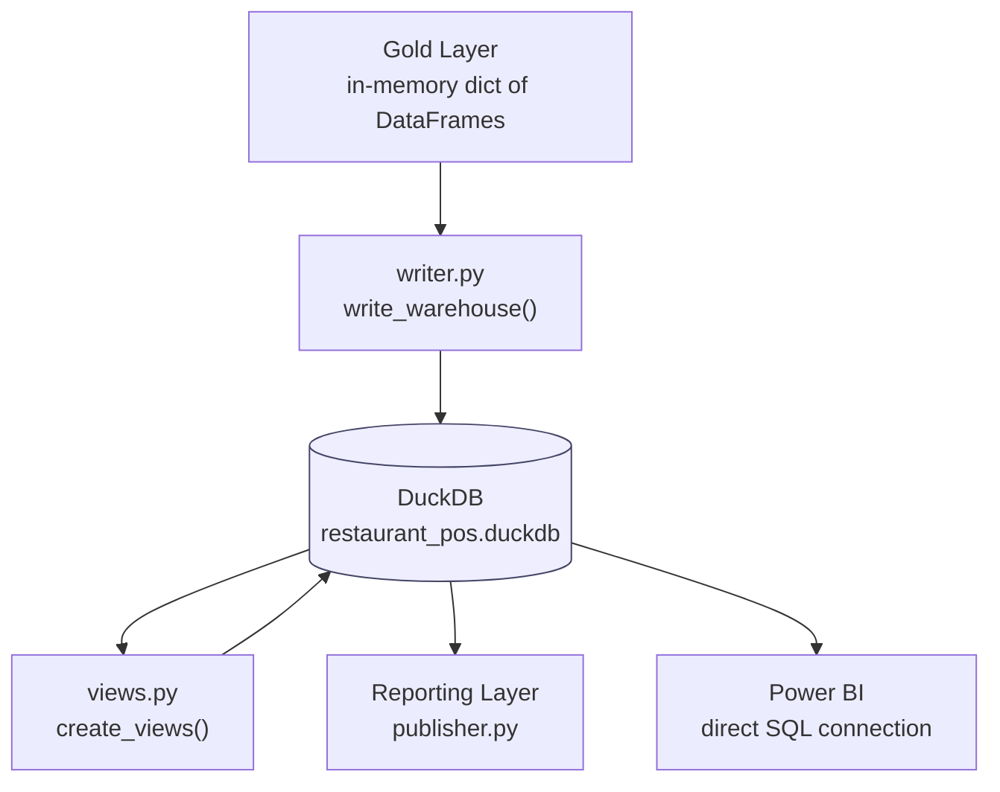
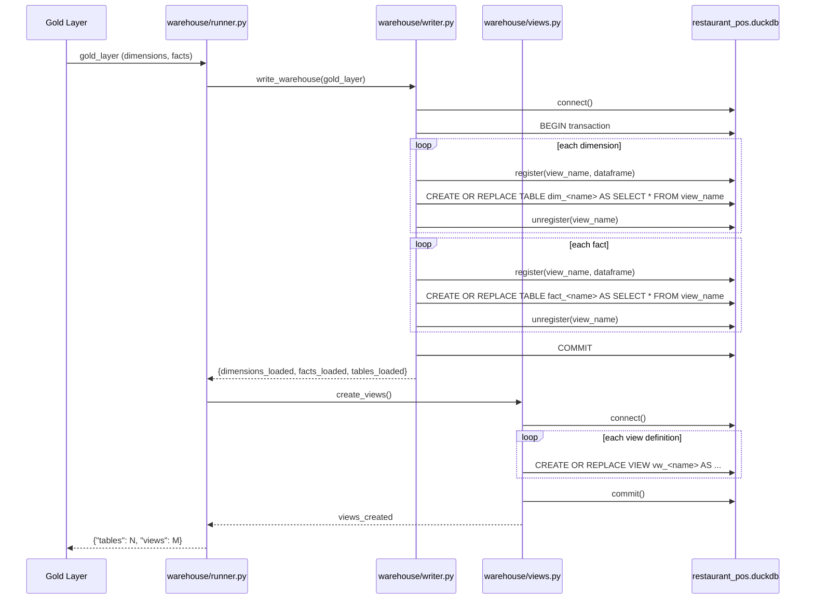

# Warehouse Layer

## Table of Contents

- [Overview](#overview)
- [Purpose](#purpose)
- [Business Context](#business-context)
- [Engineering Context](#engineering-context)
- [Folder References](#folder-references)
- [Architecture](#architecture)
- [Warehouse Tables](#warehouse-tables)
- [Load Workflow](#load-workflow)
- [Step-by-Step Processing](#step-by-step-processing)
- [Analytical Views on Top of the Warehouse](#analytical-views-on-top-of-the-warehouse)
- [Best Practices Applied](#best-practices-applied)
- [Design Decisions](#design-decisions)
- [Trade-offs](#trade-offs)
- [Performance Considerations](#performance-considerations)
- [Scalability Discussion](#scalability-discussion)
- [Maintainability Discussion](#maintainability-discussion)
- [Summary](#summary)

---

## Overview

The Warehouse Layer is the persistence stage of the pipeline. It takes the completed Gold analytical model (an in-memory dictionary of dimension and fact DataFrames) and materializes it into a physical **DuckDB** database file at `data/warehouse/restaurant_pos.duckdb`. On top of the materialized tables, this layer also defines a set of read-only **SQL analytical views** that pre-aggregate the star schema for reporting and Power BI consumption.

The Warehouse Layer is intentionally the last layer that touches business logic indirectly — it does not compute or reshape data itself. It only persists what Gold already built and exposes it through SQL.

---

## Purpose

- Provide a queryable, SQL-native store for the Gold star schema.
- Give Power BI (and any other BI/SQL client) a single, stable database file to connect to.
- Provide a layer of pre-aggregated, business-friendly analytical views so that dashboards do not need to embed raw joins and aggregations themselves.
- Keep the physical dimensional model (`dim_*` / `fact_*` tables) architecturally separate from the analytics layer (`vw_*` views) that sits on top of it.

---

## Business Context

Restaurant operators, analysts, and dashboard consumers need answers to questions such as:

- What were yesterday's / this month's sales, by restaurant, brand, or platform?
- Which categories and items are top sellers?
- How fast is the kitchen preparing orders, and where are the bottlenecks?
- What proportion of orders are cancelled, and why?
- How much of gross revenue is being eroded by discounts and non-item charges?

Rather than have every dashboard re-derive these answers from the raw fact and dimension tables, the Warehouse Layer's analytical views encode these business questions once, in SQL, as the single source of truth. This matters directly for reporting: the CSV files served by the Reporting Layer, and every Power BI visual, are built from these same view definitions.

---

## Engineering Context

The Warehouse Layer sits between the Gold Layer and the Reporting Layer / Power BI:

```
Gold Layer (in-memory DataFrames)
        │
        ▼
Warehouse Writer  →  DuckDB tables (dim_*, fact_*)
        │
        ▼
Warehouse Views   →  DuckDB views (vw_*)
        │
        ▼
Reporting Layer (CSV export) / Power BI (direct SQL)
```

The module docstrings in the codebase are explicit about this boundary:

- `src/warehouse/writer.py` performs **only** database persistence. It performs no cleaning, parsing, enrichment, business transformation, dimensional modelling, or surrogate key generation — those are Gold's responsibilities.
- `src/warehouse/views.py` performs **only** creation of SQL views. It contains no ingestion, cleaning, enrichment, or dimensional modelling logic.
- `src/warehouse/runner.py` and `src/warehouse/orchestrator.py` contain no SQL and no business logic; they simply sequence the writer and the view-creation step and report a summary.

This is a deliberate single-responsibility split that keeps the Warehouse Layer testable and easy to reason about in isolation from Gold's business rules.

---

## Folder References

```
restaurant-pos-elt-pipeline/
├── src/
│   └── warehouse/
│       ├── writer.py         # Persists Gold DataFrames into DuckDB tables
│       ├── views.py          # Defines and executes analytical SQL views
│       ├── runner.py         # Sequences writer → views
│       └── orchestrator.py   # Runs the stage and prints a summary
└── data/
    └── warehouse/
        └── restaurant_pos.duckdb   # The physical DuckDB database file
```

---

## Architecture



Architecturally, the project treats the `dim_*` / `fact_*` tables as the **physical dimensional model**, and the `vw_*` SQL views as a separate **Analytics Layer** built on top of that model. Per the `views.py` module docstring, this separation is a frozen architectural decision: Power BI consumes only the SQL views — it never queries the Warehouse tables or Gold directly.

---

## Warehouse Tables

Every Gold dimension is materialized as a table named `dim_<name>`, and every Gold fact as `fact_<name>`. The current contents of `restaurant_pos.duckdb` are:

| Table | Type | Grain | Row Count* |
|---|---|---|---|
| `dim_brand` | Dimension | One row per brand | 2 |
| `dim_category` | Dimension | One row per item category | 74 |
| `dim_date` | Dimension | One row per calendar date | 60 |
| `dim_item` | Dimension | One row per menu item | 843 |
| `dim_platform` | Dimension | One row per ordering platform | 6 |
| `dim_restaurant` | Dimension | One row per restaurant/outlet | 6 |
| `fact_orders` | Fact | One row per order (invoice) | 61,838 |
| `fact_order_items` | Fact | One row per ordered line item | 109,428 |
| `fact_kitchen` | Fact | One row per kitchen order ticket (KOT) item | 107,027 |

*Row counts reflect the current state of the committed `restaurant_pos.duckdb` file at the time of writing and will grow as new source periods are ingested.

Full column-level definitions for each table are documented in [`data_dictionary.md`](data_dictionary.md).

---

## Load Workflow



---

## Step-by-Step Processing

1. **Connection creation** (`_create_connection`): the `data/warehouse/` directory is created if missing, and a DuckDB connection is opened against `restaurant_pos.duckdb`.
2. **Transaction start**: `write_warehouse()` begins an explicit transaction so that either all tables load or none do.
3. **Table materialization** (`_materialize_tables`): for each dataset in `gold_layer["dimensions"]` and `gold_layer["facts"]`, the pandas DataFrame is registered with DuckDB under a temporary view name (`<table_name>_df`), and then materialized with:
   ```sql
   CREATE OR REPLACE TABLE <table_name> AS
   SELECT * FROM <table_name>_df
   ```
   This uses DuckDB's native SQL materialization path rather than `DataFrame.to_sql()`, which is faster and avoids row-by-row inserts. The temporary registration is always unregistered afterward, even if the `CREATE TABLE` statement fails (via `try`/`finally`).
4. **Commit or rollback**: if every table materializes successfully, the transaction commits; if any step raises, the transaction rolls back and the exception propagates.
5. **Connection close**: the connection is closed in a `finally` block regardless of outcome.
6. **View creation** (`create_views`): a second connection is opened, and every SQL statement in `_VIEW_DEFINITIONS` is executed as a `CREATE OR REPLACE VIEW` statement, then committed.
7. **Summary reporting**: `orchestrator.py` prints the number of tables loaded and views created.

---

## Analytical Views on Top of the Warehouse

The Warehouse database currently contains 16 views. Nine of them (`vw_daily_sales`, `vw_platform_performance`, `vw_brand_performance`, `vw_category_performance`, `vw_item_performance`, `vw_kitchen_performance`, `vw_daypart_sales`, `vw_order_type_performance`, `vw_order_status_analysis`) are defined in source control in `src/warehouse/views.py`. The remaining seven (`vw_aov_analysis`, `vw_brand_sales`, `vw_category_sales`, `vw_charge_analysis`, `vw_discount_analysis`, `vw_item_sales`, `vw_platform_sales`) exist inside the committed `restaurant_pos.duckdb` file and are referenced by the Reporting Layer's `REPORTING_VIEWS` configuration and exported as CSVs, but their `CREATE VIEW` statements are not currently present in `views.py`. This is a real gap between the tracked SQL source and the database artifact that a future contributor should reconcile by adding the missing view definitions to `_VIEW_DEFINITIONS`.

Full column-level detail for every view (both the nine tracked in `views.py` and the seven currently only present in the database file) is documented in [`reporting_layer.md`](reporting_layer.md) and [`data_dictionary.md`](data_dictionary.md).

---

## Best Practices Applied

- **Single Responsibility**: writer, view definitions, and orchestration are separated into distinct modules.
- **Idempotent DDL**: every table and view uses `CREATE OR REPLACE`, so re-running the pipeline against the same warehouse file is safe and does not require manual `DROP` statements.
- **Explicit transactions**: `write_warehouse()` wraps all table creation in a begin/commit/rollback block rather than relying on DuckDB's autocommit behavior.
- **Resource cleanup**: connections and temporary DuckDB view registrations are always released via `finally` blocks.
- **In-memory hand-off**: the writer consumes the Gold DataFrames directly from memory rather than re-reading Gold Parquet files from disk, avoiding redundant I/O within a single pipeline run.

---

## Design Decisions

- **DuckDB as the warehouse engine**: DuckDB is an embedded, file-based analytical database. It requires no server process, integrates natively with pandas (`connection.register()`), and supports full SQL, which is what the analytical views layer depends on.
- **Single database file**: all dimensions, facts, and views live in one `restaurant_pos.duckdb` file, simplifying deployment, backup, and the connection string used by Power BI.
- **Views instead of materialized reporting tables**: aggregations for reporting are expressed as SQL views, computed on demand, rather than pre-computed and stored as additional tables. This keeps the aggregated numbers always consistent with the latest `dim_*`/`fact_*` contents without a separate refresh step.
- **`CREATE OR REPLACE` over incremental `MERGE`/`UPSERT`**: each pipeline run fully rebuilds every table and view from the current Gold output, rather than incrementally patching existing warehouse tables.

---

## Trade-offs

- **Full rebuild vs. incremental warehouse load**: rebuilding every `dim_*`/`fact_*` table on each run is simple and guarantees consistency with Gold, but it means the warehouse load itself is not incremental — only the upstream Bronze/Silver ingestion is. For the current data volumes (tens of thousands to ~110K rows per fact table) this is inexpensive; at much larger scale it would become a bottleneck.
- **Views over materialized aggregates**: SQL views recompute their aggregation on every query, which keeps them simple and always fresh, but means dashboard query latency scales with the size of the underlying fact tables rather than being pre-computed.
- **Single-file DuckDB vs. client/server warehouse**: DuckDB's embedded, single-file model is easy to develop against and ship, but it does not offer concurrent multi-writer access or the operational tooling (roles, replication, monitoring) of a client/server warehouse such as PostgreSQL or Snowflake.
- **Untracked views**: as noted above, seven of the sixteen views living in the `.duckdb` file are not currently defined in `views.py`. This is convenient in that the database already reflects the desired reporting surface, but it is a maintainability risk — the database file is currently the only source of truth for those seven views.

---

## Performance Considerations

- Materializing tables via `CREATE OR REPLACE TABLE ... AS SELECT * FROM <registered_dataframe>` lets DuckDB bulk-load the pandas DataFrame using its native Arrow/pandas integration, which is substantially faster than row-by-row `INSERT` statements or `to_sql()`.
- Views that aggregate `fact_orders` (61,838 rows) and `fact_order_items` (109,428 rows) rely on DuckDB's columnar, vectorized query engine, which is well suited to the `GROUP BY`/`SUM`/`COUNT DISTINCT` patterns used throughout `_VIEW_DEFINITIONS`.
- `COUNT(DISTINCT invoice_no)` is used consistently instead of `COUNT(*)` wherever an "order count" is needed, because `fact_order_items` and `fact_kitchen` are grained at the line-item/ticket level, not the order level — counting rows there would overcount orders.

---

## Scalability Discussion

- Because DuckDB is embedded and file-based, scaling this warehouse vertically (larger fact tables, more months of data) is straightforward up to the memory and disk limits of the host running the pipeline.
- Horizontal scaling (multiple concurrent writers, distributed query execution) is out of scope for DuckDB's current design and would require migrating to a client/server warehouse (e.g., PostgreSQL, Snowflake, BigQuery) if the project's data volume or concurrency needs grow significantly.
- The full-rebuild table load strategy means load time grows linearly with the total size of the Gold output. As more monthly source files are ingested, this stage will take proportionally longer; an incremental "append new dates only" load would be the natural next optimization.

---

## Maintainability Discussion

- The clean separation between `writer.py` (persistence), `views.py` (analytics SQL), `runner.py`, and `orchestrator.py` (sequencing/reporting) makes it straightforward to modify one concern without touching the others.
- The biggest maintainability risk identified in this document is the seven analytical views that exist in `restaurant_pos.duckdb` but not in `src/warehouse/views.py`. Because `create_views()` only executes what is defined in `_VIEW_DEFINITIONS`, deleting and rebuilding the warehouse file from a clean checkout today would **not** reproduce `vw_aov_analysis`, `vw_brand_sales`, `vw_category_sales`, `vw_charge_analysis`, `vw_discount_analysis`, `vw_item_sales`, or `vw_platform_sales`. Bringing their `CREATE VIEW` statements into `views.py` (they are documented in full in [`reporting_layer.md`](reporting_layer.md)) would close this gap and make the warehouse fully reproducible from source.

---

## Summary

The Warehouse Layer takes the Gold star schema and turns it into a real, queryable DuckDB database: six dimension tables and three fact tables, materialized via idempotent `CREATE OR REPLACE TABLE` statements inside an explicit transaction, followed by a layer of SQL analytical views that encode the project's core business questions (daily sales, platform/brand/category/item performance, kitchen performance, dayparts, order status, discounts, and charges). This database is the single point of truth consumed by both the Reporting Layer (CSV export) and Power BI (direct SQL connection). The main opportunity for improvement is reconciling the seven views that currently exist only in the database file with the version-controlled view definitions in `views.py`.
